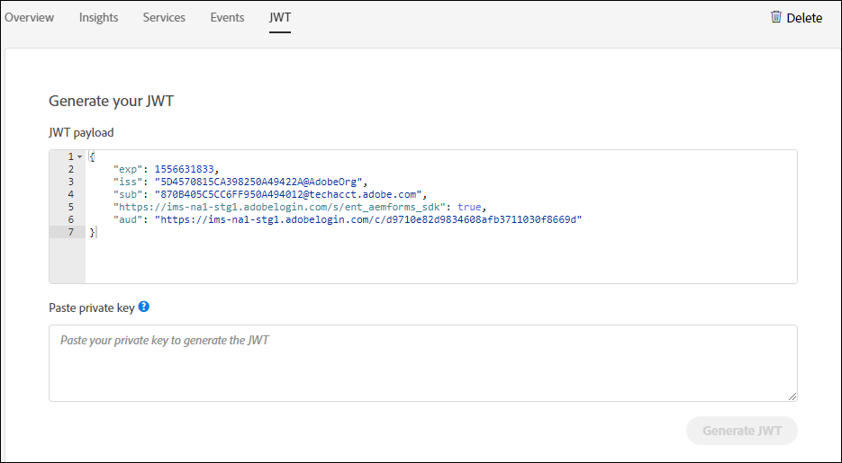

# 配置自动化表单转换服务 {#about-this-help}

此帮助介绍AEM管理员如何配置“自动表单转换”服务以自动将其PDF表单转换为自适应表单。 此帮助适用于贵组织的IT和AEM管理员。 提供的信息基于以下假设：阅读本帮助的任何人都熟悉以下技术：

* 安装、配置和管理Adobe Experience Manager和AEM包，

* 使用Linux和Microsoft Windows操作系统，

* 配置SMTP邮件服务器

>[!VIDEO](https://video.tv.adobe.com/v/29267/)

**观看视频或阅读文章以配置自动表单转换服务**

## 入门{#onboarding}

AEM 6.4 Forms和AEM 6.5 Forms内部部署定期客户以及Adobe Managed Service企业客户可免费使用该服务。 欲访问服务，请联系 Adobe 销售团队或 Adobe 代表。

Adobe 可为贵企业开启访问通道，并为您指定的管理员提供各种所需权限。 管理员可以向贵企业的 AEM Forms 开发人员（用户）授予权限并连接到该服务。 

## 前提条件 {#prerequisites}

您需要满足以下条件才能使用Automated Forms Conversion Service:

* 您的组织启用了自动表单转换服务
* 具有转换服务管理员权限的Adobe ID帐户
* 带有最新AEM Service Pack的AEM 6.4或AEM 6.5作者实例正在运行
* AEM用户（在AEM实例上），它是表单用户组的成员

## Set up the environment {#setuptheservice}

在使用服务之前，请准备AEM作者实例以连接到在Adobe Cloud上运行的服务。 在所列序列中执行以下步骤以准备服务实例：

1. [下载并安装AEM 6.4或AEM 6.5](#aemquickstart)
1. [下载并安装最新的AEM Service Pack](#servicepack)
1. [下载和安装最新的AEM Forms加载项包](#downloadaemformsaddon)
1. [下载和安装最新的连接器包](#installConnectorPackage)
1. [创建自定义主题和模板](#referencepackage)

### 下载并安装AEM 6.4或AEM 6.5 {#aemquickstart}


自动表单转换服务在AEM作者实例上运行。 您需要AEM 6.4或AEM 6.5来设置AEM作者实例。 如果尚未启动并运行AEM，请从以下位置下载它：

* 如果您是现有AEM客户，请从 [Adobe授权许可网站下载AEM 6.4或AEM 6.5](http://licensing.adobe.com)。

* 如果您是Adobe合作伙伴，请使用 [Adobe合作伙伴培训计划](https://adobe.allegiancetech.com/cgi-bin/qwebcorporate.dll?idx=82357Q) ，以请求AEM 6.4或AEM 6.5。

下载AEM后，有关设置AEM作者实例的说明，请参阅部署 [和维护](https://helpx.adobe.com/experience-manager/6-5/sites/deploying/using/deploy.html#defaultlocalinstall)。

### 下载和安装AEM最新Service Pack {#servicepack}

下载并安装最新的AEM Service Pack。 有关详细说明，请参阅 [AEM 6.4 Service Pack发行说明](https://helpx.adobe.com/experience-manager/6-4/release-notes/sp-release-notes.html) 或 [AEM 6.5 Service Pack发行说明](https://helpx.adobe.com/experience-manager/6-5/release-notes/sp-release-notes.html)。

### 下载和安装AEM Forms加载项包 {#downloadaemformsaddon}

AEM实例包含基本表单功能。 转换服务需要AEM Forms的完全功能。 下载并安装AEM Forms加载项包，以利用AEM Forms的所有功能。 设置和运行转换服务需要包。 有关详细说明，请参 [阅安装和配置数据捕获功能。](https://helpx.adobe.com/experience-manager/6-5/forms/using/installing-configuring-aem-forms-osgi.html)

>[!NOTE]
> 确保在安装加载项包后执行强制安装后配置。


### 下载和安装连接器包 {#installConnectorPackage}

您需要连接器软件包1.1.38或更高版本才能使用AFC-2020.03.1版中提供的最新功能和改进。您可以从AEM包共享下载连接器包。

| 操作系统 | 连接器包下载链接 |
| ------------- | ------------- |
| Microsoft Windows | https://www.adobeaemcloud.com/content/marketplace/marketplaceProxy.html?packagePath=/content/companies/public/adobe/packages/cq650/servicepack/fd/AEM-Forms-6.5.4.0-WIN |
| Linux | https://www.adobeaemcloud.com/content/marketplace/marketplaceProxy.html?packagePath=/content/companies/public/adobe/packages/cq650/servicepack/fd/AEM-Forms-6.5.4.0-WIN |

>[!NOTE]
> 如果您已经拥有并运行了Automated Forms Conversion服务环境，要使用转换服务的最新功能，请按上述顺序安装最新的服务包、最新的AEM Forms Add-on包和最新的连接器包。


### 创建自定义主题和模板 {#referencepackage}

如果以生产模式 [（nosamplecontent运行模式）启动AEM](https://helpx.adobe.com/experience-manager/6-5/sites/administering/using/production-ready.html) ，则不会安装引用包。 参考包中包含示例主题和模板。 自动表单转换服务至少需要一个主题和一个模板来将PDF表单转换为自适应表单。 在使用服务之前，创建您自己的和点服务配置的自 [定义主题和模板](#configure-the-cloud-service) ，以使用自定义模板和主题。

## 配置服务 {#configure-the-service}

在您继续配置服务并将本地实例与Adobe Cloud上运行的服务连接之前，请了解连接到服务所需的角色和权限。 该服务使用两种不同类型的角色，管理员和开发人员：

* **管理员**:管理员负责为其组织管理Adobe软件和服务。 管理员授予组织中的开发人员访问权限，以便连接到在Adobe Cloud上运行的自动表单转换服务。 为组织设置管理员后，管理员将收到一封包含标题的电子邮件 **[!UICONTROL 'You now have administrator rights to manage Adobe software and services for your organization']**。 如果您是管理员，请检查邮箱中是否有前面提到的标题，然后继续向 [组织的开发人员授予访问权限](#adduseranddevs)。


* **开发人员**:开发人员将本地AEM Forms作者实例连接到Adobe Cloud上运行的自动表单转换服务。 当管理员授予开发人员连接到自动表单转换服务的权限时，将向开发人员发送一封电子邮件，其标题为“您现在拥有开发人员访问权限，可以管理组织的Adobe API集成。 如果您是开发人员，请检查邮箱中是否有前面提到的标题，然后继续将您的本地AEM实例连接到Adobe Cloud上的“自动表单转换”服务。 [](#connectafcadobeio)


### （仅限管理员）授予组织的开发人员访问权限 {#adduseranddevs}

在Adobe为您的组织启用访问权限并向管理员提供所需的权限后，管理员可以登录Admin Console（下面的详细说明），创建配置文件，并将开发人员添加到配置文件。 开发人员可以将AEM Forms的本地实例连接到Adobe Cloud上的自动表单转换服务。

开发人员是指定用于运行转换服务的组织成员。 只有添加到Adobe自动表单转换服务配置文件的开发人员才有权使用自动表单转换服务。 执行以下步骤以创建配置文件并向其添加开发人员：

1. 登录到 [Admin Console](https://adminconsole.adobe.com/)。 使用 **Adobe ID** （提供管理员ID），以便使用自动表单转换服务登录。 请勿使用任何其他ID或Federated ID进行登录。
1. 单击选 **[!UICONTROL Automated Forms Conversion]** 项。
1. 单击 **[!UICONTROL New Profile]** 选项卡 **[!UICONTROL Products]** 中的。
1. 为 **[!UICONTROL Name]**&#x200B;配置 **[!UICONTROL Display Name]**&#x200B;文件指 **[!UICONTROL Description]** 定、和。 单击 **[!UICONTROL Done]**. 此时会创建配置文件。

   

1. 将开发人员添加到配置文件。 要添加开发人员，请执行以下操作：
   1. 在管理控 [制台中](https://adminconsole.adobe.com/enterprise)，导航到概述选项卡。
   1. 单击 **[!UICONTROL Assign Developers]** 所需的产品卡。
   1. 输入开发人员的电子邮件地址以及（可选）名和姓。
   1. 选择产品配置。 点按 **[!UICONTROL Save]**.

为所有用户重复上述步骤。  有关添加开发人员的更多详细信息，请参阅 [管理开发人员](https://helpx.adobe.com/enterprise/using/manage-developers.html)。

管理员将开发人员添加到Adobe I/O配置文件后，开发人员会通过电子邮件收到通知。 在收到电子邮件后，开发人员可以继续将 [本地AEM Forms实例与Adobe Cloud上的“自动表单转换”服务连接起来](#connectafcadobeio)。

### （仅限开发人员）将您的本地AEM Forms实例连接到Adobe Cloud上的自动表单转换服务 {#connectafcadobeio}

在管理员为您提供开发人员访问权限后，您可以将本地AEM Forms实例连接到Adobe Cloud上运行的自动表单转换服务。 按照所列顺序执行以下步骤，将AEM Forms实例连接到服务：

* [配置电子邮件通知](configure-service.md#configureemailnotification)
* [将用户添加到表单用户组](#adduserstousergroup)
* [获取公共证书](#obtainpubliccertificates)
* [创建Adobe I/O集成](#createintegration)
* [配置云服务](configure-service.md#configure-the-cloud-service)

#### 配置电子邮件通知 {#configureemailnotification}

自动表单转换服务使用Day CQ邮件服务发送电子邮件通知。 这些电子邮件通知包含有关成功或失败转换的信息。 如果选择不接收通知，请跳过这些步骤。 执行以下步骤以配置Day CQ Mail服务：

1. 转到AEM配置管理器，网址为 `http://localhost:4502/system/console/configMgr`
1. 打开Day CQ Mail服务配置。 指定、和字 **[!UICONTROL SMTP server host name]**&#x200B;段 **[!UICONTROL SMTP server port]**&#x200B;的 **[!UICONTROL From address]** 值。 单击 **[!UICONTROL Save]**.

   有关SMTP服务器的主机名和端口的信息，请与电子邮件服务提供商或IT管理员联系。 您可以在发件人字段中使用任何有效的电子邮件地址。 例如，notification@example.com或donotreply@example.com。

1. 打开配 **[!UICONTROL Day CQ Link Externalizer]** 置。 在字段 **[!UICONTROL Domains]** 中，指定本地、作者和发布实例的实际主机名或IP地址和端口号。 单击 **[!UICONTROL Save]**.

#### 将用户添加到表单用户组 {#adduserstousergroup}

在指定用于运行服务的AEM用户的配置文件中指定电子邮件地址。 确保用户是表单用户组的 [成员](https://helpx.adobe.com/experience-manager/6-4/forms/using/forms-groups-privileges-tasks.html) 。 电子邮件会发送到运行转换的用户的电子邮件地址。 要为用户指定电子邮件地址并将用户添加到表单用户组，请执行以下操作：

1. 以AEM管理员身份登录到AEM Forms作者实例。 使用您的本地AEM凭据登录。 请勿使用Adobe ID登录。 点按 **[!UICONTROL Adobe Experience Manager]** > **[!UICONTROL Tools]** > **[!UICONTROL Security]** > **[!UICONTROL Users]**.

1. 选择指定用于运行转换服务的用户，然后点按 **[!UICONTROL Properties]**。 此时将打开“编辑用户设置”页。
1. 在字段中指定电子邮件地址， **[!UICONTROL Email]** 然后点按 **[!UICONTROL Save]**。 成功完成或转换失败时，电子邮件会发送到指定的电子邮件地址。
1. Tap the **Groups** tab. 在“选择用户组”选项卡中，键入并选 **择表单用户组** 。 点按 **保存并关闭**。 用户现在是表单用户组的成员。

#### 获取公共证书 {#obtainpubliccertificates}

公共证书允许您在Adobe I/O上验证您的配置文件。

1. 登录到AEM Forms作者实例。 导航至 **[!UICONTROL Tools]**> **[!UICONTROL Security]** > **[!UICONTROL Adobe IMS Configurations]**. 点按 **[!UICONTROL Create]**. 将显 **[!UICONTROL Adobe IMS Technical Account Configuration]** 示页面。

   

1. 在云解 **[!UICONTROL Automated Forms Conversion Service]** 决方案中进行选择。

1. 选中该 **[!UICONTROL Create new certificate]** 复选框并指定别名。 别名用作对话框的名称。 点按 **[!UICONTROL Create certificate]**. 将显示一个对话框。 单击 **[!UICONTROL OK]**. 将创建证书。

1. 点 **[!UICONTROL Download Public Key]** 按并在您 *的计算机上保存AEM-Adobe-IMS.crt* 证书文件。 证书文件用于在Adobe [I/O控制台上创建集成](#createintegration)。 点按 **[!UICONTROL Next]**.

1. 指定以下内容：

   * 标题：指定标题。
   * 授权服务器： [https://ims-na1.adobelogin.com](https://ims-na1.adobelogin.com)
   现在将其他字段留空（稍后提供）。 保持页面打开。

   <!--
   Comment Type: draft

   <li> </li>
   -->

   <!--
   Comment Type: draft

   <li>Step text</li>
   -->

#### 创建Adobe I/O集成 {#createintegration}

要使用自动表单转换服务，请在Adobe I/O中创建集成。该集成生成API密钥、客户端机密、有效负荷(JWT)。

1. 登录 [https://console.adobe.io/](https://console.adobe.io/)。 使用您的Adobe ID，即管理员为登录Adobe I/O控制台而提供的开发人员帐户。

1. 点按 **[!UICONTROL View Integrations]**. 将显示一个屏幕，其中包含所有可用的集成功能。
1. 从下拉菜单中选择您的组织 **[!UICONTROL Integrations]**。 点 **[!UICONTROL New Integration]**&#x200B;按、选 **[!UICONTROL Access an API]**&#x200B;择和点按 **[!UICONTROL Continue]**。
1. 选择 **[!UICONTROL Experience Cloud]** > **[!UICONTROL Automated Forms Conversion]** 并点按 **[!UICONTROL Continue]**。 如果为您禁用了“自动表单转换”选项，请确保您从选项上方的下拉框中选择了正确的组 **[!UICONTROL Adobe Services]** 织。 如果您不了解您的组织，请与管理员联系。

   

1. 指定集成的名称和说明。 点 **[!UICONTROL Select a File from your computer]** 按并上传在“获取公共证书”部分下载的AEM-Adobe-IMS.crt [文件](#obtainpubliccertificates) 。
1. 选择在授予组织的开发 [人员访问权限时创建的配置文件](#adduseranddevs) ，然后点按 **[!UICONTROL Create Integration]**。 将创建集成。
1. 点按 **[!UICONTROL Continue to integration details]** 以查看集成信息。 该页面包含API密钥、客户端机密以及将本地AEM实例连接到自动表单转换服务所需的其他信息。 页面上的信息用于在本地计算机上创建IMS配置。

   

1. 打开本地实例上的“IMS配置”页。 您在“获取公共证书”部分的结尾处保持 [该页面打开](#obtainpubliccertificates)。

   

1. 在“Adobe IMS技术”页上，指定API密钥和客户端机密。 使用在集成页面上指定的值。

   **对于有效负荷，请使用集成页面的JWT选项卡中提供的代码。** 点按  **[!UICONTROL Save]**. 将创建IMS配置。 关闭集成页面。

   

   >[!CAUTION]
   >
   >仅创建一个IMS配置。 请勿创建多个IMS配置。

1. 选择IMS配置并点按 **[!UICONTROL Check Health]**。 将显示一个对话框。 点按 **[!UICONTROL Check]**. 成功连接时，将显示 *已成功检索的令牌* 消息。

   

   <br/> <br/>

#### 配置云服务 {#configure-the-cloud-service}

创建云服务配置以将AEM实例连接到转换服务。 它还允许您指定模板、主题和表单片段进行转换。 您可以为每组表单分别创建多个云服务配置。 例如，您可以为销售部门表单设置单独的配置，为客户支持表单设置单独的配置。 执行以下步骤以创建云服务配置：

1. 在AEM Forms实例中，点按 **[!UICONTROL Adobe Experience Manager]** > **[!UICONTROL Tools]**> **[!UICONTROL Cloud Services]** > **[!UICONTROL Automate Forms Conversion Configuration]**。
1. 点按文 **[!UICONTROL Global]** 件夹并点按 **[!UICONTROL Create]**。 此时将显示用于创建自动表单转换配置的页面。 此时将在全局文件夹中创建配置。 您还可以在已存在的其他文件夹中创建配置，或为配置创建新文件夹。

1. 在页面 **[!UICONTROL Create Automated Forms Conversion Configuration]** 上，指定以下字段的值并点按 **[!UICONTROL Next]**。

   | 字段 | 描述 |
   |--- |--- |
   | 标题 | 配置的唯一标题。 标题显示在用于开始转换的UI中。 |
   | 名称 | 配置的唯一名称。 此配置将使用指定的名称保存在CRX-Repository中。 名称可以与标题相同。 |
   | 缩略图位置 | 配置的缩略图位置。 |
   | 服务 URL | Adobe Cloud上的自动表单转换服务的URL。 使用 `https://aemformsconversion.adobe.io/` URL。 |
   | 模板 | 要应用于已转换表单的默认模板。 在开始转换之前，您始终可以指定其他模板。 模板包含自适应表单的基本结构和初始内容。 您可以从现成的模板中选择模板。 您还可以创建自定义模板。 |
   | 主题 | 要应用于转换表单的默认主题。 在开始转换之前，您始终可以指定不同的主题。  您可以单击该图标以选择现成的主题。 您还可以创建自定义主题。 |
   | 现有片段 | 现有片段的位置（如果有）。 |
   | 自定义元模型 | 自定义元模型的。schema.json文件的路径。 |


1. 在页面 **[!UICONTROL Advanced]** 的选项卡中， **[!UICONTROL Create Automated Forms Conversion Configuration]** 为以下字段指定值：

   <table>
   <thead>
   <tr>
   <th>字段</th>
   <th>描述</th>
   </tr>
   </thead>
   <tbody>
   <tr>
   <td >生成记录文档</td>
   <td>选择此选项可为转换的表单自动生成记录文档。 此选项仅适用于基于XFA的表单（XDP和PDF表单）。 当您启用此选项时，在提交表单后，您可以允许客户以打印或文档格式记录他们在表单中填写的信息，以供将来参考。 这称为记录文档。</td>
   </tr>
   <tr>
   <td>启用 Analytics</td>
   <td>选择此选项可在所有转换的表单上启用Adobe Analytics。 在使用此选项之前，请确保为AEM Forms实例启用了Adobe Analytics。</td>
   </tr>
   </tbody>
   </table>

   * 当源是基于XFA的表单，扩展名为。XDP时，输出DOR将保留XFA布局，否则转换服务使用现成的模板为其他基于XFA的表单生成DOR。
   * 提交XFA表单时，表单的提交数据将另存为XML元素或属性。 For example, `<Amount currency="USD"> 10.00 </Amount>`. 货币将保存为属性，货币金额将保存为元素，10.00。 自适应表单的提交数据没有属性，只有元素。 因此，当基于XFA的表单转换为自适应表单时，自适应表单提交数据包含每个此类属性的元素。 例如，

   ```css
      {
         "Type": "Principal",
   
         "Amount": "10.00",
   
         "currency": "USD"
      }
   ```

1. 点按 **[!UICONTROL Create]**. 云配置已创建。 您的AEM Forms实例可以开始将旧版表单转换为自适应表单。
