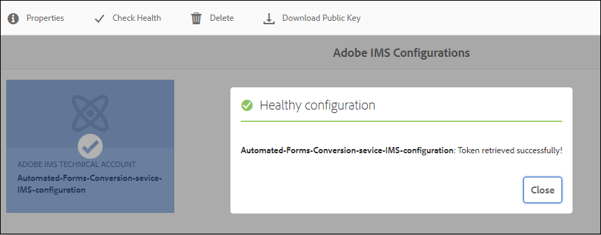

# 配置自动化表单转换服务 {#about-this-help}

此帮助介绍AEM管理员如何配置Automated forms conversion服务，以自动将其PDF forms转换为自适应表单。 此帮助适用于贵组织的IT和AEM管理员。 提供的信息基于以下假设：阅读本帮助的任何人都熟悉以下技术：

* 安装、配置和管理Adobe Experience Manager和AEM包，

* 使用Linux®和Microsoft® Windows®操作系统，

* 配置SMTP邮件服务器

<!--- >[!VIDEO](https://video.tv.adobe.com/v/29267/) 

**Watch the video or read the article to configure Automated Forms Conversion service** -->

## 入门{#onboarding}

AEM 6.4 Forms和AEM 6.5 Forms内部部署客户和Adobe管理服务企业客户可免费使用此服务。 欲访问服务，请联系 Adobe 销售团队或 Adobe 代表。此外，AEM Forms作为Cloud Service客户，还可免费使用并预启用该服务。

Adobe 可为贵企业开启访问通道，并为您指定的管理员提供各种所需权限。 管理员可以向贵企业的 AEM Forms 开发人员（用户）授予权限并连接到该服务。 

## 前提条件 {#prerequisites}

您需要满足以下条件才能使用Automated forms conversion服务：

* automated forms conversion服务已为您的组织启用
* 具有转换服务管理员权限的Adobe ID帐户
* 作为具有最新AEM Service Pack或最新更新的Cloud Service作者实例，已启动且正在运行的AEM 6.4、AEM 6.5或AEM Forms。
* 作为表单用户组成员的AEM用户(在您的AEM实例上)

## 设置环境 {#setuptheservice}

在使用该服务之前，请准备您的AEM创作实例以连接到在Adobe云上运行的服务。 按照列出的顺序执行以下步骤，为服务准备实例：

1. [下载并安装AEM 6.4、AEM 6.5或板载AEM Forms作为Cloud Service](#aemquickstart)
1. [下载并安装最新的AEM Service Pack](#servicepack)
1. [下载并安装最新的AEM Forms附加组件包](#downloadaemformsaddon)
1. （可选）[下载并安装最新的连接器软件包](#installConnectorPackage)
1. [创建自定义主题和模板](#referencepackage)

### 下载并安装AEM 6.4或AEM 6.5或板载AEM Forms作为Cloud Service {#aemquickstart}


automated forms conversion服务在AEM创作实例上运行。 您需要AEM 6.4、AEM 6.5或AEM Forms作为Cloud Service来设置AEM创作实例。

* 如果AEM 6.4或AEM 6.5尚未启动并运行，请从以下位置下载它。 下载AEM后，有关设置AEM创作实例的说明，请参阅[部署和维护](https://helpx.adobe.com/experience-manager/6-5/sites/deploying/using/deploy.html#defaultlocalinstall)。

   * 如果您是现有AEM客户，请从[Adobe授权网站](http://licensing.adobe.com)下载AEM 6.4或AEM 6.5。

   * 如果您是Adobe合作伙伴，请使用[Adobe合作伙伴培训计划](https://adobe.allegiancetech.com/cgi-bin/qwebcorporate.dll?idx=82357Q)请求AEM 6.4或AEM 6.5。

* 如果您使用AEM Forms作为Cloud Service，请参阅板载到[AEM Forms作为Cloud Service](https://experienceleague.adobe.com/docs/experience-manager-forms-cloud-service/forms/setup-environment/setup-forms-cloud-service.html?lang=en#setup-environment)和[设置本地开发环境](https://experienceleague.adobe.com/docs/experience-manager-forms-cloud-service/forms/setup-environment/setup-local-development-environment.html?lang=en#setup-environment)。

### (仅限AEM 6.4和AEM 6.5)下载并安装AEM最新Service Pack {#servicepack}

下载并安装最新的AEM Service Pack。 有关详细说明，请参阅或[AEM 6.4 Service Pack发行说明](https://helpx.adobe.com/cn/experience-manager/6-4/release-notes/sp-release-notes.html)或[AEM 6.5 Service Pack发行说明](https://helpx.adobe.com/cn/experience-manager/6-5/release-notes/sp-release-notes.html)。

### (仅限AEM 6.4和AEM 6.5)下载并安装AEM Forms附加组件包  {#downloadaemformsaddon}

AEM实例包含基本表单功能。 转换服务需要完整的AEM Forms功能。 下载并安装AEM Forms附加组件包，以利用AEM Forms的所有功能。 设置和运行转换服务需要包。 有关详细说明，请参阅[安装和配置数据捕获功能。](https://helpx.adobe.com/experience-manager/6-5/forms/using/installing-configuring-aem-forms-osgi.html)

>[!NOTE]
> 确保在安装附加组件包后执行强制的安装后配置。

<!-- ### (Optional) Download and install connector package  {#installConnectorPackage}

The connector package provides early access to the [Auto-detect logical sections](convert-existing-forms-to-adaptive-forms.md#run-the-conversion) features and improvements delivered in release AFC-2020.03.1. Do not install the package if you do not require feature and improvements delivered in AFC-2020.03.1.  You can [download the connector package from AEM Package Share](https://www.adobeaemcloud.com/content/marketplace/marketplaceProxy.html?packagePath=/content/companies/public/adobe/packages/cq650/featurepack/AFCS-Connector-2020.03.1). -->


### 创建自定义主题和模板 {#referencepackage}

如果在[生产模式](https://helpx.adobe.com/experience-manager/6-5/sites/administering/using/production-ready.html)（nosamplecontent运行模式）下启动AEM 6.4或AEM 6.5，则不会安装引用包。 引用包包含示例主题和模板。 automated forms conversion服务至少需要一个主题和一个模板才能将PDF表单转换为自适应表单。 创建您自己的自定义主题和模板，并指向[服务配置](#configure-the-cloud-service)以在使用服务之前使用自定义模板和主题。

您还可以在创作实例上下载并安装[AEM Forms引用资产](https://experience.adobe.com/#/downloads/content/software-distribution/en/aemcloud.html)包。 它会创建一些参考主题和模板。

## 配置服务 {#configure-the-service}

在您继续配置服务并将本地实例与在Adobe云上运行的服务连接之前，请了解连接到服务所需的角色和权限。 该服务使用两种不同类型的角色：管理员和开发人员：

* **管理员**:管理员负责管理其组织的Adobe软件和服务。管理员授予组织中开发人员的访问权限，以便连接到在Adobe Cloud上运行的Automated forms conversion服务。 为组织配置管理员后，管理员会收到标题为&#x200B;**[!UICONTROL 'You now have administrator rights to manage Adobe software and services for your organization']**&#x200B;的电子邮件。 如果您是管理员，请检查邮箱中是否有前面提到的标题的电子邮件，然后继续[授予贵组织开发人员的访问权限](#adduseranddevs)。


* **开发人员**:开发人员将本地AEM Forms创作实例连接到在Adobe云上运行的Automated forms conversion服务。当管理员向开发人员授予连接到Automated forms conversion服务的权限时，将向开发人员发送一封电子邮件，其中包含标题您现在拥有开发人员管理组织AdobeAPI集成的访问权限。 如果您是开发人员，请检查邮箱中是否有前面提到的标题的电子邮件，然后继续[将本地AEM实例连接到Adobe云上的Automated forms conversion服务。](#connectafcadobeio)


### (仅限AEM 6.4和AEM 6.5的管理员)授予组织开发人员的访问权限 {#adduseranddevs}

在Adobe为您的组织启用访问权限并向管理员提供所需的权限后，管理员可以登录Admin Console（详细说明如下）、创建配置文件并将开发人员添加到配置文件中。 开发人员可以将AEM Forms的本地实例连接到Adobe云上的Automated forms conversion服务。

开发人员是指定用于运行转换服务的组织成员。 只有添加到AdobeAutomated forms conversion服务配置文件的开发人员才有权使用Automated forms conversion服务。 执行以下步骤以创建配置文件并向其添加开发人员。 要向组织的开发人员授予所需的访问权限，至少需要一个配置文件：

1. 登录到[Admin Console](https://adminconsole.adobe.com/)。 使用已配置为使用Automated forms conversion服务登录的管理员的&#x200B;**Adobe ID**。 请勿使用任何其他ID或Federated ID进行登录。
1. 单击&#x200B;**[!UICONTROL Automated Forms Conversion]**&#x200B;选项。
1. 单击&#x200B;**[!UICONTROL Products]**&#x200B;选项卡中的&#x200B;**[!UICONTROL New Profile]**。
1. 为配置文件指定&#x200B;**[!UICONTROL Name]**、**[!UICONTROL Display Name]**&#x200B;和&#x200B;**[!UICONTROL Description]**。 单击 **[!UICONTROL Done]**. 随即会创建用户档案。

   

1. 将开发人员添加到配置文件。 要添加开发人员，请执行以下操作：
   1. 在[Admin Console](https://adminconsole.adobe.com/enterprise)中，导航到概述选项卡。
   1. 单击所需产品卡上的&#x200B;**[!UICONTROL Assign Developers]**。
   1. 输入开发人员的电子邮件地址，以及（可选）名字和姓氏。
   1. 选择产品配置文件。 点按 **[!UICONTROL Save]**.

为所有用户重复上述步骤。 有关添加开发人员的更多详细信息，请参阅[管理开发人员](https://helpx.adobe.com/enterprise/using/manage-developers.html)。

管理员将开发人员添加到Adobe I/O配置文件后，开发人员会通过电子邮件收到通知。 开发人员收到电子邮件后，可以继续[将本地AEM Forms实例与AdobeCloud](#connectafcadobeio)上的Automated forms conversion服务连接。

### （仅限开发人员）将本地AEM Forms实例连接到Adobe云上的Automated forms conversion服务 {#connectafcadobeio}

在管理员为您提供开发人员访问权限后，您可以将本地AEM Forms实例连接到在Adobe云上运行的Automated forms conversion服务。 按照所列顺序执行以下步骤，将AEM Forms实例连接到服务：

* [配置电子邮件通知](configure-service.md#configureemailnotification)
* [将用户添加到表单用户组](#adduserstousergroup)
* [获取公共证书](#obtainpubliccertificates)
* [在Adobe开发人员控制台上配置服务API](#createintegration)
* [配置云服务](configure-service.md#configure-the-cloud-service)

#### 配置电子邮件通知 {#configureemailnotification}

automated forms conversion服务使用Day CQ邮件服务发送电子邮件通知。 这些电子邮件通知包含有关转化成功或失败的信息。 如果选择不接收通知，请跳过这些步骤。 执行以下步骤以配置Day CQ Mail Service:

* 对于AEM 6.4 Forms或AEM 6.5 Forms:

   1. 转到位于`http://localhost:4502/system/console/configMgr`的AEM配置管理器
   1. 打开Day CQ Mail Service配置。 为&#x200B;**[!UICONTROL SMTP server host name]**、**[!UICONTROL SMTP server port]**&#x200B;和&#x200B;**[!UICONTROL From address]**&#x200B;字段指定值。 单击 **[!UICONTROL Save]**.

      您可以联系电子邮件服务提供商或IT管理员，以获取有关SMTP服务器的主机名和端口的信息。 您可以在“发件人”字段中使用任何有效的电子邮件地址。 例如，notification@example.com或donotreply@example.com。

   1. 打开&#x200B;**[!UICONTROL Day CQ Link Externalizer]**&#x200B;配置。 在&#x200B;**[!UICONTROL Domains]**&#x200B;字段中，为本地、创作和发布实例指定实际的主机名或IP地址和端口号。 单击 **[!UICONTROL Save]**.

* 对于AEM Forms作为Cloud Service,[记录支持票证以启用电子邮件服务](https://experienceleague.adobe.com/docs/experience-manager-cloud-service/implementing/developing/development-guidelines.html?lang=en#sending-email)。

#### 将用户添加到表单用户组 {#adduserstousergroup}

在指定用于运行服务的AEM用户的配置文件中指定电子邮件地址。 确保用户是[forms user](https://experienceleague.adobe.com/docs/experience-manager-65/forms/manage-administer-aem-forms/forms-groups-privileges-tasks.html)组的成员。 电子邮件会发送到运行转化的用户的电子邮件地址。 要为用户指定电子邮件地址并将用户添加到表单用户群组，请执行以下操作：

1. 以AEM管理员身份登录到AEM Forms创作实例。 使用您的本地AEM凭据登录。 请勿使用Adobe ID登录。 点按 **[!UICONTROL Adobe Experience Manager]** > **[!UICONTROL Tools]** > **[!UICONTROL Security]** > **[!UICONTROL Users]**.

1. 选择指定用于运行转化服务的用户，然后点按&#x200B;**[!UICONTROL Properties]**。 此时将打开“编辑用户设置”页面。
1. 在&#x200B;**[!UICONTROL Email]**&#x200B;字段中指定电子邮件地址，然后点按&#x200B;**[!UICONTROL Save]**。 转化成功完成或失败时，电子邮件会发送到指定的电子邮件地址。
1. 点按&#x200B;**组**&#x200B;选项卡。 在“选择组”选项卡中，键入并选择&#x200B;**forms-users**&#x200B;组。 点按&#x200B;**保存并关闭**。 用户现在是表单用户组的成员。

#### (仅限AEM 6.4和AEM 6.5)获取公共证书 {#obtainpubliccertificates}

公共证书允许您在Adobe I/O时验证配置文件。

1. 登录到您的AEM Forms创作实例。 导航至 **[!UICONTROL Tools]**> **[!UICONTROL Security]** > **[!UICONTROL Adobe IMS Configurations]**. 点按 **[!UICONTROL Create]**. 此时将显示&#x200B;**[!UICONTROL Adobe IMS Technical Account Configuration]**&#x200B;页面。

   

1. 在云解决方案中选择&#x200B;**[!UICONTROL Automated Forms Conversion Service]**。

1. 选中&#x200B;**[!UICONTROL Create new certificate]**&#x200B;复选框并指定别名。 别名将用作对话框的名称。点按 **[!UICONTROL Create certificate]**. 将显示一个对话框。单击 **[!UICONTROL OK]**. 将创建证书。

1. 点按&#x200B;**[!UICONTROL Download Public Key]**，然后将&#x200B;*AEM-Adobe-IMS.crt*&#x200B;证书文件保存到您的计算机上。 证书文件用于[在Adobe开发人员控制台](#createintegration)上配置服务API。 点按 **[!UICONTROL Next]**.

1. 指定以下内容：

   * 标题：指定标题。
   * 授权服务器：[https://ims-na1.adobelogin.com](https://ims-na1.adobelogin.com)\

   暂时将其他字段留空（稍后提供）。 保持页面打开。

   <!--
   Comment Type: draft

   <li> </li>
   -->

   <!--
   Comment Type: draft

   <li>Step text</li>
   -->

#### (仅限AEM 6.4和AEM 6.5)在Adobe开发人员控制台上配置服务API {#createintegration}

要使用Automated forms conversion服务，请创建一个项目，并在Adobe开发人员控制台上将自动Forms配置服务API添加到该项目。 集成会生成API密钥、客户端密钥、有效负载(JWT)。

1. 登录到[https://console.adobe.io/](https://console.adobe.io/)。 使用您的Adobe ID（管理员已配置的开发人员帐户）登录到Adobe I/O控制台进行登录。
1. 从右上角选择您的组织。 如果您不了解您的组织，请与管理员联系。
1. 点按 **[!UICONTROL Create new project]**. 此时会显示一个用于开始新项目的屏幕。 点按 **[!UICONTROL Add API]**. 此时会显示一个屏幕，其中包含为您的帐户启用的所有API的列表。
1. 选择&#x200B;**[!UICONTROL Automated Forms Conversion service]**&#x200B;并点按&#x200B;**[!UICONTROL Next]**。 此时会显示用于配置API的屏幕。
1. 选择[!UICONTROL Upload your public key]选项，上载在[获取公共证书](#obtainpubliccertificates)部分中下载的AEM-Adobe-IMS.crt文件，然后点按&#x200B;**[!UICONTROL Next]**。 此时会显示创建新服务帐户(JWT)凭据选项。 点按 **[!UICONTROL Next]**.
1. 选择产品配置文件，然后点按&#x200B;**[!UICONTROL Save configured API]**。 选择在[授予组织开发人员访问权限时创建的配置文件](#adduseranddevs)。 如果您不知道要选择的用户档案，请联系您的管理员。
1. 点按&#x200B;**[!UICONTROL Service Account (JWT)]**&#x200B;以查看将本地AEM实例连接到Automated forms conversion服务所需的API密钥、客户端密钥和其他信息。 页面上的信息用于在本地计算机上创建IMS配置。

1. 在本地实例上打开IMS配置页面。 保持打开该页面[获取公共证书](#obtainpubliccertificates)的结尾部分。

   

1. 在“AdobeIMS技术”页面上，指定API密钥和客户端密钥。 使用在Adobe开发人员控制台页面的服务帐户(JWT)中指定的值。

   >[!NOTE]
   >
   >
   >对于有效负载，请使用Adobe开发人员控制台的服务帐户(JWT)页面的生成JWT选项卡中提供的代码。

1. 点按 **[!UICONTROL Save]**. 将创建IMS配置。

   >[!CAUTION]
   >
   >仅创建一个IMS配置。 请勿创建多个IMS配置。

1. 选择IMS配置，然后点按&#x200B;**[!UICONTROL Check Health]**。 将显示一个对话框。点按 **[!UICONTROL Check]**. 成功连接时，将显示&#x200B;*已成功检索令牌*&#x200B;消息。

   

   <br/> <br/>

#### 配置Cloud Service {#configure-the-cloud-service}

创建Cloud Service配置以将AEM实例连接到转换服务。 它还允许您为转化指定模板、主题和表单片段。 您可以为每组表单分别创建多个云服务配置。 例如，您可以为销售部门表单提供单独的配置，并为客户支持表单提供单独的配置。 执行以下步骤以创建云服务配置：

1. 在AEM Forms实例中，点按&#x200B;**[!UICONTROL Adobe Experience Manager]** > **[!UICONTROL Tools]**> **[!UICONTROL Cloud Services]** > **[!UICONTROL Automate Forms Conversion Configuration]**。
1. 点按&#x200B;**[!UICONTROL Global]**&#x200B;文件夹，然后点按&#x200B;**[!UICONTROL Create]**。 此时会显示用于创建Automated forms conversion配置的页面。 配置在全局文件夹中创建。 您还可以在现有的其他文件夹中创建配置，或为配置创建文件夹。

1. 在&#x200B;**[!UICONTROL Create Automated Forms Conversion Configuration]**&#x200B;页面上，为以下字段指定值，然后点按&#x200B;**[!UICONTROL Next]**。

   | 字段 | 描述 |
   |--- |--- |
   | 标题 | 配置的唯一标题。 标题显示在用于开始转换的UI中。 |
   | 名称 | 配置的唯一名称。 配置将使用指定的名称保存在CRX-Repository中。 名称可以与标题相同。 |
   | 缩略图位置 | 配置缩略图的位置。 |
   | 服务 URL | Adobe云上的Automated forms conversion服务URL。 使用`https://aemformsconversion.adobe.io/` URL。 |
   | 模板 | 要应用于已转换表单的默认模板。 在开始转换之前，您始终可以指定其他模板。 模板包含自适应表单的基本结构和初始内容。 您可以从现成提供的模板中选择模板。 您还可以创建自定义模板。 |
   | 主题 | 要应用于转换表单的默认主题。 在开始转换之前，您始终可以指定不同的主题。  您可以单击图标以选择现成提供的主题。 您还可以创建自定义主题。 |
   | 现有片段 | 现有片段的位置（如果有）。 |
   | 自定义元模型 | 自定义元模型的.schema.json文件的路径。 您可以为英语、法语、德语、西班牙语、意大利语和葡萄牙语创建单独的元模型。 |

1. 在&#x200B;**[!UICONTROL Create Automated Forms Conversion Configuration]**&#x200B;页面的&#x200B;**[!UICONTROL Advanced]**&#x200B;选项卡中，为以下字段指定值：

   <table>
   <thead>
   <tr>
   <th>字段</th>
   <th>描述</th>
   </tr>
   </thead>
   <tbody>
   <tr>
   <td >生成记录文档</td>
   <td>选择用于为转换的表单自动生成记录文档的选项。 此选项仅适用于基于XFA的表单(XDP和PDF forms)。 启用此选项后，在提交表单后，您可以允许客户以打印或文档格式记录他们在表单中填写的信息，以供将来参考。 这称为记录文档。</td>
   </tr>
   <tr>
   <td>启用 Analytics</td>
   <td>(仅限AEM 6.4和AEM 6.5)选择选项，以在所有转换的表单上启用Adobe Analytics。 在使用选项之前，请确保为您的AEM Forms实例启用了Adobe Analytics。</td>
   </tr>
   </tbody>
   </table>

   * 如果源是基于XFA且扩展名为.XDP的表单，则输出DOR将保留XFA布局，否则转换服务将使用现成的模板为其他基于XFA的表单生成DOR。
   * 提交XFA表单后，表单的提交数据将另存为XML元素或属性。 例如，`<Amount currency="USD"> 10.00 </Amount>`。 货币将另存为属性和货币金额，10.00将另存为元素。 自适应表单的提交数据没有属性，只有元素。 因此，当基于XFA的表单转换为自适应表单时，自适应表单提交数据包含每个此类属性的元素。 例如，

   ```css
      {
         "Type": "Principal",
   
         "Amount": "10.00",
   
         "currency": "USD"
      }
   ```

1. 点按 **[!UICONTROL Create]**. 将创建云配置。您的AEM Forms实例可以开始将旧版表单转换为自适应表单。
