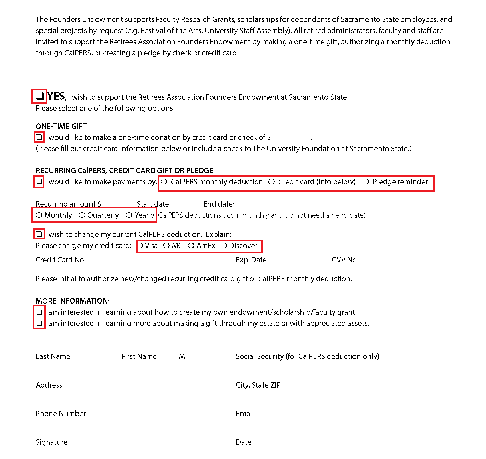

# [请勿发布最佳实践] 和注意事项 {#do-not-publish-best-practices-and-considerations}

AEM Forms自动转换服务将PDF表单转换为自适应表单。 该服务使用人工智能和机器学习算法来了解源表单的布局和字段。 每项机器学习服务都会不断学习源数据，并在每次客户流失时生成更好的输出。 这些服务从人类的体验中学习。

自动表单转换服务是针对大量表单进行培训的。 它可轻松识别源表单中的字段并生成自适应表单。 但是，PDF forms中有一些领域和风格，它们在人眼中很容易看到，但在服务中却很难理解。 服务可以为某些字段或样式指定不同于适用字段类型或面板。 下面列出了所有此类字段和样式模式。

该服务将开始识别正确的字段或面板并将其分配给这些模式，因为它会不断从源数据中学习。 目前，您可以使用“审阅” [和“更正](review-correct-ui-edited.md) ”编辑器修复此类问题。 在开始修复问题或进一步阅读之前，请先熟悉自 [适应表单组件](https://helpx.adobe.com/experience-manager/6-5/forms/using/introduction-forms-authoring.html)。

## 常规 {#general}

<!--
Comment Type: draft

<ul>
<li>Service does not convert filled PDF forms to adaptive form. Use empty adaptive forms.Service does not convert colored PDF forms to adaptive form. Use  and white or grayscale adaptive forms.   </li>
<li>Service does not convert filled PDF forms to adaptive form. Use empty adaptive forms.</li>
<li>Service does not support scanned forms. Do not use scanned forms. </li>
<li>Service can fail to recognize text and fields in a dense form. Increase the width between text and fields of a dense form before starting the conversion.</li>
<li>Service does not extract images. Manually add images to converted forms.</li>
<li>Service does not extract text present within an image. Manually add text to the adaptive form.</li>
</ul>
-->

<table border="1" cellpadding="1" cellspacing="0" style="border-collapse: separate; border-spacing: 0px;" width="100%"> 
 <tbody>
  <tr>
   <td width="30%">已知模式和分辨率</td> 
   <td width="70%">示例</td> 
  </tr>
  <tr>
   <td>
<strong>图案</strong>
 
服务不会将彩色PDF forms转换为自适应表单。
 
 
 
<strong>分辨率</strong>
 
使用黑白或灰度PDF forms。 
 </td> 
   <td style="text-align: left;"> </td> 
  </tr>
  <tr>
   <td>
<strong>图案</strong>
 
服务不会将已填写的PDF forms转换为自适应表单。
 
 
 
<strong>分辨率</strong>
 
使用空的自适应表单。
 </td> 
   <td style="text-align: left;"></td> 
  </tr>
  <tr>
   <td>
<strong>图案</strong>
 
服务无法识别密集表单中的文本和字段。
 
 
 
<strong>分辨率</strong>
 
在开始转换之前，增加密集表单的文本和字段之间的宽度。
 </td> 
   <td style="text-align: left;"></td> 
  </tr>
  <tr>
   <td>
<strong>图案</strong>
 
服务不支持扫描的表单。
 
 
 
<strong>分辨率</strong>
 
请勿使用扫描的表单。 
 </td> 
   <td></td> 
  </tr>
  <tr>
   <td>
<strong>图案</strong>
 
服务不提取图像和图像中的文本。 
 
 
 
<strong>分辨率</strong>
 
手动向转换的表单添加图像或文本。
 </td> 
   <td></td> 
  </tr>
  <tr>
   <td>
<strong>图案</strong>
 
不会转换带有虚线或非清晰边界和边框的表。
 
<strong>分辨率</strong>
 
使用具有清晰显式边界和边框的表。 支持。
 </td> 
   <td></td> 
  </tr>
 </tbody>
</table>

## 选择组  {#choice-group}

<table border="1" cellpadding="1" cellspacing="0" width="100%"> 
 <tbody>
  <tr>
   <td width="30%">图案</td> 
   <td width="70%">示例</td> 
  </tr>
  <tr>
   <td>
<strong>图案</strong>
 
具有非框或圆形形状的选择组选项不会转换为相应的自适应表单组件。 
 
 
 
<strong>分辨率</strong>
 
将选项形状更改为框或圆，或使用“审阅并更正”编辑器来标识形状。
 </td> 
   <td> </td> 
  </tr>
 </tbody>
</table>

## 表单字段 {#form-fields}

<table border="1" cellpadding="1" cellspacing="0" width="100%"> 
 <tbody>
  <tr>
   <td width="30%">图案</td> 
   <td width="70%">示例</td> 
  </tr>
  <tr>
   <td width="25%">
<strong>图案</strong>
 
服务不会识别没有清晰边框的字段。
 
 
 
<strong>分辨率</strong>
 
使用“审阅”和“正确”编辑器来标识此类字段。
 
 
 
 
 </td> 
   <td width="50%">  </td> 
  </tr>
  <tr>
   <td>
<strong>图案</strong>
 
服务会保留一些底部或右侧带有未识别标题的表单字段。
 
 
 
<strong>分辨率</strong>
 
使用“审阅”和“正确”编辑器来标识此类字段
 </td> 
   <td>    </td> 
  </tr>
  <tr>
   <td>
<strong>图案</strong>
 
服务会合并或为某些表单字段指定错误类型，这些字段彼此非常靠近或没有清晰的边框。 
 
 
 
<strong>分辨率</strong>
 
使用“审阅”和“正确”编辑器来标识此类字段。
 </td> 
   <td></td> 
  </tr>
  <tr>
   <td>
<strong>图案</strong>
 
服务无法识别带有远离字幕的字段或字幕和输入字段之间的虚线。
 
 
 
<strong>分辨率</strong>
 
使用边界明确的表单字段或使用“审阅并更正”编辑器来修复此类问题。
 </td> 
   <td></td> 
  </tr>
 </tbody>
</table>

## 列表 {#lists}

<table border="1" cellpadding="1" cellspacing="0" width="100%"> 
 <tbody>
  <tr>
   <td width="30%">图案</td> 
   <td width="70%">示例</td> 
  </tr>
  <tr>
   <td>
<strong>图案</strong>
 
包含表单字段的列表会合并或不会转换为相应的自适应表单组件
 
<strong>分辨率</strong>
 
使用边界明确的表单字段或使用“审阅并更正”编辑器来修复此类问题。
 </td> 
   <td></td> 
  </tr>
  <tr>
   <td>
<strong>图案</strong>
 
服务可能会将一些嵌套列表保留为未标识
 
 
 
<strong>分辨率</strong>
 
使用“审阅”和“更正”编辑器修复此类问题。
 </td> 
   <td> </td> 
  </tr>
  <tr>
   <td>
<strong>图案</strong>
 
服务将包含选择组的某些列表相互合并
 
<strong>分辨率</strong>
 
使用“审阅”和“更正”编辑器修复此类问题。
 </td> 
   <td> </td> 
  </tr>
 </tbody>
</table>

<!--
Comment Type: draft

<h3>Choice groups</h3>
-->

<!--
Comment Type: draft

<ul>
<li>Lists with form fields, nested lists, and nested choice groups are not supported.</li>
<li>Form fields with captions at bottom or right are not supported.</li>
<li>Form fiields without bordes are not supported.</li>
<li>Hidden form fields are not supported.</li>
<li>Button in PDF forms are not converted to adaptive form buttons.  </li>
<li>Tables with clear explicit boundaries and borders are supported.</li>
<li>Fields with far away captions are not supported.  </li>
<li>Choice groups with only box or circle shaped selectors are supported. </li>
</ul>
-->

