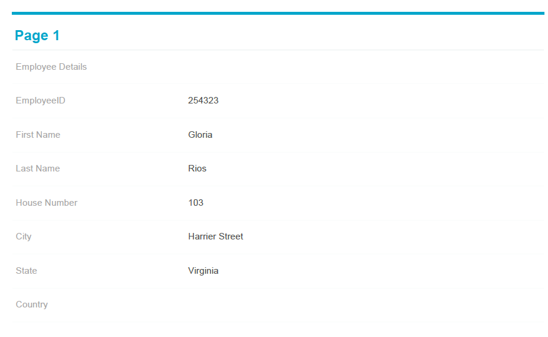
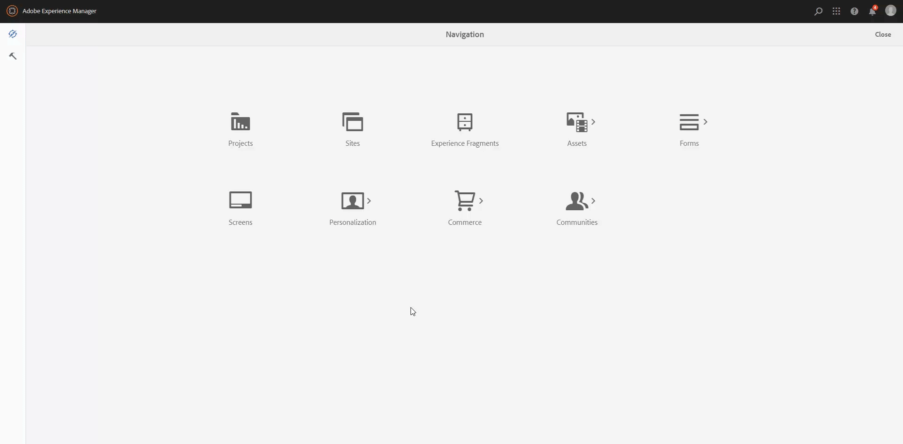

# 促进生成自适应表单记录文档的工作流建议 {#recommended-workflows-dor-generation}

记录文档(DoR)使您能够保留您以自适应表单提供和提交的信息记录，以便您以后可以参考它。
DoR使用基本模板来定义其布局。 您可以使用默认模板或将任何其他模板与自适应表单关联来生成DoR。

有关生成DoR的更多信息，请参阅 [为自适应表单生成记录文档](https://helpx.adobe.com/experience-manager/6-5/forms/using/generate-document-of-record-for-non-xfa-based-adaptive-forms.html).

此 [automated forms conversion服务](../help/introduction.md) 将以下源表单转换为自适应表单：

* 非交互式PDF forms
* Acro Forms
* 基于XFA的PDF forms

根据用于转换的源表单，可以使用以下方式生成DoR：

* 默认模板
* 源表单作为模板 — 如果选择此选项，转换服务会自动将源表单与作为DoR模板的已转换自适应表单相关联。
* 将任何其他模板与转换后的自适应表单关联

下表说明了您使用的DoR模板如何影响生成的DoR的布局的示例：

<table> 
 <tbody>
 <tr>
  <td>
<strong>源表单</strong>
</td>
  <td>
<strong>生成的DoR</strong>
</td> 
   </tr>
  <tr>
   <td></td>
   <td>
如果使用默认模板生成DoR： </td>
   </tr>
   <tr>
   <td></td>
   <td>
如果您使用源表单作为模板来生成DoR： 
</td>
   </tr>
  </tbody>
</table>

如表所示，如果将源表单用作模板，则DoR将保留源表单的布局。
本文介绍了基于三种源表单类型生成DoR的建议路径。

<table> 
 <tbody> 
  <tr> 
   <th><strong>源表单</strong></th> 
   <th><strong>生成DoR的方法</strong></th> 
  </tr> 
  <tr> 
   <td>
非交互式PDF forms
</td> 
   <td> 
    <ul> 
     <li><a href="#generate-document-of-record-using-cloud-configuration">启用自适应表单转换前的DoR生成功能，以使用默认模板生成DoR</a></li> 
     <li><a href="#edit-adaptive-form-properties-generate-document-of-record">在自适应表单转换后编辑自适应表单属性，以启用使用默认或任何其他表单模板生成DoR</a></li> 
    </ul> </td> 
  </tr>
  <tr> 
   <td>
Acro Forms或基于XFA的PDF forms
</td> 
   <td> 
    <ul> 
     <li><a href="#use-input-form-as-template-to-generate-document-of-record">启用自适应表单转换前的DoR生成，以使用源表单作为模板生成DoR</a></li> 
     <li><a href="#edit-adaptive-form-properties-to-generate-document-of-record">在自适应表单转换后编辑自适应表单属性，以启用使用默认模板、源表单作为模板或任何其他表单模板生成DoR</a></li> 
    </ul> </td> 
  </tr>    
 </tbody> 
</table>

## 为非交互式PDF forms生成记录文档 {#generate-document-of-record-non-interactive-pdf}

如果您使用非交互式PDF表单作为Automated forms conversion服务的源表单，则可以：

* 启用自适应表单转换前的DoR生成功能，以使用默认模板生成DoR
* 或在自适应表单转换后编辑自适应表单属性，以使用默认或任何其他表单模板启用DoR生成

### 启用转换前的DoR生成，以使用默认模板生成DoR {#generate-document-of-record-using-cloud-configuration}

1. 选择 **[!UICONTROL Tools]** > **[!UICONTROL Cloud Services]** > **[!UICONTROL Automated Forms Conversion Configuration]** >用于转换的云配置的属性> **[!UICONTROL Advanced]** > **[!UICONTROL Generate Document of Record]** 选项。

   

1. 点按 **[!UICONTROL Save & Close]** 以保存设置。

1. [运行转换](../help/convert-existing-forms-to-adaptive-forms.md). 确保您使用在这些说明的第1步中编辑的云配置。
在提交转换后的自适应表单时，将使用默认模板自动生成DoR。

### 在转换后编辑自适应表单属性以启用DoR生成 {#edit-adaptive-form-properties-generate-document-of-record}

如果在将源表单转换为自适应表单之前未启用DoR生成，则转换后仍可启用。

1. [运行转换](../help/convert-existing-forms-to-adaptive-forms.md) 在非交互式PDF表单上生成自适应表单。

1. 选择自适应表单 **[!UICONTROL output]** 文件夹并点按 **[!UICONTROL Properties]**.

1. 在 **[!UICONTROL Form Model]** 选项卡，展开 **[!UICONTROL Document of Record Template Configuration]** 部分并选择 **[!UICONTROL Generate Document of Record]**.

   

1. 点按 **[!UICONTROL Save & Close]** 以保存设置。

在提交转换后的自适应表单时，将使用默认模板自动生成DoR。 如果要将任何其他DoR模板与转换后的自适应表单关联，可以选择 **[!UICONTROL Associate form template as the Document of Record template]** 选项。

## 为基于Acro Forms或XFA的PDF forms生成记录文档 {#generate-document-of-record-acroform-xfaform}

如果您使用Acro表单或基于XFA的PDF表单作为Automated forms conversion服务的源表单，则可以：

* 启用自适应表单转换前的DoR生成，以使用源表单作为模板生成DoR

* 或在自适应表单转换后编辑自适应表单属性，以启用使用默认模板、源表单作为模板或任何其他表单模板生成DoR

### 启用转换前的DoR生成，以使用源表单模板生成DoR {#use-input-form-as-template-to-generate-document-of-record}

1. 选择 **[!UICONTROL Tools]** > **[!UICONTROL Cloud Services]** > **[!UICONTROL Automated Forms Conversion Configuration]** >用于转换的云配置的属性> **[!UICONTROL Advanced]** > **[!UICONTROL Generate Document of Record]** 选项。

1. 点按 **[!UICONTROL Save & Close]** 以保存设置。

1. [运行转换](../help/convert-existing-forms-to-adaptive-forms.md). 确保您使用在这些说明的第1步中编辑的云配置。
转换服务会自动将基于Acro表单或XFA的PDF表单与转换后的自适应表单关联为DoR模板。
您可以打开自适应表单属性以查看 **[!UICONTROL Document of Record Template Configuration]** 部分 **[!UICONTROL Form Model]** 选项卡。

   

   在提交转换后的自适应表单时，会使用源表单模板自动生成DoR。

### 在转换后编辑自适应表单属性以启用DoR生成 {#edit-adaptive-form-properties-to-generate-document-of-record}

1. [运行转换](../help/convert-existing-forms-to-adaptive-forms.md) 在非交互式PDF表单上生成自适应表单。

1. 选择自适应表单 **[!UICONTROL output]** 文件夹并点按 **[!UICONTROL Properties]**.

1. 在 **[!UICONTROL Form Model]** 选项卡，展开 **[!UICONTROL Document of Record Template Configuration]** 部分并选择 **[!UICONTROL Generate Document of Record]** 以启用使用默认模板生成DoR。
您也可以选择 **[!UICONTROL Associate form template as the Document of Record template]** 选项并选择模板以启用使用源表单模板或任何其他表单模板生成DoR。

1. 点按 **[!UICONTROL Save & Close]** 以保存设置。
