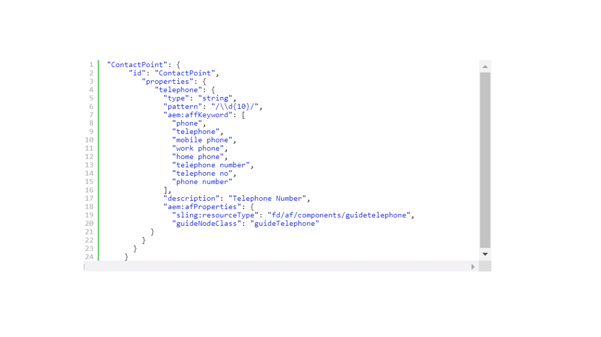

# 扩展默认元模型 {#extend-the-default-meta-model}

automated forms conversion服务识别源表单中的表单对象并将其从中提取。 语义映射器可帮助服务确定提取的对象如何以自适应形式表示。 例如，源表单可以有许多不同类型的日期表示形式。 语义映射器帮助将源表单的日期表单对象的所有表示形式映射到自适应表单的日期组件。 语义映射器还允许该服务在转换期间预配置验证、规则、数据模式、帮助文本和可访问性属性并将其应用于自适应表单组件。


元模型是一个JSON架构。 在开始使用元模型之前，请确保您熟悉JSON。 您必须具有创建、编辑和读取以JSON格式保存的数据的经验。

## 默认元模型 {#default-meta-model}

automated forms conversion服务具有默认的元模型。 它是一个JSON架构，通过Automated forms conversion服务的其他组件驻留在Adobe云上。 您可在本地AEM服务器上找到元模型的副本，网址为：http://&lt;server>：&lt;port>/aem/forms.html/content/dam/formsanddocuments/metamodel/`global.schema.json`. 您还可以 [单击此处](assets/en.globalschema.json) 访问或下载英语架构。 的元模型 [法语](assets/fr.globalschema.json)， [德语](assets/de.globalschema.json) [西班牙语](assets/es.globalschema.json)， [意大利语](assets/it.globalschema.json)、和 [葡萄牙语](assets/pt_br.globalschema.json) 语言也可供下载。

元模型的模式源自https://schema.org/docs/schemas.html上的模式实体。 它具有Person、PostalAddress、LocalBusiness和https://schema.org上定义的更多实体。 元模型的每个实体都遵循JSON架构对象类型。 以下代码表示一个元模型结构示例：

```
   "Entity": {
      "id": "Entity",
      "properties": {
        "name": {
          "type": "string"
        },

        "description": {
          "type": "string",
          "description": "Description of the item"
        }
      }
    }
```

## 下载默认元模型 {#download-the-default-meta-model}

执行以下步骤以将默认元模型下载到本地文件系统：

1. 登录到您的AEM Forms实例。
1. 导航到 **[!UICONTROL Forms]** > **[!UICONTROL Forms & Documents]** **>** **[!UICONTROL Meta Model]** 文件夹。
1. 选择 **[!UICONTROL global.schema.json]** 文件并点按 **[!UICONTROL Download]**. 此时将显示下载对话框。 选择 **[!UICONTROL Download asset(s) as binary files]** 选项。 点击&#x200B;**[!UICONTROL Download]**。已下载存档。

   <!--
   Comment Type: draft

   <li><p>Extract the archive and open the global.schema.json file for editing. </p> </li>
   -->

   <!--
   Comment Type: draft

   <li>Step text</li>
   -->

## 了解元模型 {#understanding-the-meta-model}

元模型是指包含实体的JSON架构文件。 JSON架构文件中的所有实体都包含名称和ID。 每个实体可以包含多个属性。 图元及其属性可因域而异。 您可以使用关键字和字段配置来扩充架构文件，以将架构属性映射到自适应表单组件。

```
"Event": {
      "id": "Eventid",
      "allOf": [
        {
          "$ref": "#Entity"
        },
        {
          "properties": {
            "startDate": {
              "type": "string",
              "format": "date",
              "description": "Specify the start date and time of the event in ISO 8601 date format."
            },
            "endDate": {
              "type": "string",
              "format": "date",
              "description": "Specify the end date and time of the event in ISO 8601 date format."
            },
            "location": {
              "$ref": "#PostalAddress",
              "description": "Specify the location of the event."
            }
          }
        }
      ]
    }
```

在此示例中， **事件** 表示实体的名称，其值为 **id** 作为 **Eventid**. 事件实体包括多个属性：

* startDate
* endDate
* 位置

此 **allOf** 元模型中的构造实现了实体间的继承。

每个属性还可以包括：

* [JSON架构属性](#jsonschemaproperties)
* [基于关键字的搜索，用于将属性应用于生成的自适应表单字段](#keywordsearch)
* [其他属性](#additionalproperties)



基于使用的引用关键词 **aem：affKeyword**，转换服务对源表单字段执行搜索操作。 转换服务将JSON架构属性和其他属性应用于符合搜索条件的字段。

在此示例中，转换服务在源表单中搜索电话、电话、移动电话、工作电话、家庭电话、电话号码、电话号码和电话号码关键字。 转换服务会根据包含这些关键字的字段，在转换后将类型、模式和aem：afProperties应用于自适应表单字段。

### 生成的自适应表单字段的JSON架构属性 {#jsonschemaproperties}

元模型支持使用Automated forms conversion服务生成的自适应表单字段的以下JSON架构通用属性：

<table> 
 <tbody> 
  <tr> 
   <th><strong>属性名称</strong></th> 
   <th><strong>描述</strong></th> 
  </tr> 
  <tr> 
   <td><p>标题</p></td> 
   <td> 
    <p>元模型中的标题属性中提到的文本用作搜索关键字，以对生成的自适应表单字段执行操作。 例如，修改自适应表单字段的标签。 有关更多信息，请参阅 <strong>修改表单字段的标签</strong> 在 <a href="#custommetamodelexamples">自定义元模型示例。</a></p> </td> 
  </tr>
  <td><p>说明</p></td> 
   <td> 
    <p>description属性为生成的自适应表单字段设置帮助文本。 有关更多信息，请参阅 <strong>将帮助文本添加到表单字段</strong> 在 <a href="#custommetamodelexamples">自定义元模型示例。</a></p> </td> 
  </tr>
  <td><p>类型</p></td> 
   <td> 
    <p>type属性定义生成的自适应表单字段的数据类型。 标题属性的可能值包括：</p>
    <ul> 
     <li>字符串：生成文本数据类型的自适应表单字段。</li> 
     <li>数字：生成数值数据类型的自适应表单字段。</li>
     <li>integer：生成子类型设置为integer的numeric数据类型的自适应表单字段。</li>
     <li>布尔值：生成切换自适应表单组件。</li>
     </ul><p>有关在元模型中使用类型属性的更多信息，请参阅 <strong>修改表单字段的类型</strong> 在 <a href="#custommetamodelexamples">自定义元模型示例。</a></p></td> 
  </tr>
  <td><p>模式</p></td> 
   <td> 
    <p>pattern属性根据正则表达式来限制生成的自适应表单字段的值。 例如，元模型中的以下代码将生成的自适应表单字段的值限制为10位数：<br>"pattern"： "/\\d{10}/"<br>同样，元模型中的以下代码将字段的值限制为特定的日期格式。<br> "pattern"： "date{DD MMMM， YYYY}"，</p> </td> 
  </tr>
  <td><p>格式</p></td> 
   <td> 
    <p>format属性根据命名模式而不是正则表达式来限制生成的自适应表单字段的值。 format属性的可能值包括：<ul><li>电子邮件：生成电子邮件自适应表单组件。</li><li>hostname：生成文本框自适应表单组件。</li></ul>有关在元模型中使用format属性的更多信息，请参阅 <strong>修改表单字段的格式</strong> 在 <a href="#custommetamodelexamples">自定义元模型示例。</a></p> </td> 
  </tr>
  <td><p>枚举和枚举名称</p></td> 
   <td> 
    <p>enum和enumNames属性将下拉列表、复选框或单选按钮字段的值限制为固定集。 enumNames中列出的值将显示在用户界面上。 使用enum属性列出的值用于计算。<br>有关更多信息，请参阅 <strong>将表单字段转换为自适应表单中的多选复选框</strong>， <strong>将文本字段转换为自适应表单中的下拉列表</strong>、和 <strong>向下拉列表添加其他选项</strong> 在 <a href="#custommetamodelexamples">自定义元模型示例。</a></p> </td> 
  </tr>
 </tbody> 
</table>

### 基于关键字的搜索，用于将属性应用于生成的自适应表单字段 {#keywordsearch}

automated forms conversion服务在转换期间对源表单执行关键词搜索。 筛选满足搜索条件的字段后，转换服务将为元模型中的这些字段定义的属性应用于生成的自适应表单字段。

关键字的引用方式 **aem：affKeyword** 属性。

```
{
  "numberfields": {
      "type": "number",
      "aem:affKeyword": ["Bank account number"]
 }
}
```

在此示例中，转换服务使用中的文本 **aem：affKeyword** 作为搜索关键词。 检索 **银行帐号** 文本，转换服务会将字段转换为 **数字** 使用键入 **type** 属性。

### 生成的自适应表单字段的其他属性 {#additionalproperties}

您可以使用 **aem：afProperties** 元模型中的属性，以便为使用Automated forms conversion服务生成的自适应表单字段定义以下附加属性：

<table> 
 <tbody> 
  <tr> 
   <th><strong>属性名称</strong></th> 
   <th><strong>描述</strong></th> 
  </tr> 
  <tr> 
   <td><p>多行</p></td> 
   <td> 
    <p>multiLine属性在转换后将源表单字段转换为自适应表单中的多行字段。 有关更多信息，请参阅 <strong>将字符串字段转换为多行字段</strong> 在 <a href="#custommetamodelexamples">自定义元模型示例。</a></p> </td> 
  </tr>
  <td><p>必需</p></td> 
   <td> 
    <p>Mandatory属性将转换后的自适应表单字段输入设置为必需。<br>有关更多信息，请参阅 <strong>向自适应表单字段添加验证</strong> 在 <a href="#custommetamodelexamples">自定义元模型示例。</a></p>
    </td> 
  </tr>
  <td><p>jcr:title</p></td> 
   <td> 
    <p>使用jcr：title属性和title JSON架构属性，您可以在转换后修改自适应表单字段的标签。<br>有关更多信息，请参阅 <strong>修改表单字段的标签</strong> 在 <a href="#custommetamodelexamples">自定义元模型示例。</a><br>参见 <a href="https://helpx.adobe.com/experience-manager/6-5/forms/using/adaptive-form-json-schema-form-model.html" target="_blank">使用JSON架构创建自适应表单</a> 有关使用JSON架构可应用于自适应表单字段的更多属性的信息。</p>
    <p></p></td> 
  </tr>
  <td><p>sling：resourceType和guideNodeClass</p></td> 
   <td> 
    <p>sling：resourceType和guideNodeClass属性允许您将表单字段映射到相应的自适应表单组件。<br>有关更多信息，请参阅 <strong>将表单字段转换为自适应表单中的多选复选框</strong> 和 <strong>将文本字段转换为自适应表单中的下拉列表</strong> 在 <a href="#custommetamodelexamples">自定义元模型示例。</a></p> </td> 
  </tr>
  <td><p>validatePictureClause</p></td> 
   <td> 
    <p>validatePictureClause属性对转换后自适应表单字段中允许的格式设置验证。<br>有关更多信息，请参阅 <strong>向自适应表单字段添加验证</strong> 在 <a href="#custommetamodelexamples">自定义元模型示例。</p> </td> 
  </tr>
 </tbody> 
</table>

## 用您自己的语言创建自定义元模型{#language-specific-meta-model}

您可以创建特定于语言的元模型。 此类元模型可帮助您使用所选语言创建映射规则。 automated forms conversion服务允许您使用以下语言创建元模型：

* 英语(en)
* 法语 (fr)
* 德语 (de)
* 西班牙语 (es)
* 意大利语 (it)
* 葡萄牙语(pt-br)

添加 *aem：Language* 元模型顶部的metatag标记可指定其语言。 例如，

```JSON
"metaTags": {
        "aem:Language": "fr"
    }
```

当未指定语言时，服务会认为元模型是英语的。

### 创建语言特定元模型的注意事项

* 确保每个键的名称都使用英语。 例如，emailAddress。
* 确保所有id键的所有实体引用和预定义值只包含ASCII字符。 例如，“id”：“ContactPoint”/“$ref”：“#ContactPoint”。
* 确保与以下键对应的所有值都使用指定的元模型语言：
   * aem：affKeyword
   * 标题
   * 说明
   * enumName
   * shortdescription
   * validatePictureClauseMessage

   例如，当元模型的语言是法语(“aem：Language”：“fr”)时，请确保所有描述和消息都使用法语。

* 确保全部 [JSON架构属性](#jsonschemaproperties) 仅使用支持的值。 例如，type属性只能跨选定的String、Number、Integer和Boolean值。

下图显示了英语元模型和相应的法语元模型的示例：


## 使用自定义元模型修改自适应表单字段 {#modify-adaptive-form-fields-using-custom-meta-model}

除了默认元模型中列出的模式和验证之外，您的组织还可以具有这些模式和验证。 可以扩展缺省元模型，以添加特定于贵组织的阵列、验证和图元。 automated forms conversion服务在转换期间将自定义元模型应用于表单字段。 当发现特定于您组织的新模式、验证和图元时，可以不断更新元模型。

automated forms conversion服务使用保存在以下位置的默认元模型，在转换期间将源表单字段映射到自适应表单字段：

http://&lt;server>：&lt;port>/aem/forms.html/content/dam/formsanddocuments/metamodel/global.schema.json

但是，您可以将自定义元模型保存在文件夹中，并修改转换服务属性以在转换期间使用自定义元模型。

### 在转换期间使用自定义元模型 {#use-custom-meta-model-during-conversion}

执行以下步骤以在转换期间使用自定义元模型：

1. 在中创建文件夹 **[!UICONTROL Forms]** > **[!UICONTROL Forms & Documents]** 并将自定义元模型JSON架构文件上传到文件夹。
1. 使用以下方式打开转换服务属性：

   **[!UICONTROL Tools]** > **[!UICONTROL Cloud Services]** > **[!UICONTROL Automated Forms Conversion Configuration]** > **&lt;properties of=&quot;&quot; selected=&quot;&quot; configuration=&quot;&quot;>**

1. 在 **[!UICONTROL Basic]** 选项卡中，指定自定义元模型在 **[!UICONTROL Custom Meta-model]** 字段并点按 **[!UICONTROL Save & Close]**.
1. [运行转换](convert-existing-forms-to-adaptive-forms.md#start-the-conversion-process) 将自定义元模型应用于转换过程。

### 自定义元模型示例 {#custommetamodelexamples}

使用自定义元模型修改自适应表单字段属性的常见示例包括：

* 修改表单字段的标签
* 修改表单字段的类型
* 将帮助文本添加到表单字段
* 将表单字段转换为自适应表单中的多选单选按钮
* 修改表单字段的格式
* 向自适应表单字段添加验证
* 将表单字段转换为自适应表单中的下拉列表选项
* 向下拉列表添加其他选项
* 将字符串字段转换为多行字段

#### 修改表单字段的标签 {#modify-the-label-of-a-form-field}

**示例：** 在转换后，将表单中的银行帐号标签修改为自适应表单中的自定义帐号。

在此自定义元模型中，转换服务使用 **标题** 属性作为搜索关键词。 检索 **银行帐号** 文本，转换服务会将该文本替换为 **客户帐号** 字符串中提及了 **jcr：title** 中的属性 **aem：afProperties** 部分。

```
{
  "numberfields": {
      "type": "number",
   "title": "Bank account number",
   "aem:afProperties" : {
    "jcr:title" : "Customer account number"
   }
   }
}
```

#### 修改表单字段的类型 {#modify-the-type-of-a-form-field}

**示例**：修改 **银行帐号** 表单中文本类型的字段，在转换为自适应表单中的数字类型字段之前，在转换之后。

在此自定义元模型中，转换服务使用中的文本 **aem：affKeyword** 作为搜索关键词。 检索 **银行帐号** 文本，转换服务将使用以下代码将字段转换为数字类型 **type** 属性。

```
{
  "numberfields": {
      "type": "number",
      "aem:affKeyword": ["Bank account number"]
 }
}
```

#### 将帮助文本添加到表单字段 {#add-help-text-to-a-form-field}

**示例**：将帮助文本添加到 **银行帐号** 自适应表单的字段。

在此自定义元模型中，转换服务使用中的文本 **aem：affKeyword** 作为搜索关键词。 检索 **银行帐号** 文本，转换服务使用将帮助文本添加到自适应表单字段 **描述** 属性。

```
{
  "numberfields": {
      "type": "number",
      "aem:affKeyword": ["Bank account number"],
   "description": "Specify your bank account number."
 }
}
```

#### 将表单字段转换为自适应表单中的多选复选框 {#convert-a-form-field-to-multiple-choice-check-boxes-in-the-adaptive-form}

**示例**：转换 **国家/地区** 表单中字符串类型的字段，转换为自适应表单中的复选框。

在此自定义元模型中，转换服务使用中的文本 **aem：affKeyword** 作为搜索关键词。 检索 **国家/地区** 文本时，转换服务会使用将字段转换为以下复选框 **枚举** 属性：

* 印度
* 英国
* 澳大利亚
* 新西兰

**sling：resourceType** 和 **guideNodeClass** 属性将表单字段映射到自适应表单组件复选框。

```
{
"title": {
    "aem:affKeyword": [
      "country"
    ],
    "type" : "string",
    "enum": [
      "India",
      "England",
      "Australia",
      "New Zealand"
    ],
    "aem:afProperties": {
      "sling:resourceType": "fd/af/components/guidecheckbox",
      "guideNodeClass": "guidecheckbox"
    }
  }
}
```

#### 修改表单字段的格式 {#modify-the-format-of-a-form-field}

**示例**：修改格式 **电子邮件地址** 字段转换为电子邮件格式。

在此自定义元模型中，转换服务使用中的文本 **aem：affKeyword** 作为搜索关键词。 检索 **电子邮件地址** 文本，转换服务使用将字段转换为电子邮件格式 **格式** 属性。

```
{
   "additionalDetails" : {
      "aem:affKeyword": ["E-mail Address"],
       "type" : "string",
       "format" : "email"
  } 
}
```

#### 向自适应表单字段添加验证 {#add-validations-to-adaptive-form-fields}

**示例1：** 将验证添加到 **邮政编码** 自适应表单的字段。

在此自定义元模型中，转换服务使用中的文本 **aem：affKeyword** 作为搜索关键词。 检索 **邮政编码** 文本，转换服务将使用以下内容向字段添加验证 **validatePictureClause** 在中定义的属性 **aem：afProperties** 部分。 根据验证，您为 **邮政编码** 自适应表单中的字段在转换后必须包含六个字符。

```
{
   "postalCode" : {
      "aem:affKeyword": ["Postal Code"],
      "type" : "string",
      "aem:afProperties" : {
        "validatePictureClause" : "\\d{6}"
      } 
   }
}
```

**示例2：** 将验证添加到 **银行帐号** 自适应表单的字段。

在此自定义元模型中，转换服务使用中的文本 **aem：affKeyword** 作为搜索关键词。 检索 **银行帐号** 文本，转换服务将使用以下内容向字段添加验证 **必需** 在中定义的属性 **aem：afProperties** 部分。 根据验证，必须为 **银行帐号** 字段。

```
{
  "numberfields": {
      "type": "number",
      "aem:affKeyword": ["Bank account number"],
   "aem:afProperties" : {
        "mandatory": "true"
      }   
   }
}
```

#### 将文本字段转换为自适应表单中的下拉列表 {#convert-a-text-field-to-drop-down-list-in-the-adaptive-form}

**示例**：转换 **国家/地区** 表单中字符串类型的字段，在转换为自适应表单中的下拉选项之前，在转换之后。

在此自定义元模型中，转换服务使用中的文本 **aem：affKeyword** 作为搜索关键词。 检索 **国家/地区** 文本时，转换服务会使用将字段转换为以下下拉列表选项 **枚举** 属性：

* 印度
* 英国
* 澳大利亚
* 新西兰

**sling：resourceType** 和 **guideNodeClass** 属性将表单字段映射到下拉自适应表单组件。

```
{
"title": {
    "aem:affKeyword": [
      "country"
    ],
    "type" : "string",
    "enum": [
      "India",
      "England",
      "Australia",
      "New Zealand"
    ],
    "aem:afProperties": {
      "sling:resourceType": "fd/af/components/guidedropdownlist",
      "guideNodeClass": "guideDropDownlist"
    }
  }
}
```

#### 向下拉列表添加其他选项 {#add-additional-options-to-the-drop-down-list}

**示例：** 添加 **斯里兰卡** 作为使用自定义元模型的现有下拉列表的额外选项。

要添加额外选项，请更新 **枚举** 属性。 在此示例中，更新 **枚举** 属性 **斯里兰卡** 作为额外选项。 中列出的值 **枚举** 属性显示在下拉列表中。

```
{
"title": {
    "aem:affKeyword": [
      "country"
    ],
    "type" : "string",
    "enum": [
      "India",
      "England",
      "Australia",
      "New Zealand",
   "Sri Lanka"
    ],
    "aem:afProperties": {
      "sling:resourceType": "fd/af/components/guidecheckbox",
      "guideNodeClass": "guidecheckbox"
    }
  }
}
```

#### 将字符串字段转换为多行字段 {#convert-a-string-field-to-a-multi-line-field}

**示例：** 转换 **地址** 字符串类型的字段转换为表单中的多行字段。

在此自定义元模型中，转换服务使用中的文本 **aem：affKeyword** 作为搜索关键词。 检索 **地址** 文本，该服务将使用以下内容将文本字段转换为多行字段 **多行** 在中定义的属性 **aem：afProperties** 部分。

```
{
 "multiLine" : {
   "aem:affKeyword": [
      "Address"
    ],
    "type" : "string",
    "aem:afProperties": {
      "multiLine": "true"
    }
  }
}
```
