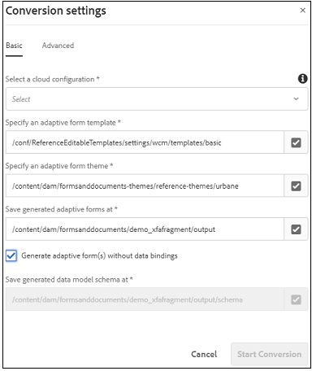

# 基于数据源的预填充和提交工作流建议（用于生成自适应表单） {#recommended-data-source-btased-prefill-and-submit-workflows-for-adaptive-forms}

您可以将以下任意数据源与使用Automated forms conversion服务转换的自适应表单一起使用：

* 表单数据模型、OData或任何其他第三方服务
* JSON模式
* XSD模式

根据数据源，您可以选择生成带有或不带有数据模型的自适应表单。

本文介绍在选择数据源并使用转换服务生成自适应表单后预填字段值和提交选项的推荐工作流。

<table> 
 <tbody> 
  <tr> 
   <th><strong>数据源</strong></th> 
   <th><strong>推荐的工作流</strong></th> 
  </tr> 
  <tr> 
   <td><p>表单数据模型、OData或任何其他第三方服务</p></td> 
   <td> 
    <p><strong>选项1</strong>:您选择表单数据模型、OData或任何其他第三方服务作为数据源。使用Automated forms conversion服务，您<a href="#generate-adaptive-forms-with-no-data-binding">生成没有数据绑定的自适应表单</a>。 您可以手动将自适应表单字段绑定到表单数据模型实体，并使用“表单数据模型预填服务”选项预填字段值。 您可以使用“使用表单数据模型提交”选项提交自适应表单。</p></td> 
  </tr>
  <tr> 
   <td></td> 
   <td> 
   <p><strong>选项2</strong>:您选择表单数据模型、OData或任何其他第三方服务作为数据源。使用Automated forms conversion服务，您<a href="#generate-adaptive-forms-with-no-data-binding">生成没有数据绑定的自适应表单</a>。 您可以使用规则编辑器绑定自适应表单字段以预填字段值。 根据需要修改字段值，并将数据提交到crx-repository。</p>
    </td> 
  </tr>
  <tr> 
   <td></td> 
   <td> 
    <p>有关执行这些工作流的分步说明，请参阅<a href="#sqldatasource">使用数据库、OData或任何第三方服务作为数据源。</a></p> </td> 
  </tr>
  <tr>
  <td><p>JSON模式</p></td> 
   <td> 
    <p>您选择JSON模式作为数据源。 基于所选数据源：</p></td> 
  </tr>
  <tr>
  <td></td> 
   <td> 
    <p><strong>选项1</strong>:您可 <a href="#generate-adaptive-forms-with-no-data-binding">以使用Automated forms conversion服务生成无</a> 数据绑定的自适应表单，并将JSON模式配置为数据源。手动将自适应表单字段绑定到JSON模式,<a href="https://helpx.adobe.com/experience-manager/6-5/forms/using/prepopulate-adaptive-form-fields.html#Supportedprotocolsforprefillinguserdata" target="_blank">使用任何支持的协议</a>预填字段值。 根据需要修改字段值，并将数据提交到crx-repository。</p></td> 
  </tr>
  <tr>
  <td></td> 
   <td> 
    <p>有关执行工作流的分步说明，请参阅<a href="#jsondatasource">将JSON模式用作数据源。</p></td> 
  </tr>
  <tr>
  <td></td> 
   <td> 
    <p><strong>选项2</strong>:您可 <a href="#generate-adaptive-forms-with-json-binding">以使用Automated forms conversion服务生成具</a> 有JSON数据绑定的自适应表单。预填服务和表单提交功能无缝衔接。 您不需要任何配置步骤。</p> </td> 
  </tr>
   <tr>
  <td></td> 
   <td> 
    <p>有关执行工作流的分步说明，请参阅<a href="#jsonwithdatabinding">将JSON模式用作数据源。</a></p> </td> 
  </tr>
  <tr>
  <td><p>XSD模式</p></td> 
   <td> 
    <p>选择XSD模式作为数据源。 根据所选数据源，您<a href="#generate-adaptive-forms-with-no-data-binding">使用Automated forms conversion服务生成没有数据绑定的自适应表单</a>，并将XSD模式配置为数据源。 手动将自适应表单字段绑定到XSD模式,<a href="https://helpx.adobe.com/experience-manager/6-5/forms/using/prepopulate-adaptive-form-fields.html#Supportedprotocolsforprefillinguserdata" target="_blank">使用任何支持的协议</a>预填字段值。 根据需要修改字段值，并将数据提交到crx-repository。</p>
    </td> 
  </tr>
  <tr>
  <td></td> 
   <td> 
    <p>有关执行工作流的分步说明，请参阅<a href="#xsddatasource">将XSD模式用作数据源。</a></p>
    </td> 
  </tr>
 </tbody> 
</table>


有关Automated forms conversion服务的详细信息，请参阅以下文章：

* [自动化表单转换服务简介](introduction.md)
* [配置自动化表单转换服务](configure-service.md)
* [将打印表单转换为自适应表单](convert-existing-forms-to-adaptive-forms.md)
* [审阅并修正转换后的表单](review-correct-ui-edited.md)

本文提供的信息基于以下假设：任何阅读该信息的人都具有自适应表单概念的基本知识。

## 先决条件{#pre-requisites}

* 配置[AEM作者实例](https://helpx.adobe.com/experience-manager/6-5/sites/deploying/using/deploy.html)
* 在AEM作者实例](configure-service.md)上配置[Automated forms conversion服务

## 自适应表单示例{#sample-adaptive-form}

要执行用例以在自适应表单中预填字段值并将其提交到数据源，请下载以下范例PDF文件。

贷款申请表示例

[获取文件](assets/sample_loan_application_form.pdf)

PDF文件用作Automated forms conversion服务的输入。 服务将此文件转换为自适应表单。 下图以PDF格式描述了示例贷款应用程序。


## 为表单型号{#prepare-data-for-form-model}准备数据

AEM Forms数据集成允许您配置和连接不同的数据源。 在使用转换过程生成自适应表单后，您可以根据表单数据模型、XSD或JSON模式定义表单模型。 您可以使用数据库、Microsoft Dynamics或任何其他第三方服务创建表单数据模型。

本教程使用MySQL数据库作为源创建表单数据模型。 在模式库中创建&#x200B;**loanapplication**，并根据自适应表单中可用的字段将&#x200B;**applicant**&#x200B;表添加到模式。


可以使用以下DDL语句在数据库中创建&#x200B;**applicant**&#x200B;表。

```sql
CREATE TABLE `applicant` (
   `name` varchar(45) DEFAULT NULL,
   `address` varchar(45) DEFAULT NULL,
   `phonenumber` int(11) NOT NULL,
   `email` varchar(45) DEFAULT NULL,
   `occupation` varchar(45) DEFAULT NULL,
   `annualsalary` varchar(45) DEFAULT NULL,
   `familymembers` int(11) DEFAULT NULL,
   PRIMARY KEY (`phonenumber`)
 ) ENGINE=InnoDB DEFAULT CHARSET=utf8
```

如果使用XSD模式作为表单模型来执行用例，请使用以下文本创建XSD文件：

```xml
<?xml version="1.0" encoding="utf-8" ?>
    <xs:schema targetNamespace="http://adobe.com/sample.xsd"
                    xmlns="http://adobe.com/sample.xsd"
                    xmlns:xs="http://www.w3.org/2001/XMLSchema">

<xs:element name="sample" type="SampleType"/>

  <xs:complexType name="SampleType">
    <xs:sequence>
      <xs:element name="name" type="xs:string"/>
   <xs:element name="address" type="xs:string"/>
   <xs:element name="phonenumber" type="xs:int"/>
   <xs:element name="email" type="xs:string"/>
   <xs:element name="occupation" type="xs:string"/>
   <xs:element name="annualsalary" type="xs:string"/>
   <xs:element name="familymembers" type="xs:string"/>
 </xs:sequence>
  </xs:complexType>

  </xs:schema>
```

或将XSD模式下载到本地文件系统。

贷款申请范例XSD模式

[获取文件](assets/loanapplication.xsd)

有关在自适应表单中使用XSD模式作为表单模型的详细信息，请参阅[使用XML模式创建自适应表单](https://helpx.adobe.com/experience-manager/6-5/forms/using/adaptive-form-xml-schema-form-model.html)。

如果您使用JSON模式作为表单模型来执行用例，请创建包含以下文本的JSON文件：

```JSON
{
    "$schema": "http://json-schema.org/draft-04/schema#",
    "definitions": {
        "loanapplication": {
            "type": "object",
            "properties": {
                "name": {
                    "type": "string"
                },
                "address": {
                    "type": "string"
                },
    "phonenumber": {
                    "type": "number"
                },
    "email": {
                    "type": "string"
                },
    "occupation": {
                    "type": "string"
                },
    "annualsalary": {
                    "type": "string"
                },
    "familymembers": {
                    "type": "number"
                }
            }
        }
 },
 "type": "object",
    "properties": {
        "employee": {
            "$ref": "#/definitions/loanapplication"
        }
    }
}
```

或将JSON模式下载到本地文件系统。

贷款申请范例JSON模式

[获取文件](assets/demo_schema.json)

有关在自适应表单中将JSON模式用作表单模型的更多信息，请参阅[使用JSON模式创建自适应表单](https://helpx.adobe.com/experience-manager/6-5/forms/using/adaptive-form-json-schema-form-model.html)。

## 生成没有数据绑定的自适应表单{#generate-adaptive-forms-with-no-data-binding}

使用[Automated forms conversion服务将[示例贷款申请表](#sample-adaptive-form)转换为无数据绑定的自适应表单。 ](convert-existing-forms-to-adaptive-forms.md)确保选中&#x200B;**[!UICONTROL Generate adaptive form(s) without data bindings]**&#x200B;复选框以生成没有数据绑定的自适应表单。



在生成没有数据绑定的自适应表单后，为自适应表单选择数据源：

* [数据库、OData或任何第三方服务](#sqldatasource)
* [JSON模式](#jsondatasource)
* [XSD模式](#xsddatasource)

>[!NOTE]
> 如果您使用Automated forms conversion服务转换的自适应表单包含多个具有相同名称的字段，请确保这些字段绑定到数据源实体以避免在提交过程中可能丢失数据。


### 使用数据库、OData或任何第三方服务作为数据源{#sqldatasource}

用例：使用Automated forms conversion服务生成没有数据绑定的自适应表单，并将MYSQL数据库配置为数据源。 手动将自适应表单字段绑定到表单数据模型实体，并使用&#x200B;**[!UICONTROL Form Data Model Prefill Service]**&#x200B;选项预填字段值。 使用&#x200B;**[!UICONTROL Submit using Form Data Model]**&#x200B;选项提交自适应表单。

在执行用例之前：

* [将MySQL数据库配置为数据源](https://helpx.adobe.com/experience-manager/6-5/forms/using/configure-data-sources.html#configurerelationaldatabase)
* [创建表单数据模型](https://helpx.adobe.com/experience-manager/6-5/forms/using/work-with-form-data-model.html)

根据用例，创建&#x200B;**loanapplication**&#x200B;表单数据模型并将读取服务参数绑定到&#x200B;**[!UICONTROL Literal]**&#x200B;值。 电话号码字面值必须是在MySQL模式库的&#x200B;**applicant**&#x200B;中配置的记录之一。 服务将该值用作从数据源获取详细信息的参数。 还可以从&#x200B;**[!UICONTROL Binding To]**&#x200B;下拉用户档案中选择[用户列表属性或请求属性](https://helpx.adobe.com/experience-manager/6-5/forms/using/work-with-form-data-model.html#bindargument)


>[!NOTE]
>
>确保在执行用例之前，将&#x200B;**get**&#x200B;和&#x200B;**insert**&#x200B;服务添加到表单数据模型，配置和测试服务。

执行以下步骤：

1. 选择&#x200B;**[!UICONTROL output]**&#x200B;文件夹中可用的转换后的&#x200B;**示例贷款申请表**，然后点按&#x200B;**[!UICONTROL Properties]**。
1. 点按&#x200B;**[!UICONTROL Form Model]**&#x200B;选项卡，从&#x200B;**[!UICONTROL Select From]**&#x200B;下拉列表中选择&#x200B;**[!UICONTROL Form Data Model]**，然后点按&#x200B;**[!UICONTROL Select Form Data Model]**&#x200B;以选择&#x200B;**loanapplication**&#x200B;表单数据模型。 点按&#x200B;**[!UICONTROL Save & Close]**&#x200B;以保存表单。
1. 选择&#x200B;**示例贷款申请表**&#x200B;并点按&#x200B;**[!UICONTROL Edit]**。
1. 在&#x200B;**[!UICONTROL Content]**&#x200B;选项卡中，点按配置图标：

   

   1. 在&#x200B;**[!UICONTROL Basic]**&#x200B;部分，从&#x200B;**[!UICONTROL Prefill Service]**&#x200B;下拉列表中选择&#x200B;**[!UICONTROL Form Data Model Prefill service]**。

   1. 在&#x200B;**[!UICONTROL Submission]**&#x200B;部分，从&#x200B;**[!UICONTROL Submit Action]**&#x200B;下拉列表中选择&#x200B;**[!UICONTROL Submit using Form Data Model]**。

   1. 使用&#x200B;**[!UICONTROL Data Model to submit]**&#x200B;字段选择数据模型。
   1. 点按以保存属性。

1. 点按申请人姓名文本框，选择（配置）。

   1. 在“绑定引用”字段中，选择&#x200B;**申请人** > **名称**，然后点按以保存属性。 同样，为&#x200B;**地址**、**电话号码**、**电子邮件**、**职业**、**年薪（以美元为单位）**&#x200B;和&#x200B;**否创建数据绑定。 具有表单数据模型实体的从属族成员**&#x200B;字段。

   

1. 点按&#x200B;**[!UICONTROL Preview]**&#x200B;以视图预填的自适应表单字段值。
1. 根据需要修改字段值，然后提交自适应表单。 字段值将提交到MySQL数据库。 您可以刷新数据库中的&#x200B;**applicant**&#x200B;表，以视图表中的更新值。

**用例：您** 可以使用Automated forms conversion服务生成没有数据绑定的自适应表单，并将MYSQL数据库配置为数据源。您可以使用规则编辑器绑定自适应表单字段以预填字段值。 根据需要修改字段值，并将数据提交到crx-repository。

执行以下步骤以使用[规则编辑器](https://helpx.adobe.com/experience-manager/6-5/forms/using/rule-editor.html)调用表单数据模型服务以绑定自适应表单中的字段和预填值：

1. 在&#x200B;**[!UICONTROL output]**&#x200B;文件夹中选择&#x200B;**示例贷款申请表**，然后点按&#x200B;**[!UICONTROL Edit]**。
1. 在&#x200B;**[!UICONTROL Content]**&#x200B;选项卡中，点按配置图标：

   

   在&#x200B;**[!UICONTROL Basic]**&#x200B;部分，从&#x200B;**[!UICONTROL Prefill Service]**&#x200B;下拉列表中选择&#x200B;**[!UICONTROL Form Data Model Prefill service]**。

1. 点按&#x200B;**[!UICONTROL Applicant Name]**&#x200B;文本框，然后点按&#x200B;**[!UICONTROL Edit Rules]**。

   

1. 点按“规则编辑器”页面上的&#x200B;**[!UICONTROL Create]**。
1. 在&#x200B;**[!UICONTROL Rule Editor]**&#x200B;页面上：

   1. 为“申请人姓名”文本框选择一个状态。 例如，**[!UICONTROL is initialized]**，当您以&#x200B;**[!UICONTROL Preview]**&#x200B;模式呈现表单时，它会导致执行&#x200B;**[!UICONTROL Then]**&#x200B;条件。

   1. 在&#x200B;**[!UICONTROL Then]**&#x200B;部分，从&#x200B;**[!UICONTROL Select Action]**&#x200B;下拉列表中选择&#x200B;**[!UICONTROL Invoke Service]**。 您的Forms实例上的所有服务都显示在下拉列表中。

   1. 从列出表单数据模型的部分中选择&#x200B;**[!UICONTROL Get]**&#x200B;服务。 “输入”字段显示&#x200B;**电话号码**，该号码是为&#x200B;**applicant**&#x200B;数据模型定义的主键。 系统根据此字段检索并预填充“输出”部分中字段的自适应表单中的值。

   1. 使用“输出”部分为具有表单数据模型实体的自适应表单字段创建绑定。 例如，将&#x200B;**[!UICONTROL Applicant Name]**&#x200B;自适应表单字段与&#x200B;**名称**&#x200B;实体绑定。

   1. 点按 **[!UICONTROL Done]**. 再次点按“规则编辑器”页面上的&#x200B;**[!UICONTROL Done]**。

   

1. 点按&#x200B;**[!UICONTROL Preview]**&#x200B;以视图预填的自适应表单字段值。

   >[!NOTE]
   >
   >确保与自适应表单关联的表单数据模型中的&#x200B;**get**&#x200B;服务属性的&#x200B;**[!UICONTROL Return Array]**&#x200B;属性设置为OFF。

1. 根据需要修改字段值，然后提交自适应表单。 提交的数据位于crx-repository中的以下位置：

   `http://host name:port/crx/de/index.jsp#/content/forms/fp/admin/submit/data/latest file available in the folder`

### 使用JSON模式作为数据源{#jsondatasource}

**用例：您** 可以使用Automated forms conversion服务生成没有数据绑定的自适应表单，并将JSON模式配置为数据源。您可以手动将自适应表单字段绑定到JSON模式，并使用&#x200B;**预览与数据**&#x200B;选项预填字段值。 根据需要修改字段值，并将数据提交到crx-repository。

在执行用例之前，请确保您具有：

* [符合JSON模式结构的有效JSON模式](#prepare-data-for-form-model)
* [无数据绑定的自适应表单](#generate-adaptive-forms-with-no-data-binding)

执行以下步骤：

1. 选择&#x200B;**output**&#x200B;文件夹中可用的转换的&#x200B;**示例贷款申请表**，然后点按&#x200B;**[!UICONTROL Properties]**。
1. 点按&#x200B;**[!UICONTROL Form Model]**&#x200B;选项卡，从&#x200B;**[!UICONTROL Select From]**&#x200B;下拉列表中选择&#x200B;**[!UICONTROL Schema]**，然后点按&#x200B;**[!UICONTROL Select Schema]**&#x200B;以上传保存在本地文件系统中的&#x200B;**demo.模式JSON**&#x200B;模式。 点按&#x200B;**[!UICONTROL Save & Close]**&#x200B;以保存表单。
1. 选择&#x200B;**示例贷款申请表**&#x200B;并点按&#x200B;**[!UICONTROL Edit]**。
1. 点按申请人姓名文本框，选择（配置）。

   在“绑定引用”字段中，选择&#x200B;**申请人** > **名称**，然后点按以保存属性。 同样，为&#x200B;**地址**、**电话号码**、**电子邮件**、**职业**、**年薪（以美元为单位）**&#x200B;和&#x200B;**否创建数据绑定。 具有JSON模式实体的从属家庭成员**&#x200B;字段。

1. 再次选择&#x200B;**[!UICONTROL output]**&#x200B;文件夹中可用的转换后的&#x200B;**示例贷款申请表**，然后选择&#x200B;**[!UICONTROL Preview]** > **[!UICONTROL Preview with Data]**。</br>

   下载示例数据文件</br>

   [获取文件](assets/json_data_file.txt)</br>

1. 根据需要修改字段值，然后提交自适应表单。 提交的数据位于crx-repository中的以下位置：

   `http://host name:port/crx/de/index.jsp#/content/forms/fp/admin/submit/data/latest file available in the folder`

### 使用XSD模式作为数据源{#xsddatasource}

**用例：您** 可以使用Automated forms conversion服务生成没有数据绑定的自适应表单，并将XSD模式配置为数据源。将自适应表单字段手动绑定到XSD模式，并使用&#x200B;**预览与数据**&#x200B;预填字段值。 根据需要修改字段值，并将数据提交到crx-repository。

在执行用例之前，请确保您具有：

* [符合XML模式结构的有效XSD模式](#prepare-data-for-form-model)
* [无数据绑定的自适应表单](#generate-adaptive-forms-with-no-data-binding)

执行以下步骤：

1. 选择&#x200B;**[!UICONTROL output]**&#x200B;文件夹中可用的转换后的&#x200B;**示例贷款申请表**，然后点按&#x200B;**[!UICONTROL Properties]**。
1. 点按&#x200B;**[!UICONTROL Form Model]**&#x200B;选项卡，从&#x200B;**[!UICONTROL Select From]**&#x200B;下拉列表中选择&#x200B;**[!UICONTROL Schema]**，然后点按&#x200B;**[!UICONTROL Select Schema]**&#x200B;以上传保存在本地文件系统中的&#x200B;**loanapplication** XSD模式。 选择XSD模式的根元素，然后点按&#x200B;**[!UICONTROL Save & Close]**&#x200B;以保存表单。
1. 选择&#x200B;**示例贷款申请表**&#x200B;并点按&#x200B;**[!UICONTROL Edit]**。
1. 点按申请人姓名文本框，选择（配置）。
在“绑定引用”字段中，选择**申请人** > **名称**，然后点按以保存属性。 同样，为&#x200B;**地址**、**电话号码**、**电子邮件**、**职业**、**年薪（以美元为单位）**&#x200B;和&#x200B;**否创建数据绑定。 具有XSD模式实体的从属族成员**&#x200B;字段。

1. 再次选择&#x200B;**output**&#x200B;文件夹中可用的转换后的&#x200B;**示例贷款申请表**，然后选择&#x200B;**[!UICONTROL Preview]** > **[!UICONTROL Preview with Data]**。</br>

   下载示例数据文件</br>

   [获取文件](assets/loan-application-data-xml-data.zip)</br>


1. 根据需要修改字段值，然后提交自适应表单。 提交的数据位于crx-repository中的以下位置：

   `http://host name:port/crx/de/index.jsp#/content/forms/fp/admin/submit/data/latest file available in the folder`

## 生成具有JSON绑定{#generate-adaptive-forms-with-json-binding}的自适应表单

使用[Automated forms conversion服务将[示例贷款申请表](#sample-adaptive-form)转换为具有数据绑定的自适应表单。 ](convert-existing-forms-to-adaptive-forms.md)确保在生成自适应表单时不选中&#x200B;**[!UICONTROL Generate adaptive form(s) without data bindings]**&#x200B;复选框。


### 使用JSON模式作为数据源{#jsonwithdatabinding}

**用例：您** 使用Automated forms conversion服务生成具有JSON数据绑定的自适应表单。预填服务和表单提交功能无缝衔接。 您不需要任何配置步骤。

在执行用例之前，请确保您具有[具有数据绑定的自适应表单](#generate-adaptive-forms-with-json-binding)。

执行以下步骤：

1. 再次选择&#x200B;**[!UICONTROL output]**&#x200B;文件夹中可用的转换后的&#x200B;**示例贷款申请表**，然后选择&#x200B;**[!UICONTROL Preview]** > **[!UICONTROL Preview with Data]**。</br>

   下载示例数据文件</br>

   [获取文件](assets/loan_application_data_source_json_data_binding.txt)</br>

1. 根据需要修改字段值，然后提交自适应表单。 提交的数据位于crx-repository中的以下位置：

   `http://host name:port/crx/de/index.jsp#/content/forms/fp/admin/submit/data/latest file available in the folder`

## 将提交的自适应表单JSON数据转换为XML格式{#convert-submitted-adaptive-form-data-to-xml}

在自适应表单字段中输入值并提交时，crx-repository中的数据将采用JSON格式。 您可以使用[org.apache.sling.commons.json.xml](https://sling.apache.org/apidocs/sling5/org/apache/sling/commons/json/xml/XML.html#toString) API或以下示例代码将JSON数据格式转换为XML:

```
import org.apache.sling.commons.json.JSONException;
import org.apache.sling.commons.json.JSONObject;
import org.apache.sling.commons.json.xml.XML;
 
public class ConversionUtils {
 
    public static String jsonToXML(String jsonString) throws JSONException {
        //https://sling.apache.org/apidocs/sling5/org/apache/sling/commons/json/xml/XML.html#toString(java.lang.Object)
        //jar - http://maven.ibiblio.org/maven2/org/apache/sling/org.apache.sling.commons.json/2.0.18/
        //Note: Need to extract boundData part before converting to XML
        return XML.toString(new JSONObject(jsonString));
    }
}
```
