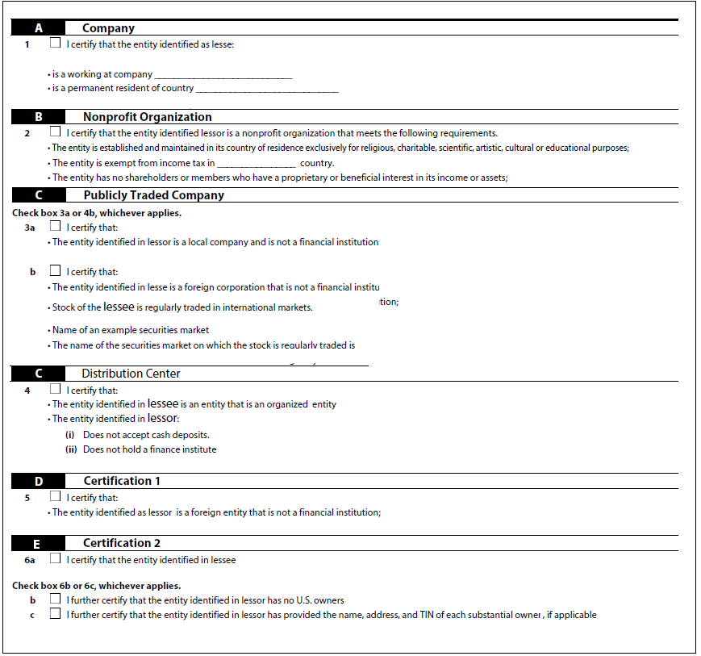
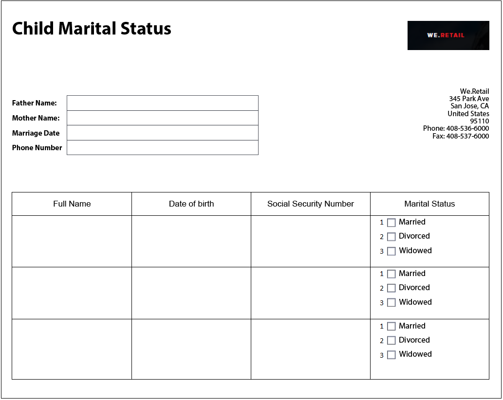

# 最佳实践和已知的复杂模式 {#Best-practices-and-considerations2}

本文档提供了表单管理员、作者和开发人员在使用时可以从中受益的准则和建议 [!DNL Automated Forms Conversion service]. 它讨论了从准备源表单到修复复杂模式的最佳实践，这些模式需要为自动化转换付出一些额外的努力。 该等最佳常规整体上为本集团整体表现及产出作出贡献 [!DNL Automated Forms Conversion service].

## 最佳实践

转换服务可转换AEM上可用的PDF forms [!DNL Forms] 自适应表单实例。 下面列出的最佳实践可帮助您提高转换速度和准确性。 此外，这些最佳实践可帮助您节省转化活动后所花费的时间。

### 上传源之前

您可以根据需要一次性上传所有PDF forms，也可以分阶段上传。 上传表单之前，请注意以下几点：

* 将文件夹中的表单数保持在15个以下，将文件夹中的总页数保持在50个以下。
* 将文件夹大小保持在10 MB以下。 请勿将表单放在子文件夹中。 
* 将表单中的页数保持在15页以下。
* 将源文档组织成一批8-15个文档。 将带有通用自适应表单片段的源表单保留在单个批次中。
* 请勿上传受保护的表单。 该服务无法转换受密码保护和受保护的表单。
* 不上传 [PDFPortfolio](https://helpx.adobe.com/acrobat/using/overview-pdf-portfolios.html). 该服务无法将PDFPortfolio转换为自适应表单。
* 请勿上载文件名中带有空格的源表单。 在上传表单之前，从文件名称中删除空格。
* 除英语、法语、德语、西班牙语、意大利语和葡萄牙语外，请勿上传任何语言的扫描、填写和表单。 此类表单不受支持。

使用XDP表单进行转换时，请先执行以下步骤，然后再上传源XPD表单：

* 分析XDP表单并修复视觉问题。 确保原始凭证使用预期的控制和结构。 例如，源表单中可能包含复选框而不是单选按钮。 将复选框更改为单选按钮以生成带有预期组件的自适应表单。
* [将绑定添加到XDP表单](http://www.adobe.com/go/learn_aemforms_designer_65_cn) ，然后再开始转换。 当绑定在源XDP表单中可用时，该服务会在转换期间自动将绑定应用于相应的自适应表单字段。 这样可节省手动应用绑定所需的时间。
* [添加Adobe Sign标记](https://helpx.adobe.com/sign/using/text-tag.html) 到XDP文件。 该服务会自动将Adobe Sign标签转换为相应的自适应表单字段。 自适应Forms支持有限数量的Adobe Sign字段。 有关支持的字段的完整列表，请参阅 [在自适应表单中使用Adobe Sign](https://experienceleague.adobe.com/docs/experience-manager-65/forms/adaptive-forms-advanced-authoring/working-with-adobe-sign.html?lang=en) 文档。
* 如果可能，将XDP文档中的复杂表转换为简单表。 如果表格单元格中有表单字段、单元格大小不一、跨行或跨列单元格、合并的单元格、部分边框或没有可见边框，则这些表格被视为一个复杂的表格。 具有上述任何一项的表被视为一个复杂的表。
<!-- * Use sub-forms in XDP documents to create panels in adaptive forms. Service converts each sub-form to one or more adaptive form panels during conversion. -->

### 开始转换之前

* 创建自适应表单模板。 模板有助于为组织或部门的表单指定统一结构。
* 在自适应表单模板中指定页眉和页脚。 该服务忽略源文档的页眉 — 页脚，并使用在自适应表单模板中指定的页眉 — 页脚。
* 创建自适应表单主题。 主题有助于为组织或部门的各种形式提供统一的外观和风格。
* 配置表单数据模型以保存和检索数据源。 为表单数据模型创建和配置读写服务。
* 创建自适应表单片段并将服务配置为使用您的自适应表单片段。
* 为需要业务流程自动化的表单准备通用工作流模型。
* 配置Adobe Analytics（如果需要）

## 了解复杂模式

AEM [!DNL Forms Automated Conversion service] 使用人工智能和机器学习算法来了解源表单的布局和字段。 每个机器学习服务都不断从源数据中学习，并在每次流失时产生改进的输出。 这些服务就像人类一样，从经验中学习。

[!DNL Automated Forms Conversion service] 接受过大量表单培训。 它可轻松识别源表单中的字段并生成自适应表单。 然而，PDF forms中有些领域和风格是肉眼容易看到，但服务却难以理解的。 该服务可以为某些字段或样式分配与适用的字段类型或面板不同的类型。 下面列出了所有此类字段和样式模式。

当该服务不断从源数据中学习时，它将开始为这些模式标识和分配正确的字段或面板。 目前，您可以使用 [查看并更正](review-correct-ui-edited.md) 编辑器以修复此类问题。 在开始修复问题或进一步阅读之前，请熟悉 [自适应表单组件](https://helpx.adobe.com/experience-manager/6-5/forms/using/introduction-forms-authoring.html).

### 常规模式 {#general}

| 图案 | 示例 |
|--- |--- |
| **图案**  服务无法将填写的PDF forms转换为自适应表单。   **分辨率**  使用空的自适应表单。 |  |
| **图案**  服务可能无法识别密集表单中的文本和字段。   **分辨率**   在开始转换之前，增加密集表单的文本和字段之间的宽度。 |  |
| **图案**  服务不支持扫描的表单。   **分辨率**  请勿使用扫描的表单。 |  |
| **图案**  服务不提取图像中的图像和文本。   **分辨率**   手动将图像或文本添加到转换后的表单。 |  |
| **图案**  具有虚线或不清除边界和边界的表格不会转换。   **分辨率**  使用具有明确明确边界和边框的表。 受支持。 |  |
| **图案**   自适应表单不支持开箱即用的垂直文本。 因此，该服务不会将垂直文本转换为相应的自适应Forms文本。   **分辨率**   如果需要，可使用自适应表单编辑器添加垂直文本。 |  |

### 选择组  {#choice-group}

| 图案 | 解决方法 |
|--- |--- |
| **图案**   具有框或圆以外的形状的选择组选项不会转换为相应的自适应表单组件。   **分辨率**   将选择选项形状更改为框或圆形，或者使用“审阅并更正”编辑器来标识形状。 |  |

### 表单字段 {#form-fields}

| 图案 | 解决方法 |
|--- |--- |
| **图案**   服务无法识别没有明确边界的字段。   **分辨率**   使用“检查并更正”编辑器标识此类字段。 |  |
| **图案**   服务可能无法识别某些选择组表单字段，这些字段在表单的底部或右侧带有标题。   **分辨率**   使用“检查并更正”编辑器标识此类字段 |  |
| **图案**   服务将错误类型合并或分配给彼此非常接近或没有明确边框的某些表单字段。   **分辨率**   使用“检查并更正”编辑器标识此类字段。 |  |
| **图案**   服务可能无法识别带有遥远字幕的字段或字幕与输入字段之间的虚线。   **分辨率**   使用具有明确边界的表单字段或使用审阅和更正编辑器修复此类问题。 |  |

### 列表 {#lists}

| 图案 | 解决方法 |
|--- |--- |
| **图案**  包含表单字段的列表会合并或无法转换为相应的自适应表单组件   **分辨率**  使用具有明确边界的表单字段或使用审阅和更正编辑器修复此类问题。 |  |
| **图案**  服务可能会保留一些未识别的嵌套列表   **分辨率**   使用审阅和修正编辑器可修复此类问题。 |  |
| **图案**   服务将一些包含选择组的列表相互合并   **分辨率**   使用审阅和修正编辑器可修复此类问题。 |  |

<!--
Comment Type: draft

<h3>Choice groups</h3>
-->

<!--
Comment Type: draft

<ul>
<li>Lists with form fields, nested lists, and nested choice groups are not supported.</li>
<li>Form fields with captions at bottom or right are not supported.</li>
<li>Form fields without borders are not supported.</li>
<li>Hidden form fields are not supported.</li>
<li>Button in PDF forms are not converted to adaptive form buttons.  </li>
<li>Tables with clear explicit boundaries and borders are supported.</li>
<li>Fields with far away captions are not supported.  </li>
<li>Choice groups with only box or circle shaped selectors are supported. </li>
</ul>
-->
