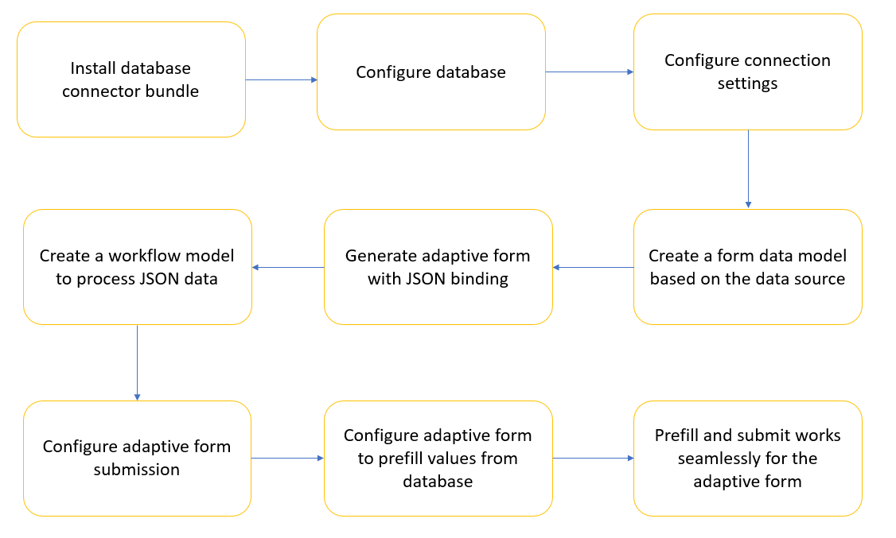

# 使用 AEM 工作流实现自适应表单与数据库集成 {#submit-forms-to-database-using-forms-portal}

自动表单转换服务允许您将非交互式PDF表单、Acro表单或基于XFA的PDF表单转换为自适应表单。 在启动转换过程时，您可以选择生成带有或不带数据绑定的自适应表单。

如果选择生成不带数据绑定的自适应表单，则转换后可以将转换后的自适应表单与表单数据模型、XML架构或JSON架构集成。 对于表单数据模型，您需要手动将自适应表单字段与表单数据模型绑定。 但是，如果生成具有数据绑定的自适应表单，则转换服务会自动将自适应表单与JSON架构关联，并在自适应表单和JSON架构中可用的字段之间创建数据绑定。 然后，您可以将自适应表单与您选择的数据库集成，在表单中填写数据，并将其提交到数据库。 同样，成功与数据库集成后，您可以配置转换的自适应表单中的字段，以从数据库检索值并预填自适应表单字段。

下图描述了将转换的自适应表单与数据库集成的不同阶段：



本文描述了成功执行所有这些集成阶段的分步说明。

## Pre-requisites {#pre-requisites}

* 设置AEM 6.4或6.5作者实例
* 为您 [的AEM实例安装最](https://helpx.adobe.com/experience-manager/aem-releases-updates.html) 新的Service Pack
* AEM Forms加载项包的最新版本
* Configure [Automated Forms Conversion service](configure-service.md)
* 设置数据库。 示例实现中使用的数据库是MySQL 5.6.24。但是，您可以将转换后的自适应表单与您选择的任何数据库集成。

## 范例自适应表单 {#sample-adaptive-form}

要执行用例以使用AEM工作流将转换的自适应表单与数据库集成，请下载以下范例PDF文件。

您可以使用以下方式下载示例联系我们表单：

[获取文件](assets/sample_contact_us_form.pdf)

PDF文件用作“自动表单转换”服务的输入。 该服务将此文件转换为自适应表单。 下图以PDF格式描述了联系我们表单的示例。


## 安装mysql-connector-java-5.1.39-bin.jar文件 {#install-mysql-connector-java-file}

对所有作者实例和发布实例执行以下步骤以安装mysql-connector-java-5.1.39-bin.jar文件：

1. 导航到 `http://server:port/system/console/depfinder` com.mysql.jdbc包并搜索。
1. 在“导出依据”列中，检查包是否由任何包导出。 如果包未由任何包导出，请继续。
1. 导航到并 `http://server:port/system/console/bundles` 单击 **[!UICONTROL Install/Update]**。
1. 单 **[!UICONTROL Choose File]** 击并浏览以选择mysql-connector-java-5.1.39-bin.jar文件。 此外，选择 **[!UICONTROL Start Bundle]** 和复 **[!UICONTROL Refresh Packages]** 选框。
1. 单击 **[!UICONTROL Install]** 或 **[!UICONTROL Update]**。 完成后，重新启动服务器。
1. （仅限Windows）关闭操作系统的系统防火墙。

## 为表单模型准备数据 {#prepare-data-for-form-model}

AEM Forms Data Integration允许您配置并连接到不同的数据源。 在使用转换过程生成自适应表单后，您可以基于表单数据模型、XSD或JSON架构定义表单模型。 您可以使用数据库、Microsoft Dynamics或任何其他第三方服务创建表单数据模型。

本教程使用MySQL数据库作为源创建表单数据模型。 在数据库中创建一个架构，并根 **据自适应表单中可用的字段** ，将联系人表添加到该架构。


可以使用以下DDL语句在数据库中创 **建** “联系人”表。

```sql
CREATE TABLE `contactus` (
   `name` varchar(45) NOT NULL,
   `email` varchar(45) NOT NULL,
   `phonenumber` varchar(10) DEFAULT NULL,
   `issuedesc` varchar(1000) DEFAULT NULL,
   PRIMARY KEY (`email`)
 ) ENGINE=InnoDB DEFAULT CHARSET=utf8
```

## 配置AEM实例与数据库之间的连接 {#configure-connection-between-aem-instance-and-database}

执行以下配置步骤以在AEM实例与MYSQL数据库之间创建连接：

1. 转到AEM Web Console配置页，网址为 `http://server:port/system/console/configMgr`。
1. 查找并单击以在Web控 **[!UICONTROL Apache Sling Connection Pooled DataSource]** 制台配置的编辑模式下打开。 如下表所述，指定属性的值：

   <table> 
    <tbody> 
    <tr> 
    <th><strong>属性</strong></th> 
    <th><strong>值</strong></th> 
    </tr> 
    <tr> 
    <td><p>数据源名称</p></td> 
    <td><p>用于从数据源池过滤驱动程序的数据源名称。</p></td>
    </tr>
    <tr> 
    <td><p>JDBC驱动程序类</p></td> 
    <td><p>com.mysql.jdbc.Driver</p></td>
    </tr>
    <tr> 
    <td><p>JDBC连接URI</p></td> 
    <td><p>jdbc:mysql://[主机]:[端口]/[schema_name]</p></td>
    </tr>
    <tr> 
    <td><p>用户名</p></td> 
    <td><p>对数据库表进行身份验证和执行操作的用户名</p></td>
    </tr>
    <tr> 
    <td><p>密码</p></td> 
    <td><p>与用户名关联的口令</p></td>
    </tr>
    <tr> 
    <td><p>事务隔离</p></td> 
    <td><p>READ_COMMITTED</p></td>
    </tr>
    <tr> 
    <td><p>最大活动连接数</p></td> 
    <td><p>1000</p></td>
    </tr>
    <tr> 
    <td><p>最大空闲连接数</p></td> 
    <td><p>100</p></td>
    </tr>
    <tr> 
    <td><p>最小空闲连接数</p></td> 
    <td><p>10</p></td>
    </tr>
    <tr> 
    <td><p>初始大小</p></td> 
    <td><p>10</p></td>
    </tr>
    <tr> 
    <td><p>最大等待</p></td> 
    <td><p>100000</p></td>
    </tr>
     <tr> 
    <td><p>借阅测试</p></td> 
    <td><p>已选中</p></td>
    </tr>
     <tr> 
    <td><p>空闲时测试</p></td> 
    <td><p>已选中</p></td>
    </tr>
     <tr> 
    <td><p>验证查询</p></td> 
    <td><p>示例值为SELECT 1(mysql)、从dual(oracle)中选择1、SELECT 1(MS Sql Server)(validationQuery)</p></td>
    </tr>
     <tr> 
    <td><p>验证查询超时</p></td> 
    <td><p>10000</p></td>
    </tr>
    </tbody> 
    </table>

## Create form data model {#create-form-data-model}

将MYSQL配置为数据源后，请执行以下步骤以创建表单数据模型：

1. 在AEM作者实例中，导航到 **[!UICONTROL Forms]** > **[!UICONTROL Data Integrations]**。

1. 点按 **[!UICONTROL Create]** > **[!UICONTROL Form Data Model]**.

1. 在向 **[!UICONTROL Create Form Data Model]** 导中，指 **定workflow_submit** 作为表单数据模型的名称。 点按 **[!UICONTROL Next]**.

1. 选择您在上一节中配置的MYSQL数据源，然后点按 **[!UICONTROL Create]**。

1. 点 **[!UICONTROL Edit]** 按并展开左窗格中列出的数据源，以选择 **联系人** 、表、 **[!UICONTROL get]**&#x200B;和 **[!UICONTROL insert]** 服务，然后点按 **[!UICONTROL Add Selected]**。

   

1. 在右侧窗格中选择数据模型对象，然后点按 **[!UICONTROL Edit Properties]**。 从 **[!UICONTROL get]** 和下 **[!UICONTROL insert]** 拉列 **[!UICONTROL Read Service]** 表中进 **[!UICONTROL Write Service]** 行选择。 指定读取服务的参数，然后点按 **[!UICONTROL Done]**。

1. 在选项 **[!UICONTROL Services]** 卡中，选择服务 **[!UICONTROL get]** 并点按 **[!UICONTROL Edit Properties]**。 选择 **[!UICONTROL Output Model Object]**、禁用切 **[!UICONTROL Return array]** 换和点按 **[!UICONTROL Done]**。

1. 选择服 **[!UICONTROL Insert]** 务并点按 **[!UICONTROL Edit Properties]**。 选择并 **[!UICONTROL Input Model Object]** 点按 **[!UICONTROL Done]**。

1. 点按 **[!UICONTROL Save]** 以保存表单数据模型。

您可以使用以下方式下载示例表单数据模型：

[获取文件](assets/DownloadedFormsPackage_1497728018502500.zip)

## 生成具有JSON绑定的自适应表单 {#generate-adaptive-forms-with-json-binding}

使用“自 [动表单转换”服务将“联系我](convert-existing-forms-to-adaptive-forms.md) 们”表单转换为具有数据绑定的自适应表单 [](#sample-adaptive-form) 。 确保在生成自适应表单时 **[!UICONTROL Generate adaptive form(s) without data bindings]** 不选中该复选框。


选择文件夹中 **的已转换的“联系我们** ”表单 **[!UICONTROL output]** ，然后点 **[!UICONTROL Forms & Documents]** 按 **[!UICONTROL Edit]**。 点 **[!UICONTROL Preview]**&#x200B;按，在自适应表单字段中输入值并点按 **[!UICONTROL Submit]**。

登录到 **crx-repository** ，然后导航到 */content/forms/fp/admin/submit/data* ，以JSON格式查看提交的值。 以下是提交转换后的联系我们自适应表单时JSON格式 **的示例数** 据：

```json
{
  "afData": {
    "afUnboundData": {
      "data": {}
    },
    "afBoundData": {
      "data": {
        "name1": "Gloria",
        "email": "abc@xyz.com",
        "phone_number": "2346578965",
        "issue_description": "Test message"
      }
    },
    "afSubmissionInfo": {
      "computedMetaInfo": {},
      "stateOverrides": {},
      "signers": {},
      "afPath": "/content/dam/formsanddocuments/docs_conversion/output/sample_form_json",
      "afSubmissionTime": "20191204014007"
    }
  }
}
```

您现在需要创建一个工作流模型，以便处理此数据并使用您在前几节中创建的表单数据模型将其提交到MYSQL数据库。

## 创建用于处理JSON数据的工作流模型 {#create-workflow-model}

执行以下步骤以创建工作流模型以将自适应表单数据提交到数据库：

1. 打开“工作流模型”控制台。 默认URL为 `https://server:port/libs/cq/workflow/admin/console/content/models.html/etc/workflow/models`。

1. 然 **[!UICONTROL Create]**&#x200B;后选择 **[!UICONTROL Create Model]**。 将出 **[!UICONTROL Add Workflow Model]** 现对话框。

1. 输入和 **[!UICONTROL Title]** ( **[!UICONTROL Name]** 可选)。 例如， **workflow_json_submit**。 点 **[!UICONTROL Done]** 按以创建模型。

1. 选择工作流模型，然后点 **[!UICONTROL Edit]** 按以在编辑模式下打开模型。 点按+并向工 **[!UICONTROL Invoke Form Data Model Service]** 作流模型添加步骤。

1. 点按该 **[!UICONTROL Invoke Form Data Model Service]** 步骤并点按 。

1. 在选 **[!UICONTROL Form Data Model]** 项卡中，选择您在字段中创建的表单数据模型， **[!UICONTROL Form Data Model path]** 然后从下 **[!UICONTROL insert]** 拉列表 **[!UICONTROL Service]** 中进行选择。

1. 在选 **[!UICONTROL Input for Service]** 项卡中，从 **[!UICONTROL Provide input data using literal, variable, or a workflow metadata, and a JSON file]** 下拉列表中选择，选 **[!UICONTROL Map input fields from input JSON]** 中复选框，选 **[!UICONTROL Relative to payload]**&#x200B;择并提供 **data.xml** 作为字段的 **[!UICONTROL Select input JSON document using]** 值。

1. 在部 **[!UICONTROL Service Arguments]** 分中，为表单数据模型参数提供以下值：

   

   请注意，表单数据模型字段（例如，contactus点名）已映射到 **afData.afBoundData.data.name1**，它引用已提交自适应表单的JSON架构绑定。

## 配置自适应表单提交 {#configure-adaptive-form-submission}

执行以下步骤，将自适应表单提交到您在上一节中创建的工作流模型：

1. 在中的文件夹中选择已转换的“联系我们” **[!UICONTROL output]** 表单，然 **[!UICONTROL Forms & Documents]** 后点按 **[!UICONTROL Edit]**。

1. 点按并点按配置，打开自 **[!UICONTROL Form Container]** 适应表单 。

1. 在部 **[!UICONTROL Submission]** 分中，从 **[!UICONTROL Invoke an AEM workflow]** 下拉列 **[!UICONTROL Submit Action]** 表中进行选择，选择您在上一部分中创建的工作流模型，然后在字段 **中指定data.xml****[!UICONTROL Data File Path]** 。

1. 点按  ，以保存属性。

1. 点 **[!UICONTROL Preview]**&#x200B;按，在自适应表单字段中输入值并点按 **[!UICONTROL Submit]**。 提交的值现在显示在MYSQL数据库表中，而不 **是crx-repository**。

## 将自适应表单配置为从数据库预填值

执行以下步骤，根据表中定义的主键（本例中为“电子邮件”）配置自适应表单以从MYSQL数据库预填值：

1. 点按自 **适应表单中的** “电子邮件”字段，然后点按编 。

1. 点 **[!UICONTROL Create]** 按并 **[!UICONTROL is changed]** 从部分 **[!UICONTROL Select State]** 的下拉列表中进行选 **[!UICONTROL When]** 择。

1. 在部 **[!UICONTROL Then]** 分中，选 **[!UICONTROL Invoke Service]** 择 **** 并获取您在本文上一节中创建的表单数据模型的服务。

1. 在表 **单数据模型的** 一节和其余三个字段中选择电子邮件 **[!UICONTROL Input]** 、名称 **、电话号**&#x200B;码 **********[!UICONTROL Output]** 、Oracle Phone Issue Description（在Oracle Section中E-mail）。 点 **[!UICONTROL Done]** 按以保存设置。

   

   因此，根据MYSQL数据库中现有的电子邮件条目，您可以在自适应表单模式中预填充其余三个字 **[!UICONTROL Preview]** 段的值。 例如，如果在 **E-mail字段中指定aya.tan@xyz.com** （根据本文的“准备表单数据”部分中的现有数据）并从字段中跳出，则其余三个字段、 [Name](#prepare-data-for-form-model) 、 ************ Phone NumberAdtalis、和自适应表单中自动显示“自适应表单”中的“签名说明”。

您可以使用以下方式下载转换的自适应表单示例：

[获取文件](assets/DownloadedFormsPackage_1498226829041200.zip)
