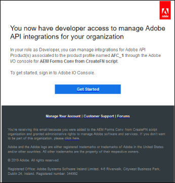
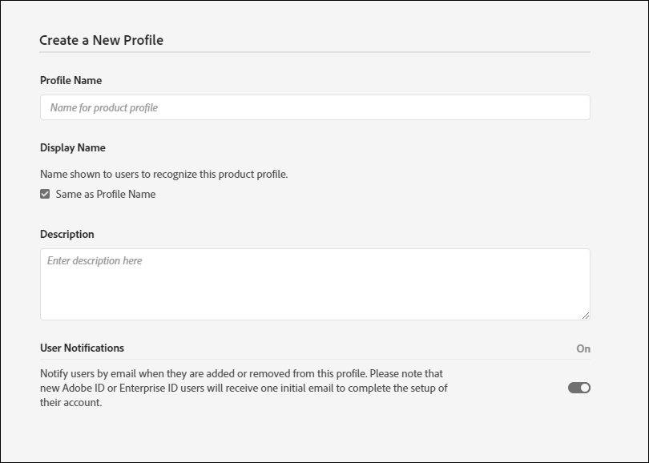

# 配置自动化表单转换服务(AFCS) {#about-this-help}

本文介绍了AEM管理员如何配置自动表单转换服务(AFCS)，以自动将其PDF forms转换为自适应Forms。 本文适用于贵组织的IT和AEM管理员。 所提供的信息基于这样一种假设，即阅读本文的任何人都熟悉以下技术：

* 安装、配置和管理Adobe Experience Manager和AEM软件包，

* 使用Linux®和Microsoft® Windows®操作系统，

<!--- >[!VIDEO](https://video.tv.adobe.com/v/29267/) 

**Watch the video or read the article to configure Automated Forms Conversion service (AFCS)** -->

## 入门培训{#onboarding}

AEM 6.5 Forms本地部署客户和Adobe托管服务企业客户可免费使用此服务。 您可以联系Adobe销售团队或Adobe代表，请求访问服务。 AEM Forms as a Cloud Service客户还可以免费使用并预启用该服务。

Adobe 可为您的组织开启访问渠道，并为您指定为组织中管理员的人员提供所需的权限。管理员可以向贵组织的AEM Forms开发人员（用户）授予权限以连接到该服务。

## 先决条件 {#prerequisites}

您需要以下各项才能使用自动化表单转换服务(AFCS)：

* 为您的组织启用了自动化表单转换服务(AFCS)
* 具有转换服务管理员权限的Adobe ID帐户
* 已启动并运行的AEM 6.5(包含最新的AEM Service Pack)或AEM Forms as a Cloud Service创作实例（包含最新的更新）。
* 作为forms-user组成员的AEM用户(在您的AEM实例上)

## 设置环境 {#setuptheservice}

在使用服务之前，请准备AEM创作实例以连接到Adobe Cloud上运行的服务。 按照列出的顺序执行以下步骤，为服务准备实例：

1. [下载并安装AEM 6.5或板载AEM Forms as a Cloud Service](#aemquickstart)
1. [(仅适用于AEM 6.5)下载并安装最新的AEM Service Pack](#servicepack)
1. [(仅适用于AEM 6.5)下载并安装最新的AEM Forms附加组件包](#downloadaemformsaddon)
1. [创建自定义主题和模板](#referencepackage)

### 1.下载并安装AEM 6.5或板载AEM Forms as a Cloud Service {#aemquickstart}


自动表单转换服务(AFCS)在AEM创作实例上运行。 您需要AEM 6.5或AEM Forms as a Cloud Service才能设置AEM创作实例。

* 如果您未启动并运行AEM 6.5，请从以下位置下载它。 下载AEM后，有关设置AEM创作实例的说明，请参阅[部署和维护](https://helpx.adobe.com/experience-manager/6-5/sites/deploying/using/deploy.html#defaultlocalinstall)：

   * 如果您是AEM现有客户，请从[AEM授权网站](http://licensing.adobe.com)下载Adobe 6.5。

   * 如果您是Adobe合作伙伴，请使用[Adobe合作伙伴培训计划](https://adobe.allegiancetech.com/cgi-bin/qwebcorporate.dll?idx=82357Q)请求AEM 6.5。

* 如果您使用的是AEM Forms as a Cloud Service，请参阅载入[AEM Forms as a Cloud Service](https://experienceleague.adobe.com/docs/experience-manager-forms-cloud-service/forms/setup-environment/setup-forms-cloud-service.html?lang=en#setup-environment)和[设置本地开发环境](https://experienceleague.adobe.com/docs/experience-manager-forms-cloud-service/forms/setup-environment/setup-local-development-environment.html?lang=en#setup-environment)。

### 2. (仅适用于AEM 6.5)下载并安装AEM最新的服务包 {#servicepack}

下载并安装最新的AEM Service Pack。 有关详细说明，请参阅[AEM 6.5 Service Pack发行说明](https://experienceleague.adobe.com/zh-hans/docs/experience-manager-65/content/release-notes/release-notes)。

### 3. (仅适用于AEM 6.5)下载并安装AEM Forms附加组件包  {#downloadaemformsaddon}

AEM实例包含基本表单功能。 转换服务需要AEM Forms的完整功能。 下载并安装AEM Forms附加组件包以使用AEM Forms的所有功能。 必须使用该包才能设置和运行转换服务。 有关详细说明，请参阅[安装和配置数据捕获功能。](https://experienceleague.adobe.com/en/docs/experience-manager-65/content/forms/install-aem-forms/osgi-installation/installing-configuring-aem-forms-osgi)
https://adminconsole.adobe.com/
>[!NOTE]
> 请确保在安装附加组件包后执行强制安装后配置。
>

<!-- ### (Optional) Download and install connector package  {#installConnectorPackage}

The connector package provides early access to the [Auto-detect logical sections](convert-existing-forms-to-adaptive-forms.md#run-the-conversion) features and improvements delivered in release AFC-2020.03.1. Do not install the package if you do not require feature and improvements delivered in AFC-2020.03.1.  You can [download the connector package from AEM Package Share](https://www.adobeaemcloud.com/content/marketplace/marketplaceProxy.html?packagePath=/content/companies/public/adobe/packages/cq650/featurepack/AFCS-Connector-2020.03.1). -->


### 4.创建自定义主题和模板 {#referencepackage}

参考包包含示例主题和模板。 自动表单转换服务(AFCS)需要至少一个主题和一个模板才能将PDF表单转换为自适应表单。 创建您自己的自定义主题和模板，并指向[服务配置](#configure-the-cloud-service)，以便在使用服务之前使用自定义模板和主题。

您还可以在创作实例上下载并安装[AEM Forms引用Assets](https://experience.adobe.com/#/downloads/content/software-distribution/en/aemcloud.html)包。 创建一些参考主题和模板。

## 配置访问和权限

在继续配置服务并将实例连接到Adobe Cloud上运行的服务之前，请了解连接到服务所需的角色和权限。 该服务使用两种不同类型的角色：管理员和开发人员：

* **管理员**：管理员负责为其组织管理Adobe软件和服务。 管理员向组织中的开发人员授予访问权限，以便连接到在Adobe Cloud上运行的自动表单转换服务(AFCS)。 为组织配置管理员后，管理员会收到标题为&#x200B;**[!UICONTROL 'You now have administrator rights to manage Adobe software and services for your organization']**&#x200B;的电子邮件。 如果您是管理员，请检查您的邮箱中是否有具有上述标题的电子邮件，然后继续[向组织的开发人员授予访问权限](#adduseranddevs)。


* **开发人员**：开发人员将AEM Forms创作实例连接到Adobe Cloud上运行的自动表单转换服务(AFCS)。 当管理员向开发人员授予连接到Automated Forms Conversion Service (AFCS)的权限时，会向开发人员发送一封电子邮件，其标题为“您现在拥有用于管理组织的Adobe API集成的开发人员访问权限”。 如果您是开发人员，请检查您的邮箱中是否有包含前述标题的电子邮件，然后继续[将您的本地AEM实例连接到Adobe Cloud上的自动表单转换服务。](#connectafcadobeio)



### 向组织的开发人员授予访问权限

在Adobe为您的组织启用访问权限并向管理员提供所需权限后，管理员可以登录Admin Console（下面的详细说明）、创建配置文件并将开发人员添加到配置文件中。 开发人员可以将AEM Forms的一个实例连接到Adobe Cloud上的自动表单转换服务(AFCS)。

开发人员是您指定用于运行转换服务的组织的成员。 只有添加到Adobe自动表单转换服务(AFCS)配置文件的那些开发人员才有权使用自动表单转换服务(AFCS)。
执行以下步骤可创建配置文件并向其中添加开发人员。 至少需要一个配置文件来向组织的开发人员授予所需的访问权限：

1. 登录到[Admin Console](https://adminconsole.adobe.com/)。 使用配置为使用自动表单转换服务(AFCS)的管理员的&#x200B;**Adobe ID**&#x200B;登录。
1. 单击&#x200B;**[!UICONTROL Automated Forms Conversion]**&#x200B;选项。
1. 在&#x200B;**[!UICONTROL Products]**&#x200B;选项卡中单击&#x200B;**[!UICONTROL New Profile]**。
1. 为配置文件指定&#x200B;**[!UICONTROL Name]**、**[!UICONTROL Display Name]**&#x200B;和&#x200B;**[!UICONTROL Description]**。 单击 **[!UICONTROL Done]**. 例如，将配置文件创建为&#x200B;**AFC_Flamingo_Test_Dev**。

   

1. 将开发人员添加到配置文件。 要添加开发人员，请执行以下操作：
   1. 在[Admin Console](https://adminconsole.adobe.com/enterprise)中，导航到“概述”选项卡。
   1. 单击所需产品卡上的&#x200B;**[!UICONTROL Assign Developers]**。
   1. 输入开发人员的电子邮件地址，以及（可选）名字和姓氏。
   1. 选择产品配置文件。 单击&#x200B;**[!UICONTROL Save]**。

对所有用户重复上述步骤。 有关添加开发人员的更多详细信息，请参阅[管理开发人员](https://helpx.adobe.com/enterprise/using/manage-developers.html)。

管理员将开发人员添加到Adobe I/O配置文件后，会通过电子邮件通知开发人员（如果已配置）。

<!--
### Configure email notification for local AEM Forms instance

Automated Forms Conversion service (AFCS) uses the Day CQ mail service to send email notifications. These email notifications contain information about successful or failed conversions. If you choose not receive notification, skip these steps. Perform the following steps to configure the Day CQ Mail Service:

* **For AEM 6.5 Forms**:

   1. Go to AEM configuration manager at `http://[server]:[port]/system/console/configMgr`
   2. Open the Day CQ Mail Service configuration. Specify a value for the **[!UICONTROL SMTP server host name]**, **[!UICONTROL SMTP server port]**, and **[!UICONTROL From address]** fields. Click **[!UICONTROL Save]**.

      You can contact your email service provider or IT administrator for information about host name and port of SMTP server. You can use any valid email address in the from field. For example, notification@example.com or donotreply@example.com.

   3. Open the **[!UICONTROL Day CQ Link Externalizer]** configuration. In the **[!UICONTROL Domains]** field, specify the actual host name or IP address and port number for local, author, and publish instances. Click **[!UICONTROL Save]**.

* For AEM Forms as a Cloud Service, [log a support ticket to enable the email service](https://experienceleague.adobe.com/docs/experience-manager-cloud-service/implementing/developing/development-guidelines.html?lang=en#sending-email). -->

### 将用户添加到表单 — 用户组 {#adduserstousergroup}

在指定用于运行服务的AEM用户的配置文件中指定电子邮件地址。 确保用户是&#x200B;**forms-users**&#x200B;组的成员。 电子邮件会发送到运行转换的用户的电子邮件地址。 要指定用户的电子邮件地址并将用户添加到表单用户组，请执行以下操作：

1. 以AEM Forms管理员身份登录到您的AEM创作实例。 使用本地AEM凭据登录。
1. 单击&#x200B;**[!UICONTROL Adobe Experience Manager]** > **[!UICONTROL Tools]** > **[!UICONTROL Security]** > **[!UICONTROL Users]**。
1. 选择指定用于运行转换服务的用户，然后单击&#x200B;**[!UICONTROL Properties]**。 将打开&#x200B;**编辑用户设置**&#x200B;页。
1. 在&#x200B;**[!UICONTROL Email]**&#x200B;字段中指定电子邮件地址，然后单击&#x200B;**[!UICONTROL Save]**。 成功完成或失败转换时，会将电子邮件发送到指定的电子邮件地址。

   
1. 单击&#x200B;**组**&#x200B;选项卡。 在“选择组”选项卡中，键入并选择&#x200B;**表单 — 用户**&#x200B;组。
1. 单击&#x200B;**保存并关闭**。 该用户现在是forms-users组的成员。

   

## 将您的AEM Forms实例连接到Adobe Cloud上的自动表单转换服务(AFCS)

管理员为您提供开发人员访问权限后，您可以将AEM Forms实例连接到Adobe Cloud上运行的自动表单转换服务(AFCS)。
执行以下步骤，将AEM Forms实例连接到Automated Forms Conversion服务：

[1.在Adobe Developer Console上配置服务API](#configure-the-service-apis-on-adobe-developer-console)

[2.创建Adobe IMS配置](#2-create-adobe-ims-configurations)

[3.创建自动化表单转换配置](#3-create-automated-forms-conversion-configuration)

### 1.在Adobe Developer Console上配置服务API

要使用自动表单转换服务(AFCS)，请创建一个项目并将&#x200B;**自动Forms配置服务** API添加到Adobe Developer Console上的项目中。 集成会生成API密钥、客户端密钥、技术帐户ID、范围和组织ID。
要在Adobe Developer Console上配置自动表单转换服务API，请执行以下步骤：

1. 登录到https://developer.adobe.com/console 。 使用管理员为登录Adobe I/O控制台而配置的Adobe ID开发人员帐户进行登录。
1. 从右上角选择您的组织。 如果您不了解您的组织，请与管理员联系。
1. 单击 **[!UICONTROL Create new project]**. 此时将显示一个新项目开始使用的屏幕。

   

1. 单击 **[!UICONTROL Add API]**. 此时将显示一个屏幕，其中包含为您的帐户启用的所有API的列表。
   

1. 选择&#x200B;**[!UICONTROL Automated Forms Conversion service]**&#x200B;并单击&#x200B;**[!UICONTROL Next]**。 出现用于配置API的屏幕。
   

1. 选择&#x200B;**OAuth服务器到服务器**&#x200B;身份验证方法。
1. 指定&#x200B;**[!UICONTROL Credential Name]**&#x200B;并单击&#x200B;**[!UICONTROL Next]**。
   
1. 选择&#x200B;**产品配置文件**。 例如，选择一个配置文件作为&#x200B;**AFC_Flamingo_Test_Dev**。
1. 单击 **[!UICONTROL Save configured API]**。
   

   >[!NOTE]
   >
   > 选择向组织的开发人员授予访问权限时创建的配置文件。 如果您不知道要选择的配置文件，请联系您的管理员。

1. 单击&#x200B;**[!UICONTROL OAuth Server-to-Server]**可查看将AEM实例连接到自动表单转换服务(AFCS)所需的API密钥、客户端密钥和其他信息。
   

   页面上的信息用于创建IMS配置，如[在AEM创作实例上创建IMS技术配置](#2-create-ims-technical-configuration-on-aem-author-instance)部分中所述。

   

### 2.创建Adobe IMS配置

登录到您的创作实例以创建Adobe IMS配置。 使用&#x200B;**OAuth凭据详细信息**&#x200B;检索API密钥、客户端密钥、技术帐户ID、范围和组织ID。

1. 登录到您的AEM Forms创作实例。 导航到&#x200B;**[!UICONTROL Tools]**> **[!UICONTROL Security]** > **[!UICONTROL Adobe IMS Configurations]**。
1. 单击 **[!UICONTROL Create]**。

   

1. 此时会显示&#x200B;**[!UICONTROL Adobe IMS Technical Account Configuration]**&#x200B;页面。

   
1. 在&#x200B;**云解决方案**&#x200B;中选择&#x200B;**[!UICONTROL Automated Forms Conversion Service]**。
1. 指定以下内容：

   * **标题**：指定标题。
   * **授权服务器**： [https://ims-na1.adobelogin.com](https://ims-na1.adobelogin.com)
   * 从[在Adobe Developer Console](#1-configure-the-service-apis-on-adobe-developer-console)上配置服务API部分中检索以下内容：
      * **客户端ID**：复制并粘贴&#x200B;**API密钥（客户端ID）**。
      * **客户端密码**：复制并粘贴&#x200B;**客户端密码**。
      * **范围**：复制并粘贴&#x200B;**范围**。
      * **组织ID**：复制并粘贴&#x200B;**技术帐户ID**。

     

1. 单击 **[!UICONTROL Save]**. 将创建Adobe IMS配置。

   >[!CAUTION]
   >
   > 仅创建一个IMS配置。 请勿创建多个IMS配置。

1. 选择&#x200B;**Adobe IMS配置**&#x200B;并单击&#x200B;**[!UICONTROL Check Health]**。 将显示一个对话框。
   

   出现&#x200B;**检查**&#x200B;对话框。

1. 单击 **[!UICONTROL Check]**。

   

   成功连接时，将显示&#x200B;*已成功检索令牌*&#x200B;消息。

   

1. 单击&#x200B;**关闭**。

### 3.创建自动化表单转换配置

创建自动表单转换配置以将您的AEM实例连接到转换服务。 它还允许您为转换指定模板、主题和表单片段。 您可以为每组表单分别创建多个云服务配置。
例如，您可以对销售部门表单进行单独配置，为客户支持表单进行单独配置。 执行以下步骤可创建Cloud Service配置：

1. 在您的AEM Forms实例上，单击&#x200B;**[!UICONTROL Adobe Experience Manager]** > **[!UICONTROL Tools]**> **[!UICONTROL Cloud Services]** > **[!UICONTROL Automate Forms Conversion Configuration]**。
1. 选择&#x200B;**[!UICONTROL Global]**&#x200B;文件夹并单击&#x200B;**[!UICONTROL Create]**。
显示**创建自动表单转换配置**&#x200B;页面。 该配置在&#x200B;**Global**文件夹中创建。 您还可以在现有的其他文件夹中创建配置，或者为您的配置创建一个文件夹。
   
1. 在&#x200B;**[!UICONTROL Create Automated Forms Conversion Configuration]**&#x200B;页面上，为以下字段指定值并单击&#x200B;**[!UICONTROL Next]**。

   

   | 字段 | 描述 |
   |--- |--- |
   | 标题 | 配置的唯一标题。 标题显示在用于开始转换的UI中。 |
   | 名称 | 配置的唯一名称。 该配置将以指定名称保存在CRX-Repository中。 名称可以和标题相同。 |
   | 缩略图位置 | 配置的缩略图位置。 |
   | 服务 URL | Adobe Cloud上自动表单转换服务(AFCS)的URL。 使用`https://aemformsconversion.adobe.io/` URL。 |
   | 模板 | 应用于已转换表单的默认模板。 在开始转换之前，您始终可以指定其他模板。 模板包含自适应表单的基本结构和初始内容。 您可以从提供的现成模板中选择模板。 您还可以创建自定义模板。 |
   | 主题 | 应用于转换表单的默认主题。 在开始转换之前，您始终可以指定不同的主题。  您可以单击图标以选择提供的现成主题。 您还可以创建自定义主题。 |
   | 现有片段 | 现有片段的位置（如果有）。 |
   | 自定义元模型 | 自定义元模型的.schema.json文件的路径。 您可以为英语、法语、德语、西班牙语、意大利语和葡萄牙语创建单独的元模型。 |

1. 在&#x200B;**[!UICONTROL Create Automated Forms Conversion Configuration]**&#x200B;页的&#x200B;**[!UICONTROL Advanced]**选项卡中，为以下字段指定值：
   

   <table>
   <thead>
   <tr>
   <th>字段</th>
   <th>描述</th>
   </tr>
   </thead>
   <tbody>
   <tr>
   <td >生成记录文档</td>
   <td>选择选项以自动生成已转换表单的记录文档。 该选项仅适用于基于XFA的表单(XDP和PDF forms)。 启用该选项后，在提交表单后，您可以允许客户以打印或文档格式保留他们在表单中填写的信息记录，以供将来参考。 这称为记录文档。</td>
   </tr>
   <tr>
   <td>启用 Analytics</td>
   <td>(对于AEM 6.5)选择选项，以在所有已转换的表单上启用Adobe Analytics。 在使用选项之前，请确保为您的AEM Forms实例启用了Adobe Analytics。</td>
   </tr>
   </tbody>
   </table>

   * 如果源是扩展名为.XDP的基于XFA的表单，则输出DOR保留XFA布局，否则转换服务使用现成的模板为其他基于XFA的表单生成DOR。
   * 在提交XFA表单时，表单的提交数据将另存为XML元素或属性。 例如，`<Amount currency="USD"> 10.00 </Amount>`。货币另存为属性和货币金额，10.00另存为元素。 自适应表单的提交数据没有属性，只有元素。 因此，当基于XFA的表单转换为自适应表单时，自适应表单提交数据将包含每个此类属性的元素。 例如，

   ```css
      {
         "Type": "Principal",
   
         "Amount": "10.00",
   
         "currency": "USD"
      }
   ```

1. 单击 **[!UICONTROL Create]**. 将创建云配置。您的AEM Forms实例已准备好开始将旧版表单转换为自适应Forms。
