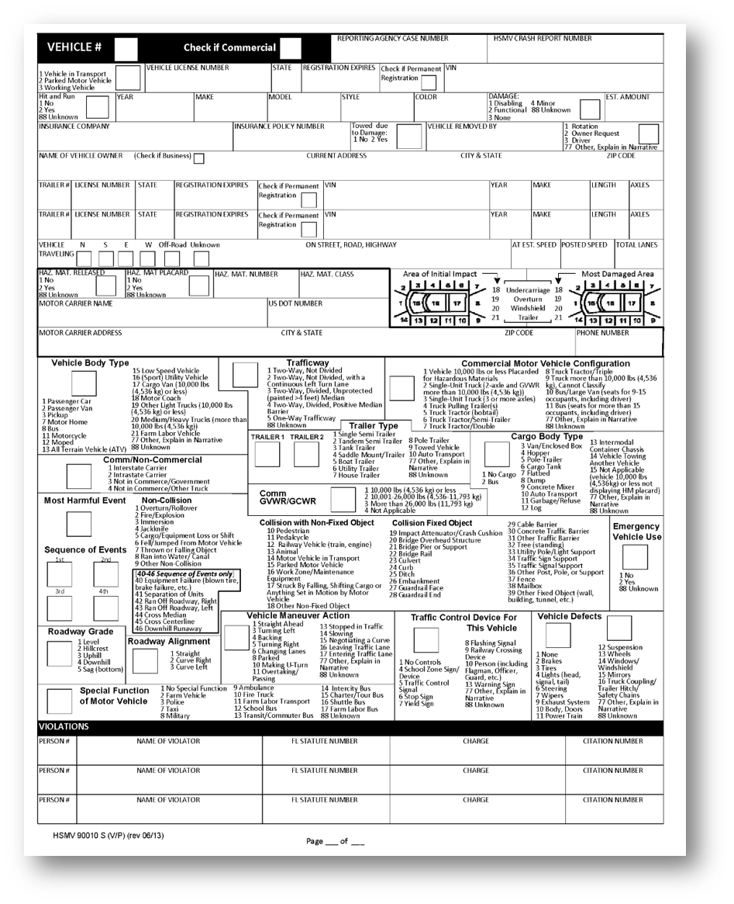
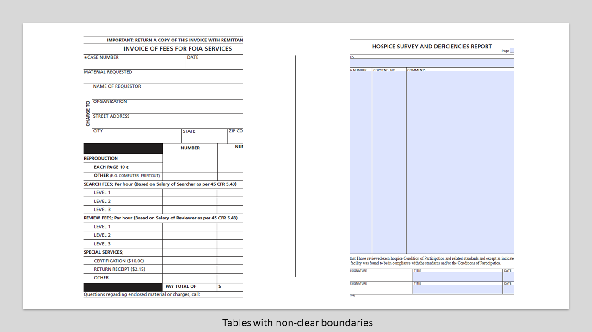

# 最佳实践和注意事项 {#do-not-publish-best-practices-and-considerations}

<!--
[DO NOT PUBLISH]
-->

AEM Forms Automated Conversion服务可将PDF表单转换为自适应表单。 该服务使用人工智能和机器学习算法来了解源表单的布局和字段。 每个机器学习服务都不断从源数据中学习，并在每次流失时产生改进的输出。 这些服务就像人类一样，从经验中学习。

automated forms conversion服务需要通过大量表单进行培训。 它可轻松识别源表单中的字段并生成自适应表单。 然而，PDF forms中有些领域和风格是肉眼容易看到，但服务却难以理解的。 此服务可以为某些字段或样式分配与适用的字段类型或面板不同的字段或样式。 下面列出了所有此类字段和样式模式。

当该服务不断从源数据中学习时，它将开始为这些模式标识和分配正确的字段或面板。 目前，您可以使用 [查看并更正](review-correct-ui-edited.md) 编辑器以修复此类问题。 在开始修复问题或进一步阅读之前，请熟悉 [自适应表单组件](https://helpx.adobe.com/experience-manager/6-5/forms/using/introduction-forms-authoring.html).

## 常规 {#general}

<table border="1" cellpadding="1" cellspacing="0" style="border-collapse: separate; border-spacing: 0px;" width="100%"> 
 <tbody>
  <tr>
   <td width="30%">已知模式和分辨率</td> 
   <td width="70%">示例</td> 
  </tr>
   <td>
<strong>图案</strong>
 
服务无法将填写的PDF forms转换为自适应表单。
 
 
 
<strong>解决方法</strong>
 
使用空的自适应表单。
 </td> 
   <td style="text-align: left;"></td> 
  </tr>
  <tr>
   <td>
<strong>图案</strong>
 
服务可能无法识别密集表单中的文本和字段。
 
 
 
<strong>解决方法</strong>
 
在开始转换之前，增加密集表单的文本和字段之间的宽度。
 </td> 
   <td style="text-align: left;"></td> 
  </tr>
  <tr>
   <td>
<strong>图案</strong>
 
服务不支持扫描的表单。
 
 
 
<strong>解决方法</strong>
 
请勿使用扫描的表单。 
 </td> 
   <td></td> 
  </tr>
  <tr>
   <td>
<strong>图案</strong>
 
服务不提取图像中的图像和文本。 
 
 
 
<strong>解决方法</strong>
 
手动将图像或文本添加到转换后的表单。
 </td> 
   <td></td> 
  </tr>
  <tr>
   <td>
<strong>图案</strong>
 
带有点状或不透明边界和边界的表格不会进行转换。
 
<strong>解决方法</strong>
 
使用具有明确明确边界和边框的表。 受支持。
 </td> 
   <td></td> 
  </tr>
 </tbody>
</table>

## 选择组  {#choice-group}

<table border="1" cellpadding="1" cellspacing="0" width="100%"> 
 <tbody>
  <tr>
   <td width="30%">图案</td> 
   <td width="70%">示例</td> 
  </tr>
  <tr>
   <td>
<strong>图案</strong>
 
具有框或圆以外的形状的选择组选项不会转换为相应的自适应表单组件。 
 
 
 
<strong>解决方法</strong>
 
将选择选项形状更改为框或圆形，或者使用“审阅并更正”编辑器来标识形状。
 </td> 
   <td> </td> 
  </tr>
 </tbody>
</table>

## 表单字段 {#form-fields}

<table border="1" cellpadding="1" cellspacing="0" width="100%"> 
 <tbody>
  <tr>
   <td width="30%">图案</td> 
   <td width="70%">示例</td> 
  </tr>
  <tr>
   <td width="25%">
<strong>图案</strong>
 
服务无法识别没有明确边界的字段。
 
 
 
<strong>解决方法</strong>
 
使用“检查并更正”编辑器标识此类字段。
 
 
 
 
 </td> 
   <td width="50%">  </td> 
  </tr>
  <tr>
   <td>
<strong>图案</strong>
 
服务将某些表单字段的底部或右侧带有未识别的字幕。
 
 
 
<strong>解决方法</strong>
 
使用“检查并更正”编辑器标识此类字段
 </td> 
   <td>    </td> 
  </tr>
  <tr>
   <td>
<strong>图案</strong>
 
服务将错误类型合并或分配给某些表单字段，这些表单字段彼此非常接近或没有清晰的边框。 
 
 
 
<strong>解决方法</strong>
 
使用“检查并更正”编辑器标识此类字段。
 </td> 
   <td></td> 
  </tr>
  <tr>
   <td>
<strong>图案</strong>
 
服务可能无法识别带有遥远字幕的字段或字幕与输入字段之间的虚线。
 
 
 
<strong>解决方法</strong>
 
使用具有明确边界的表单字段或使用审阅和更正编辑器修复此类问题。
 </td> 
   <td></td> 
  </tr>
 </tbody>
</table>

## 列表 {#lists}

<table border="1" cellpadding="1" cellspacing="0" width="100%"> 
 <tbody>
  <tr>
   <td width="30%">图案</td> 
   <td width="70%">示例</td> 
  </tr>
  <tr>
   <td>
<strong>图案</strong>
 
包含表单字段的列表会合并或无法转换为相应的自适应表单组件
 
<strong>解决方法</strong>
 
使用具有明确边界的表单字段或使用审阅和更正编辑器修复此类问题。
 </td> 
   <td></td> 
  </tr>
  <tr>
   <td>
<strong>图案</strong>
 
服务可能会保留一些未识别的嵌套列表
 
 
 
<strong>解决方法</strong>
 
使用审阅和修正编辑器可修复此类问题。
 </td> 
   <td> </td> 
  </tr>
  <tr>
   <td>
<strong>图案</strong>
 
服务将一些包含选择组的列表相互合并
 
<strong>解决方法</strong>
 
使用审阅和修正编辑器可修复此类问题。
 </td> 
   <td> </td> 
  </tr>
 </tbody>
</table>

<!--
Comment Type: draft

<h3>Choice groups</h3>
-->

<!--
Comment Type: draft

<ul>
<li>Lists with form fields, nested lists, and nested choice groups are not supported.</li>
<li>Form fields with captions at bottom or right are not supported.</li>
<li>Form fiields without bordes are not supported.</li>
<li>Hidden form fields are not supported.</li>
<li>Button in PDF forms are not converted to adaptive form buttons.  </li>
<li>Tables with clear explicit boundaries and borders are supported.</li>
<li>Fields with far away captions are not supported.  </li>
<li>Choice groups with only box or circle shaped selectors are supported. </li>
</ul>
-->

