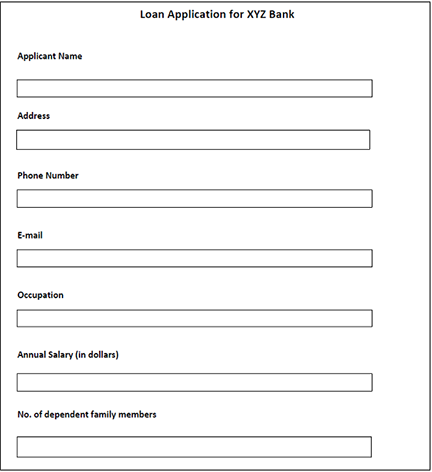
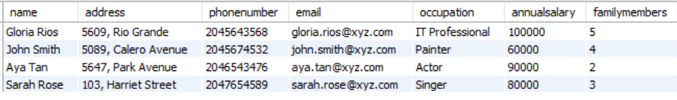
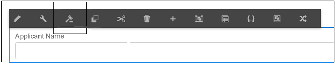
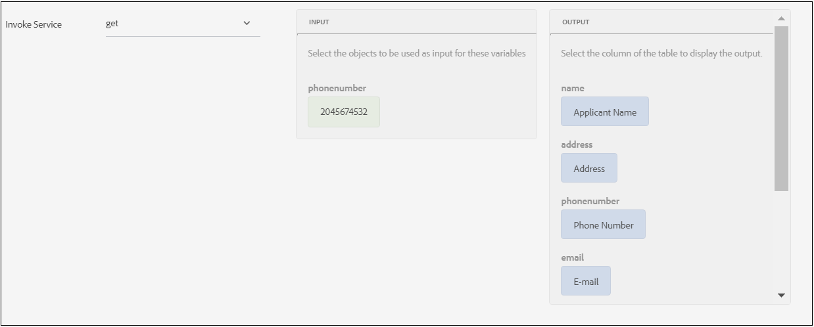

# 基于数据源的预填充和提交工作流建议（用于生成自适应表单） {#recommended-data-source-btased-prefill-and-submit-workflows-for-adaptive-forms}

您可以对通过Automated forms conversion服务转换的自适应表单使用以下任何数据源：

* 表单数据模型、OData或任何其他第三方服务
* JSON架构
* XSD架构

根据数据源，您可以选择生成带或不带数据模型的自适应表单。

本文介绍了在选择数据源并使用转换服务生成自适应表单后，用于预填充字段值和提交选项的推荐工作流。

<table> 
 <tbody> 
  <tr> 
   <th><strong>数据源</strong></th> 
   <th><strong>推荐的工作流</strong></th> 
  </tr> 
  <tr> 
   <td><p>表单数据模型、OData或任何其他第三方服务</p></td> 
   <td> 
    <p><strong>选项1</strong>：选择表单数据模型、OData或任何其他第三方服务作为数据源。 您 <a href="#generate-adaptive-forms-with-no-data-binding">生成无数据绑定的自适应表单</a> 使用Automated forms conversion服务。 您可以手动将自适应表单字段绑定到表单数据模型实体，并使用表单数据模型预填充服务选项预填充字段值。 您可以使用“使用表单数据模型提交”选项来提交自适应表单。</p></td> 
  </tr>
  <tr> 
   <td></td> 
   <td> 
   <p><strong>选项2</strong>：选择表单数据模型、OData或任何其他第三方服务作为数据源。 您 <a href="#generate-adaptive-forms-with-no-data-binding">生成无数据绑定的自适应表单</a> 使用Automated forms conversion服务。 您可以使用规则编辑器绑定自适应表单字段以预填充字段值。 如有必要，修改字段值，并将数据提交到crx-repository。</p>
    </td> 
  </tr>
  <tr> 
   <td></td> 
   <td> 
    <p>有关执行这些工作流的分步说明，请参阅 <a href="#sqldatasource">使用数据库、OData或任何第三方服务作为数据源。</a></p> </td> 
  </tr>
  <tr>
  <td><p>JSON架构</p></td> 
   <td> 
    <p>选择JSON架构作为数据源。 根据所选数据源：</p></td> 
  </tr>
  <tr>
  <td></td> 
   <td> 
    <p><strong>选项1</strong>：您 <a href="#generate-adaptive-forms-with-no-data-binding">生成无数据绑定的自适应表单</a> 使用Automated forms conversion服务并将JSON架构配置为数据源。 您可以手动将自适应表单字段绑定到JSON架构，并且 <a href="https://helpx.adobe.com/experience-manager/6-5/forms/using/prepopulate-adaptive-form-fields.html#Supportedprotocolsforprefillinguserdata" target="_blank">使用任何支持的协议</a> 以预填字段值。 如有必要，修改字段值，并将数据提交到crx-repository。</p></td> 
  </tr>
  <tr>
  <td></td> 
   <td> 
    <p>有关执行工作流的分步说明，请参阅 <a href="#jsondatasource">使用JSON架构作为数据源。</p></td> 
  </tr>
  <tr>
  <td></td> 
   <td> 
    <p><strong>选项2</strong>：您 <a href="#generate-adaptive-forms-with-json-binding">生成具有JSON数据绑定的自适应表单</a> 使用Automated forms conversion服务。 预填服务和表单提交无缝运行。 您不需要任何配置步骤。</p> </td> 
  </tr>
   <tr>
  <td></td> 
   <td> 
    <p>有关执行工作流的分步说明，请参阅 <a href="#jsonwithdatabinding">使用JSON架构作为数据源。</a></p> </td> 
  </tr>
  <tr>
  <td><p>XSD架构</p></td> 
   <td> 
    <p>选择XSD架构作为数据源。 根据所选数据源，您可以 <a href="#generate-adaptive-forms-with-no-data-binding">生成无数据绑定的自适应表单</a> 使用Automated forms conversion服务并将XSD架构配置为数据源。 您可以手动将自适应表单字段绑定到XSD架构，并且 <a href="https://helpx.adobe.com/experience-manager/6-5/forms/using/prepopulate-adaptive-form-fields.html#Supportedprotocolsforprefillinguserdata" target="_blank">使用任何支持的协议</a> 以预填字段值。 如有必要，修改字段值，并将数据提交到crx-repository。</p>
    </td> 
  </tr>
  <tr>
  <td></td> 
   <td> 
    <p>有关执行工作流的分步说明，请参阅 <a href="#xsddatasource">使用XSD架构作为数据源。</a></p>
    </td> 
  </tr>
 </tbody> 
</table>


有关Automated forms conversion服务的更多信息，请参阅以下文章：

* [自动化表单转换服务简介](introduction.md)
* [配置自动化表单转换服务](configure-service.md)
* [将打印表单转换为自适应表单](convert-existing-forms-to-adaptive-forms.md)
* [审阅并修正转换后的表单](review-correct-ui-edited.md)

本文提供的信息基于这样一种假设，即任何阅读者都具备自适应表单概念的基本知识。

## 先决条件 {#pre-requisites}

* 配置 [AEM创作实例](https://helpx.adobe.com/cn/experience-manager/6-5/sites/deploying/using/deploy.html)
* 配置 [AEM创作实例上的Automated forms conversion服务](configure-service.md)

## 自适应表单示例 {#sample-adaptive-form}

要执行用例以预填充自适应表单中的字段值并将它们提交到数据源，请下载以下示例PDF文件。

贷款申请表示例

[获取文件](assets/sample_loan_application_form.pdf)

PDF文件用作Automated forms conversion服务的输入。 服务会将此文件转换为自适应表单。 下图以PDF格式描述了示例贷款申请。



## 为表单模型准备数据 {#prepare-data-for-form-model}

AEM Forms数据集成允许您配置并连接到不同的数据源。 使用转换过程生成自适应表单后，您可以根据表单数据模型、XSD或JSON架构定义表单模型。 您可以使用数据库、Microsoft Dynamics或任何其他第三方服务来创建表单数据模型。

本教程使用MySQL数据库作为创建表单数据模型的源。 创建 **贷款申请** 架构并添加 **申请人** 表根据自适应表单中可用的字段添加到架构。



您可以使用以下DDL语句创建 **申请人** 表中的数据。

```sql
CREATE TABLE `applicant` (
   `name` varchar(45) DEFAULT NULL,
   `address` varchar(45) DEFAULT NULL,
   `phonenumber` int(11) NOT NULL,
   `email` varchar(45) DEFAULT NULL,
   `occupation` varchar(45) DEFAULT NULL,
   `annualsalary` varchar(45) DEFAULT NULL,
   `familymembers` int(11) DEFAULT NULL,
   PRIMARY KEY (`phonenumber`)
 ) ENGINE=InnoDB DEFAULT CHARSET=utf8
```

如果使用XSD架构作为表单模型来执行用例，请创建包含以下文本的XSD文件：

```xml
<?xml version="1.0" encoding="utf-8" ?>
    <xs:schema targetNamespace="http://adobe.com/sample.xsd"
                    xmlns="http://adobe.com/sample.xsd"
                    xmlns:xs="http://www.w3.org/2001/XMLSchema">

<xs:element name="sample" type="SampleType"/>

  <xs:complexType name="SampleType">
    <xs:sequence>
      <xs:element name="name" type="xs:string"/>
   <xs:element name="address" type="xs:string"/>
   <xs:element name="phonenumber" type="xs:int"/>
   <xs:element name="email" type="xs:string"/>
   <xs:element name="occupation" type="xs:string"/>
   <xs:element name="annualsalary" type="xs:string"/>
   <xs:element name="familymembers" type="xs:string"/>
 </xs:sequence>
  </xs:complexType>

  </xs:schema>
```

或者将XSD架构下载到本地文件系统。

示例贷款申请XSD架构

[获取文件](assets/loanapplication.xsd)

有关在自适应表单中使用XSD架构作为表单模型的更多信息，请参阅 [使用XML架构创建自适应表单](https://helpx.adobe.com/experience-manager/6-5/forms/using/adaptive-form-xml-schema-form-model.html).

如果您使用JSON架构作为表单模型来执行用例，请创建包含以下文本的JSON文件：

```JSON
{
    "$schema": "http://json-schema.org/draft-04/schema#",
    "definitions": {
        "loanapplication": {
            "type": "object",
            "properties": {
                "name": {
                    "type": "string"
                },
                "address": {
                    "type": "string"
                },
    "phonenumber": {
                    "type": "number"
                },
    "email": {
                    "type": "string"
                },
    "occupation": {
                    "type": "string"
                },
    "annualsalary": {
                    "type": "string"
                },
    "familymembers": {
                    "type": "number"
                }
            }
        }
 },
 "type": "object",
    "properties": {
        "employee": {
            "$ref": "#/definitions/loanapplication"
        }
    }
}
```

或者将JSON架构下载到本地文件系统。

示例贷款申请JSON架构

[获取文件](assets/demo_schema.json)

有关在自适应表单中使用JSON架构作为表单模型的更多信息，请参阅 [使用JSON架构创建自适应表单](https://helpx.adobe.com/experience-manager/6-5/forms/using/adaptive-form-json-schema-form-model.html).

## 生成无数据绑定的自适应表单 {#generate-adaptive-forms-with-no-data-binding}

使用 [要转换的Automated forms conversion服务](convert-existing-forms-to-adaptive-forms.md) 此 [贷款申请表样例](#sample-adaptive-form) 到无数据绑定的自适应表单。 确保选择 **[!UICONTROL Generate adaptive form(s) without data bindings]** 用于生成无数据绑定的自适应表单的复选框。


生成无数据绑定的自适应表单后，为该自适应表单选择数据源：

* [数据库、OData或任何第三方服务](#sqldatasource)
* [JSON架构](#jsondatasource)
* [XSD架构](#xsddatasource)

>[!NOTE]
> 如果使用Automated forms conversion服务转换的自适应表单包含多个同名字段，请确保这些字段已绑定到数据源实体，以避免在提交期间可能的数据丢失。
>

### 使用数据库、OData或任何第三方服务作为数据源 {#sqldatasource}

用例：使用Automated forms conversion服务生成无数据绑定的自适应表单，并将MYSQL数据库配置为数据源。 您可以手动将自适应表单字段绑定到表单数据模型实体，并使用 **[!UICONTROL Form Data Model Prefill Service]** 用于预填充字段值的选项。 您使用 **[!UICONTROL Submit using Form Data Model]** 用于提交自适应表单的选项。

在执行用例之前：

* [将MySQL数据库配置为数据源](https://helpx.adobe.com/experience-manager/6-5/forms/using/configure-data-sources.html#configurerelationaldatabase)
* [创建表单数据模型](https://helpx.adobe.com/experience-manager/6-5/forms/using/work-with-form-data-model.html)

根据用例，创建 **贷款申请** 表单数据模型并将读取服务参数绑定到 **[!UICONTROL Literal]** 值。 电话号码文字值必须是中配置的记录之一 **申请人** MySQL数据库的模式。 服务使用值作为参数，从数据源获取详细信息。 您还可以选择 [用户配置文件属性或请求属性](https://helpx.adobe.com/experience-manager/6-5/forms/using/work-with-form-data-model.html#bindargument) 从 **[!UICONTROL Binding To]** 下拉列表


>[!NOTE]
>
>确保添加 **get** 和 **插入** 服务到表单数据模型，在执行用例之前配置和测试服务。

执行以下步骤：

1. 选择已转换的 **贷款申请表样例** 中提供 **[!UICONTROL output]** 文件夹并点按 **[!UICONTROL Properties]**.
1. 点按 **[!UICONTROL Form Model]** 选项卡，选择 **[!UICONTROL Form Data Model]** 从 **[!UICONTROL Select From]** 下拉列表，然后点按 **[!UICONTROL Select Form Data Model]** 以选择 **贷款申请** 表单数据模型。 点按 **[!UICONTROL Save & Close]** 以保存表单。
1. 选择 **贷款申请表样例** 并点按 **[!UICONTROL Edit]**.
1. 在 **[!UICONTROL Content]** 选项卡，点按“配置”图标：

   

   1. 在 **[!UICONTROL Basic]** 部分，选择 **[!UICONTROL Form Data Model Prefill service]** 从 **[!UICONTROL Prefill Service]** 下拉列表。

   1. 在 **[!UICONTROL Submission]** 部分，选择 **[!UICONTROL Submit using Form Data Model]** 从 **[!UICONTROL Submit Action]** 下拉列表。

   1. 使用选择数据模型 **[!UICONTROL Data Model to submit]** 字段。
   1. 点按  以保存属性。

1. 点按“申请人姓名”文本框并选择  （配置）。

   1. 在“绑定引用”字段中，选择 **申请人** > **名称**，然后点按  以保存属性。 同样，为创建一个数据绑定， **地址**， **电话号码**， **电子邮件**， **职业**， **年薪（美元）**、和 **不。 受抚养家庭成员** 具有表单数据模型实体的字段。

   

1. 点按 **[!UICONTROL Preview]** 查看预填充的自适应表单字段值。
1. 如有必要，请修改字段值并提交自适应表单。 字段值将提交到MySQL数据库。 您可以刷新 **申请人** 表中的表以查看更新后的值。

**用例：** 使用Automated forms conversion服务生成无数据绑定的自适应表单，并将MYSQL数据库配置为数据源。 您可以使用规则编辑器绑定自适应表单字段以预填充字段值。 如有必要，修改字段值，并将数据提交到crx-repository。

执行以下步骤以使用 [规则编辑器](https://helpx.adobe.com/experience-manager/6-5/forms/using/rule-editor.html) 要调用表单数据模型服务以绑定自适应表单中的字段和预填充值，请执行以下操作：

1. 选择 **贷款申请表样例** 在 **[!UICONTROL output]** 文件夹并点按 **[!UICONTROL Edit]**.
1. 在 **[!UICONTROL Content]** 选项卡，点按“配置”图标：

   

   在 **[!UICONTROL Basic]** 部分，选择 **[!UICONTROL Form Data Model Prefill service]** 从 **[!UICONTROL Prefill Service]** 下拉列表。

1. 点按 **[!UICONTROL Applicant Name]** 文本框并点按 **[!UICONTROL Edit Rules]**.

   

1. 点按 **[!UICONTROL Create]** 在规则编辑器页面上。
1. 在 **[!UICONTROL Rule Editor]** 页面：

   1. 选择“申请人姓名”文本框的州。 例如， **[!UICONTROL is initialized]**，这将导致执行 **[!UICONTROL Then]** 在中呈现表单时的条件 **[!UICONTROL Preview]** 模式。

   1. 在 **[!UICONTROL Then]** 部分，选择 **[!UICONTROL Invoke Service]** 从 **[!UICONTROL Select Action]** 下拉列表。 Forms实例上的所有服务都将显示在下拉列表中。

   1. 选择 **[!UICONTROL Get]** 表单数据模型列表部分中的服务。 此时将显示输入字段 **电话号码**，为定义的主键 **申请人** 数据模型。 系统会根据此字段检索和预填充自适应表单中输出部分中字段的值。

   1. 使用“输出”部分创建自适应表单字段与表单数据模型实体的绑定。 例如，绑定 **[!UICONTROL Applicant Name]** 自适应表单字段包含 **name** 实体。

   1. 点击&#x200B;**[!UICONTROL Done]**。点按 **[!UICONTROL Done]** 再次在规则编辑器页面上。

   

1. 点按 **[!UICONTROL Preview]** 查看预填充的自适应表单字段值。

   >[!NOTE]
   >
   >确保 **[!UICONTROL Return Array]** 的属性设置为OFF **get** 与自适应表单关联的表单数据模型中的服务属性。

1. 如有必要，请修改字段值并提交自适应表单。 提交的数据可在crx-repository中的以下位置找到：

   `http://host name:port/crx/de/index.jsp#/content/forms/fp/admin/submit/data/latest file available in the folder`

### 使用JSON架构作为数据源 {#jsondatasource}

**用例：** 您可以使用Automated forms conversion服务生成无数据绑定的自适应表单，并将JSON架构配置为数据源。 您可以手动将自适应表单字段绑定到JSON架构，并使用 **使用数据预览** 用于预填充字段值的选项。 如有必要，修改字段值，并将数据提交到crx-repository。

在执行用例之前，请确保您具有：

* [与JSON架构结构兼容的有效JSON架构](#prepare-data-for-form-model)
* [无数据绑定的自适应表单](#generate-adaptive-forms-with-no-data-binding)

执行以下步骤：

1. 选择已转换的 **贷款申请表样例** 中提供 **输出** 文件夹并点按 **[!UICONTROL Properties]**.
1. 点按 **[!UICONTROL Form Model]** 选项卡，选择 **[!UICONTROL Schema]** 从 **[!UICONTROL Select From]** 下拉列表，然后点按 **[!UICONTROL Select Schema]** 上传 **demo.schema JSON** 架构保存在本地文件系统中。 点按 **[!UICONTROL Save & Close]** 以保存表单。
1. 选择 **贷款申请表样例** 并点按 **[!UICONTROL Edit]**.
1. 点按“申请人姓名”文本框并选择  （配置）。

   在“绑定引用”字段中，选择 **申请人** > **名称**，然后点按  以保存属性。 同样，为创建一个数据绑定， **地址**， **电话号码**， **电子邮件**， **职业**， **年薪（美元）**、和 **不。 受抚养家庭成员** 字段和JSON架构实体。

1. 选择已转换的 **贷款申请表样例** 中提供 **[!UICONTROL output]** 再次打开文件夹并选择 **[!UICONTROL Preview]** > **[!UICONTROL Preview with Data]**.</br>

   下载示例数据文件</br>

   [获取文件](assets/json_data_file.txt)</br>

1. 如有必要，请修改字段值并提交自适应表单。 提交的数据可在crx-repository中的以下位置找到：

   `http://host name:port/crx/de/index.jsp#/content/forms/fp/admin/submit/data/latest file available in the folder`

### 使用XSD架构作为数据源 {#xsddatasource}

**用例：** 您可以使用Automated forms conversion服务生成无数据绑定的自适应表单，并将XSD架构配置为数据源。 您可以手动将自适应表单字段绑定到XSD架构，并使用 **使用数据预览** 以预填字段值。 如有必要，修改字段值，并将数据提交到crx-repository。

在执行用例之前，请确保您具有：

* [与XML架构结构兼容的有效XSD架构](#prepare-data-for-form-model)
* [无数据绑定的自适应表单](#generate-adaptive-forms-with-no-data-binding)

执行以下步骤：

1. 选择已转换的 **贷款申请表样例** 中提供 **[!UICONTROL output]** 文件夹并点按 **[!UICONTROL Properties]**.
1. 点按 **[!UICONTROL Form Model]** 选项卡，选择 **[!UICONTROL Schema]** 从 **[!UICONTROL Select From]** 下拉列表，然后点按 **[!UICONTROL Select Schema]** 上传 **贷款申请** XSD架构保存在本地文件系统中。 选择XSD架构的根元素并点按 **[!UICONTROL Save & Close]** 以保存表单。
1. 选择 **贷款申请表样例** 并点按 **[!UICONTROL Edit]**.
1. 点按“申请人姓名”文本框并选择  （配置）。
在“绑定引用”字段中，选择 **申请人** > **名称**，然后点按  以保存属性。 同样，为创建一个数据绑定， **地址**， **电话号码**， **电子邮件**， **职业**， **年薪（美元）**、和 **不。 受抚养家庭成员** 包含XSD架构实体的字段。

1. 选择已转换的 **贷款申请表样例** 中提供 **输出** 再次打开文件夹并选择 **[!UICONTROL Preview]** > **[!UICONTROL Preview with Data]**.</br>

   下载示例数据文件</br>

   [获取文件](assets/loan-application-data-xml-data.zip)</br>


1. 如有必要，请修改字段值并提交自适应表单。 提交的数据可在crx-repository中的以下位置找到：

   `http://host name:port/crx/de/index.jsp#/content/forms/fp/admin/submit/data/latest file available in the folder`

## 生成具有JSON绑定的自适应表单 {#generate-adaptive-forms-with-json-binding}

使用 [要转换的Automated forms conversion服务](convert-existing-forms-to-adaptive-forms.md) 此 [贷款申请表样例](#sample-adaptive-form) 到具有数据绑定的自适应表单。 确保不选择 **[!UICONTROL Generate adaptive form(s) without data bindings]** 复选框。


### 使用JSON架构作为数据源 {#jsonwithdatabinding}

**用例：** 使用Automated forms conversion服务生成具有JSON数据绑定的自适应表单。 预填服务和表单提交无缝运行。 您不需要任何配置步骤。

在执行用例之前，请确保您具有 [具有数据绑定的自适应表单](#generate-adaptive-forms-with-json-binding).

执行以下步骤：

1. 选择已转换的 **贷款申请表样例** 中提供 **[!UICONTROL output]** 再次打开文件夹并选择 **[!UICONTROL Preview]** > **[!UICONTROL Preview with Data]**.</br>

   下载示例数据文件</br>

   [获取文件](assets/loan_application_data_source_json_data_binding.txt)</br>

1. 如有必要，请修改字段值并提交自适应表单。 提交的数据可在crx-repository中的以下位置找到：

   `http://host name:port/crx/de/index.jsp#/content/forms/fp/admin/submit/data/latest file available in the folder`

## 将提交的自适应表单JSON数据转换为XML格式 {#convert-submitted-adaptive-form-data-to-xml}

当您在自适应表单字段中输入值并提交时，数据在crx-repository中以JSON格式提供。 您可以使用以下任一方式将JSON数据的格式转换为XML [org.apache.sling.commons.json.xml](https://sling.apache.org/apidocs/sling5/org/apache/sling/commons/json/xml/XML.html#toString) API或以下示例代码：

```
import org.apache.sling.commons.json.JSONException;
import org.apache.sling.commons.json.JSONObject;
import org.apache.sling.commons.json.xml.XML;
 
public class ConversionUtils {
 
    public static String jsonToXML(String jsonString) throws JSONException {
        //https://sling.apache.org/apidocs/sling5/org/apache/sling/commons/json/xml/XML.html#toString(java.lang.Object)
        //jar - http://maven.ibiblio.org/maven2/org/apache/sling/org.apache.sling.commons.json/2.0.18/
        //Note: Need to extract boundData part before converting to XML
        return XML.toString(new JSONObject(jsonString));
    }
}
```
