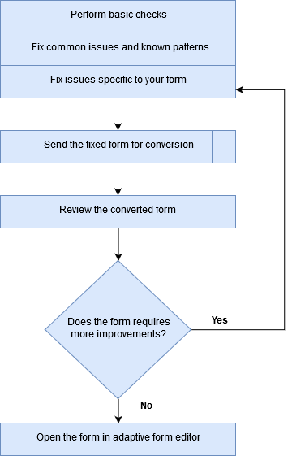

# 查看并更正转换后的表单{#review-and-correct-converted-forms}

AEM FormsAutomated forms conversion服务标识输入PDF文档的字段、内容和布局，并将PDF文档转换为自适应表单。 输出自适应表单可能缺少一些字段或字段转换不正确。 您可以使用审阅和修正编辑器对已识别字段进行改进，并重新生成自适应表单，使输出更接近所需体验。 首次转换后，您可以在编辑器中打开输入PDF文档，以：

* 查看转换期间标识的所有字段和内容
* 识别转换期间缺少的字段和内容
* 验证字段的类型并更改其类型（如果需要）
* 验证标识的表、调整列大小以及修改单元格内容
* 删除错误识别的字段

进行所需的更改后，将PDF forms重新发送到转换服务。 成功转化后，更新的资源（包括自适应表单和架构）将下载到您的AEM Forms实例。 您可以重复该过程，直到获得所需的体验。 

您需要Google Chrome、Mozilla FireFox或Microsoft Edge浏览器才能使用审阅和更正编辑器。 该编辑器不支持Internet Explorer。

## 欢迎使用审阅和修正编辑器 {#welcome-to-review-and-correct-editor}

“检查并更正”编辑器提供了一个易于使用的界面。 它包括以下组件：

* 内容浏览器：您可以使用内容浏览器更改元素的位置。 内容浏览器允许您拖放表单对象以更改其位置。 例如，在文本框之前移动表格。 它相应地更改输出自适应表单的选项卡顺序。
* 属性浏览器：显示选定字段的属性。 您还可以修改属性。
* 工具栏：工具栏位于编辑器顶部。 它显示用于添加、修改、分组、取消分组和删除字段的工具。
* 打开属性：点按  图标。 您可以单击打开属性以打开表单属性并查看其他选项。
* 过滤器按钮：过滤器按钮  位于编辑器顶部。 它允许您过滤字段以仅显示文本、字段、选择组、面板或所有组件。
* 保存按钮： **[!UICONTROL Save]** 按钮位于编辑器的右上角。 您还可以使用保存按钮旁边的箭头查看用于发送表单进行转换的选项。

* PDF表单：编辑器显示源PDF文档，并将其与已标识的字段叠加。 您可以使用工具栏中的工具来修改字段。
* 页面：源表单可以有多个页面。 编辑器在右上角提供了一个按钮，用于在页面之间导航。

**答：** 内容浏览器 **B.** 属性浏览器 **C.** 工具栏 **D.** “属性”按钮 **E.** “筛选器”按钮 **F.** 保存按钮 **G.** PDF表单与已标识的字段重叠

在第一次成功转换之后，转换服务将带有已标识的字段和组件的源PDF文档叠加在一起。 这些字段或组件的类型为：文本、字段、面板、选择组和表：

* 文本：源PDF文档中的纯文本。 例如，上面显示的图像中的贷款申请文本。
* 字段：与值或输入框关联的文本或图标标签组合。 例如，上图中的第一个字段名称。 它有文本标签和一个输入框。 字段支持文本、数字、下拉列表、日期、电子邮件、电话号码、签名、货币和密码数据类型。
* 面板：内容和组件的逻辑集合。 例如，上图中人员1和人员2的个人详细信息面板。
* 选项组：与多个选项选项关联的文本组合：复选框和单选按钮。 例如，上图中的婚姻状况和现有客户。\
  根据选择组标题及其多选选项，转换服务会自动将选择组转换为单选单选按钮或多选复选框。 例如，如果有 **选择任意一个** 由于选择组题注或多个选项只允许选择一个选项， **是** 或 **否**，转换服务会自动将选项组转换为单选单选按钮。 同样，如果存在 **选择所有适用项** 或 **选择多个** 由于选择组标题或多选选项允许您选择多个选项，因此转换服务会自动将选择组转换为多选复选框。

* 表：以列和行表示信息的二维表。 您可以在表中添加或删除行或列。

## 开始查看转换 {#start-reviewing-a-conversion}

在第一次成功转换之后，转换服务将带有已标识的字段和组件的源PDF文档叠加在一起。 您可以对已识别的字段进行改进，并重新生成自适应表单，使输出更接近所需体验。 只有在首次成功转换后，您才可以开始查看转换。

### 开始之前 {#before-you-start}

* “查看并更正”编辑器不支持片段。 请勿使用编辑器查看具有以下特征的转化 **提取片段** 选项已在转换期间启用。 您可以使用 [自适应表单编辑器](https://helpx.adobe.com/experience-manager/6-5/forms/using/introduction-forms-authoring.html) 用于此类转化。

* “检查并更正”编辑器没有撤消操作。 仅使用“保存”按钮永久保存更改。

### 开始审阅 {#start-the-review}

要开始查看转化，请选择用于转化的源PDF文档，然后选择并点按 **查看转化**. 此时将在新选项卡中打开“检查并更正”编辑器。 您可以开始查看转化。 在开始修复任何其他问题之前，请执行以下基本检查：

1. **所有字段的检查类型**：转换服务可以为字段分配错误的类型。 例如，在移动电话字段中指定类型文本而不是类型电话。 您可以将鼠标悬停在字段上以查找该字段的类型。

   要更改字段的类型，请选择该字段，打开属性浏览器，从 **[!UICONTROL Type]** 下拉列表，然后点按 **[!UICONTROL Save]**. 类型已更改。

   

1. **删除多余的面板**：转换服务可以生成额外的面板。 例如，父面板中包含一个额外的子面板，空格转换为面板，复选框转换为面板。 查看所有面板的边界并移除多余的面板。 您可以使用过滤器  按钮或内容浏览器以查看所有面板。

   您可以删除面板或取消面板分组以将其删除。 在使用删除选项时，也会删除面板的子字段或组件：

   * 要删除面板，请选择该面板，然后点按删除  图标。 在确认对话框中，点按 **[!UICONTROL Confirm]**. 点按 **[!UICONTROL Save]** 以保存更改。

   * 要取消面板分组，请选择该面板，然后点按工具栏中的取消分组图标。 该面板将取消分组，并且取消分组面板的子字段将调整为父字段。 点按**[!UICONTROL Save]**保存更改。

1. **创建文本的逻辑组**：验证标识的文本的完整性和正确性。 此外，请检查，文本在逻辑上是否放在正确的面板或组中。 例如，在多列布局中，一个逻辑组的文本放在另一个组中。

   * 要查看文本的完整性和正确性，请使用过滤器  按钮只查看文本，单击每个文本，然后验证。 修复拼写、拼写错误或语法问题（如果有）。

   * 要将文本添加到表单，请点按+按钮，点按 **[!UICONTROL Text]**. 绘制该框，打开属性浏览器，然后键入文本以添加到“内容”框中。

1. **查看表：** 确保识别表的所有边框。 另外，还要确保正确识别单元格的内容。

   * 要识别缺少的边框，请使用 **[!UICONTROL Add Column]** 或 **[!UICONTROL Add Row]** 选项。

   * 要删除多余的边框，请使用 **[!UICONTROL Delete Column]** 或 **[!UICONTROL Delete Row]** 选项。

进行所需的更改后，点按 **[!UICONTROL Save & Convert]** 按钮以将PDF forms重新发送到转换服务。 每个字段被转换为相应的自适应字段组件。 转换后，更新的资源（包括自适应表单和架构）将下载到您的AEM Forms实例。 根据表单的复杂性，服务可能需要一些时间才能完成转换。

执行基本检查后，您可以查看表单以修复特定于您组织的问题。 这些问题可能与添加缺少的字段等有关。 您可以查看 [使用“检查并更正”编辑器工具](review-correct-ui-edited.md#use-the-review-and-correct-editor-tools) 部分，了解编辑器为修复此类问题提供的所有工具。

您还可以致力于识别几乎所有表单中出现的相同问题，并将此类模式报告给Adobe。 使用“审阅并更正”编辑器，直到获得所需的体验。

## 使用“检查并更正”编辑器工具 {#use-the-review-and-correct-editor-tools}

使用“检查并更正”编辑器，您可以：

* [将组件添加到表单](review-correct-ui-edited.md#add-a-component-to-the-form)
* [添加或编辑表](review-correct-ui-edited.md)
* [更改组件类型](review-correct-ui-edited.md#change-type-a-component)

* [创建或删除面板](review-correct-ui-edited.md#create-or-remove-a-panel)
* [删除面板或组件](review-correct-ui-edited.md#delete-a-panel-or-component)
* [设置组件的属性](review-correct-ui-edited.md#set-properties-of-a-component)
* [发送表单进行转换](review-correct-ui-edited.md#send-a-form-for-conversion)

### 将组件添加到表单 {#add-a-component-to-the-form}

转换服务可能无法识别打印表单的某些组件。 例如，在 **出生日期** 表单的组件在转换期间未进行标识。 您可以使用 **+** 帮助标识此类组件的工具。 该工具允许您添加文本、字段、选择组、表格和面板组件。

要将组件添加到表单，请点按 **[!UICONTROL +]** 并点击 **[!UICONTROL Field]**. 绘制覆盖字段标签的框和输入框。 例如，上述示例图像使用字段组件添加 **出生日期** 标签和值框。 绘制框时，转换服务将标识字段的类型。 如果需要，您可以在属性浏览器中更改字段类型。 创建组件后，打开属性浏览器，并设置组件的属性。

点按 **[!UICONTROL Save]** 按钮以保存修改或使用 **[!UICONTROL Save & Convert]** 按钮以将PDF forms重新发送到转换服务。

### 添加或编辑表 {#addedittable}

转换可能会使少数单元格、边界或表单元格的内容无法识别。 例如，未标识表的行。 您可以使用“审阅并更正”编辑器来标识此类项目。 您可以对表执行以下操作：

* 要选择表，请单击该表的任意单元格。
* 要修改单元格的属性，如名称、标题或类型，请双击单元格。 您还可以双击单元格以修改内容，标记必填字段，然后选择其他属性。
* 要向表单中添加/标识完全未识别的表或新表，请使用 **[!UICONTROL +]** 工具。
* 要调整表格的单元格或行的大小，请在表格的空白区域上单击，将鼠标悬停在行或列边界上，当光标指针改变时，选择并移动边界。 调整大小后，单击 **[!UICONTROL Done]** 以提交更改。 您可以按 **[!UICONTROL ESC]** 键可放弃调整大小。

* 要添加或删除行或列，请在表行中选择一个单元格，然后选择 **[!UICONTROL Add Row]**， **[!UICONTROL Add Column]**， **[!UICONTROL Delete Row]**，或 **[!UICONTROL Delete Column]** 选项来自  菜单。

* 要将单元格拆分到表中，请选择 **[!UICONTROL Spilt Vertical]** 或 **[!UICONTROL Split Horizontal]** 选项来自  菜单。

* 要合并表的单元格，请选择要合并的单元格，然后选择 **[!UICONTROL Merge Cells]** 选项自  表格菜单。

### 更改组件类型 {#change-type-a-component}

转换服务可能会创建一些类型不正确的字段。 例如，在下图中， **性别** 字段被错误识别为 **文本** 字段。 此外，标签的内容不正确。 该字段应为选择字段类型，标签应为“性别”。 要更改组件的类型并更正其标签，请执行以下操作：

选择要转换的字段，点击  然后点按字段类型。 该字段已转换为所选的字段类型。 字段只能转换为下表列出的类型。 面板组件只能取消分组，不能转换。

| **Component** | **转换为** |
|---|---|
| 文本 | 字段或选择组 |
| 字段 | 文本或选择组 |
| 选择组 | 文本或面板 |

转换后，打开属性浏览器，指定标签，然后指定其他必需的属性。 点按 **[!UICONTROL Save]** 按钮以保存修改，或者使用“保存并转换”按钮将PDF forms重新发送到转换服务。

### 创建或删除面板 {#create-or-remove-a-panel}

转换服务将打印表单的相关组件和内容聚合到面板。 例如，该表单可以有一个地址面板，其中包含“名称”、“地块编号”、“地区”、“城市”、“州/省”、“邮政编码”和“国家/地区”等字段。 这些字段分组在面板中。 一个表单可以有多个面板。

转换服务可创建具有与其他组件无关的组件的面板，或将相对组件排除在面板之外。 您可以使用分组或取消分组工具来修复这些面板：

* 要删除某个面板，请选择该面板，然后点按取消分组 . 将移除面板，并将面板的子组件移至父组件。 您也可以使用 [删除组件](review-correct-ui-edited.md#delete-a-panel-or-component) 用于删除面板及其子项的选项。

* 要创建面板，请使用Ctrl键（在Windows或Linux上）或Control键(在Mac上)选择相关组件，然后点按  以创建面板。 打开属性浏览器以指定面板的属性。

点按 **[!UICONTROL Save]** 按钮以保存修改或使用 **[!UICONTROL Save & Convert]** 按钮以将PDF forms重新发送到转换服务。

### 删除面板或组件 {#delete-a-panel-or-component}

转换服务可能会识别一些不正确的面板或组件。 这些面板中的这些组件大多无关。 您可以删除此类面板或组件。

要删除面板或组件，请选择一个面板或组件，然后点按删除  图标。 在确认对话框中，点按 **[!UICONTROL Confirm]**. 所选的面板或组件将被删除。 删除面板时，也会删除面板的所有子项。 您可以使用Ctrl键（在Windows或Linux上）或Control键(在Mac上)选择多个组件或面板。

### 设置组件的属性 {#set-properties-of-a-component}

表单的每个组件都有一组属性，如名称、标题和类型。 要设置组件的属性，请选择该组件，然后点按属性浏览器。 此时将显示选定组件的属性。 更改或设置属性。

点按 **[!UICONTROL Save]** 按钮以保存修改或使用 **[!UICONTROL Save & Convert]** 按钮以将PDF forms重新发送到转换服务。

### 发送表单进行转换 {#send-a-form-for-conversion}

在“审核并更正”编辑器中完成所有必需的更改后，您可以重新发送表单以进行转换。 要发送表单进行转换，请点击 **[!UICONTROL Save & Convert]**. 此 **[!UICONTROL Sent for conversion label]** 应用于包含源文档的文件夹，并且更新的源表单将上传到Adobe I/O上运行的转换服务。

根据表单的复杂性，转换服务可能需要一些时间来转换表单。 转换完成后，转换后的自适应表单和相关资产将下载到您的计算机。 转换完成后，您可以在编辑器中查看表单并在中打开自适应表单 [自适应表单编辑器](https://helpx.adobe.com/experience-manager/6-5/forms/using/introduction-forms-authoring.html) 获取最终修复集（如果需要）。

如果在自适应表单编辑器中更新表单后重新发送表单进行转换，则自适应表单中所做的所有更改都将丢失。 只有在成功转换之后，您才能在审阅和更正编辑器中打开表单。

<!--
Comment Type: draft

<h3>Open adaptive forms editor</h3>
-->

<!--
Comment Type: draft

There can be instances where you require adaptive forms editor to make the changes like, applying a different theme to the form or fixing tables. Once you have made all the required changes in Review and Correct editor and converted the form, you can open your form in adaptive forms editor to make the final set of changes.

To open the form with adaptive forms editor, tap the  icon, and tap <strong>Open Adaptive Form Editor</strong>. The form opens in adaptive form editor. 

## Previous {#previous}

[Use Automated Forms Conversion service](convert-existing-forms-to-adaptive-forms.md)
-->
