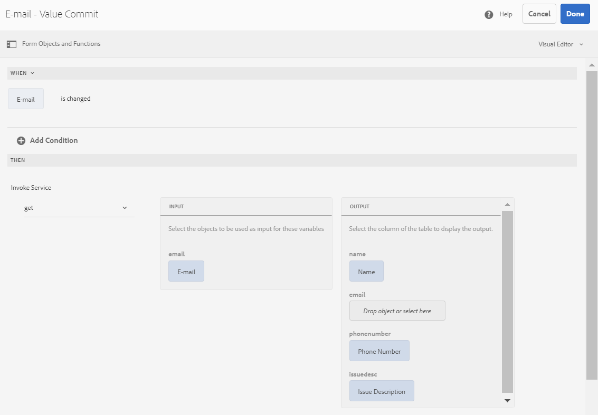

# 使用AEM Workflow集成自适应表单与数据库 {#submit-forms-to-database-using-forms-portal}

automated forms conversion服务(AFCS)允许您将非交互式PDF表单、Acro表单或基于XFA的PDF表单转换为自适应表单。 启动转换过程时，您可以选择生成带数据绑定或不带数据绑定的自适应表单。

如果选择生成无数据绑定的自适应表单，则可以在转换后将已转换的自适应表单与表单数据模型、XML架构或JSON架构集成。 对于表单数据模型，您需要手动将自适应表单字段与表单数据模型绑定。 但是，如果生成具有数据绑定的自适应表单，则转换服务会自动将自适应表单与JSON架构相关联，并在自适应表单中的可用字段与JSON架构之间创建数据绑定。 然后，您可以将自适应表单与所选的数据库集成，在表单中填写数据并将其提交到数据库。 同样，成功与数据库集成后，您可以在转换后的自适应表单中配置字段，以从数据库中检索值并预填充自适应表单字段。

下图描述了将已转换的自适应表单与数据库集成的不同阶段：


本文介绍了成功执行所有这些集成阶段的分步说明。

## 先决条件 {#pre-requisites}

* 设置AEM 6.4或6.5创作实例
* 安装 [最新Service Pack](https://helpx.adobe.com/cn/experience-manager/aem-releases-updates.html) (对于您的AEM实例)
* 最新版本的AEM Forms附加组件包
* 配置 [automated forms conversion服务](configure-service.md)
* 设置数据库。 示例实施中使用的数据库是MySQL 5.6.24。但是，您可以将转换后的自适应表单与所选的任何数据库集成。

## 自适应表单示例 {#sample-adaptive-form}

要执行用例以使用AEM工作流将转换后的自适应表单与数据库集成，请下载以下示例PDF文件。

您可以使用以下地址下载示例“联系我们”表单：

[获取文件](assets/sample_contact_us_form.pdf)

PDF文件用作Automated forms conversion服务(AFCS)的输入。 服务会将此文件转换为自适应表单。 下图以PDF格式描述了示例联系我们表单。


## 安装mysql-connector-java-5.1.39-bin.jar文件 {#install-mysql-connector-java-file}

在所有创作实例和发布实例上执行以下步骤，安装mysql-connector-java-5.1.39-bin.jar文件：

1. 导航到 `http://server:port/system/console/depfinder` 和搜索com.mysql.jdbc包。
1. 在“导出方式”列中，检查包是否由任何捆绑导出。 如果包未由任何捆绑包导出，请继续。
1. 导航到 `http://server:port/system/console/bundles` 并单击 **[!UICONTROL Install/Update]**.
1. 单击 **[!UICONTROL Choose File]** 并浏览以选择mysql-connector-java-5.1.39-bin.jar文件。 此外，选择 **[!UICONTROL Start Bundle]** 和 **[!UICONTROL Refresh Packages]** 复选框。
1. 单击 **[!UICONTROL Install]** 或 **[!UICONTROL Update]**. 完成后，重新启动服务器。
1. （仅限Windows）关闭操作系统的系统防火墙。

## 为表单模型准备数据 {#prepare-data-for-form-model}

AEM Forms数据集成允许您配置并连接到不同的数据源。 使用转换过程生成自适应表单后，您可以根据表单数据模型、XSD或JSON架构定义表单模型。 您可以使用数据库、Microsoft Dynamics或任何其他第三方服务来创建表单数据模型。

本教程使用MySQL数据库作为创建表单数据模型的源。 在数据库中创建架构并添加 **contactact** 表根据自适应表单中可用的字段添加到架构。


您可以使用以下DDL语句创建 **contactact** 表中的数据。

```sql
CREATE TABLE `contactus` (
   `name` varchar(45) NOT NULL,
   `email` varchar(45) NOT NULL,
   `phonenumber` varchar(10) DEFAULT NULL,
   `issuedesc` varchar(1000) DEFAULT NULL,
   PRIMARY KEY (`email`)
 ) ENGINE=InnoDB DEFAULT CHARSET=utf8
```

## 配置AEM实例和数据库之间的连接 {#configure-connection-between-aem-instance-and-database}

执行以下配置步骤以创建AEM实例与MYSQL数据库之间的连接：

1. 转到位于的AEM Web控制台配置页面 `http://server:port/system/console/configMgr`.
1. 查找并单击以打开 **[!UICONTROL Apache Sling Connection Pooled DataSource]** 在“Web控制台配置”的编辑模式下。 按照下表所述指定属性的值：

   <table> 
    <tbody> 
    <tr> 
    <th><strong>属性</strong></th> 
    <th><strong>价值</strong></th> 
    </tr> 
    <tr> 
    <td><p>数据源名称</p></td> 
    <td><p>用于从数据源池筛选驱动程序的数据源名称。</p></td>
    </tr>
    <tr> 
    <td><p>JDBC驱动程序类</p></td> 
    <td><p>com.mysql.jdbc.Driver</p></td>
    </tr>
    <tr> 
    <td><p>JDBC连接URI</p></td> 
    <td><p>jdbc:mysql://[主机]：[端口]/[架构名称]</p></td>
    </tr>
    <tr> 
    <td><p>用户名</p></td> 
    <td><p>用于对数据库表进行身份验证和执行操作的用户名</p></td>
    </tr>
    <tr> 
    <td><p>密码</p></td> 
    <td><p>与用户名关联的密码</p></td>
    </tr>
    <tr> 
    <td><p>事务隔离</p></td> 
    <td><p>读取已提交</p></td>
    </tr>
    <tr> 
    <td><p>最大活动连接数</p></td> 
    <td><p>1000</p></td>
    </tr>
    <tr> 
    <td><p>最大空闲连接数</p></td> 
    <td><p>100</p></td>
    </tr>
    <tr> 
    <td><p>最小空闲连接数</p></td> 
    <td><p>10</p></td>
    </tr>
    <tr> 
    <td><p>初始大小</p></td> 
    <td><p>10</p></td>
    </tr>
    <tr> 
    <td><p>最大等待</p></td> 
    <td><p>100000</p></td>
    </tr>
     <tr> 
    <td><p>借阅测试</p></td> 
    <td><p>已选中</p></td>
    </tr>
     <tr> 
    <td><p>空闲时测试</p></td> 
    <td><p>已选中</p></td>
    </tr>
     <tr> 
    <td><p>验证查询</p></td> 
    <td><p>示例值为SELECT 1(mysql)，从dual(oracle)中选择1，选择1(MS Sql Server) (validationQuery)</p></td>
    </tr>
     <tr> 
    <td><p>验证查询超时</p></td> 
    <td><p>10000</p></td>
    </tr>
    </tbody> 
    </table>

## 创建表单数据模型 {#create-form-data-model}

将MYSQL配置为数据源后，请执行以下步骤以创建表单数据模型：

1. 在AEM创作实例中，导航到 **[!UICONTROL Forms]** > **[!UICONTROL Data Integrations]**.

1. 点按 **[!UICONTROL Create]** > **[!UICONTROL Form Data Model]**.

1. 在 **[!UICONTROL Create Form Data Model]** 向导，指定 **workflow_submit** 作为表单数据模型的名称。 点按 **[!UICONTROL Next]**.

1. 选择您在上一部分中配置的MYSQL数据源，然后点击 **[!UICONTROL Create]**.

1. 点按 **[!UICONTROL Edit]** 并展开左侧窗格中列出的数据源以选择 **contactact** 表格， **[!UICONTROL get]**、和 **[!UICONTROL insert]** 服务，然后点击 **[!UICONTROL Add Selected]**.

   

1. 在右侧窗格中选择数据模型对象，然后点击 **[!UICONTROL Edit Properties]**. 选择 **[!UICONTROL get]** 和 **[!UICONTROL insert]** 从 **[!UICONTROL Read Service]** 和 **[!UICONTROL Write Service]** 下拉列表。 指定读取服务的参数，然后点击 **[!UICONTROL Done]**.

1. 在 **[!UICONTROL Services]** 选项卡，选择 **[!UICONTROL get]** 服务和点击 **[!UICONTROL Edit Properties]**. 选择 **[!UICONTROL Output Model Object]**，禁用 **[!UICONTROL Return array]** 切换并点按 **[!UICONTROL Done]**.

1. 选择 **[!UICONTROL Insert]** 服务和点击 **[!UICONTROL Edit Properties]**. 选择 **[!UICONTROL Input Model Object]** 并点击 **[!UICONTROL Done]**.

1. 点按 **[!UICONTROL Save]** 以保存表单数据模型。

您可以使用以下内容下载示例表单数据模型：

[获取文件](assets/DownloadedFormsPackage_1497728018502500.zip)

## 生成具有JSON绑定的自适应表单 {#generate-adaptive-forms-with-json-binding}

使用 [要转换的Automated forms conversion服务(AFCS)](convert-existing-forms-to-adaptive-forms.md) 该 [联系我们表单](#sample-adaptive-form) 到具有数据绑定的自适应表单。 确保您不选择 **[!UICONTROL Generate adaptive form(s) without data bindings]** 复选框。


选择已转换的 **联系我们表单** 中提供 **[!UICONTROL output]** 文件夹位置 **[!UICONTROL Forms & Documents]** 并点击 **[!UICONTROL Edit]**. 点按 **[!UICONTROL Preview]**，在自适应表单字段中输入值，然后点击 **[!UICONTROL Submit]**.

登录 **crx存储库** 并导航到 */content/forms/fp/admin/submit/data* 查看以JSON格式提交的值。 以下是提交转换后的JSON格式的数据示例 **联系我们** 自适应表单：

```json
{
  "afData": {
    "afUnboundData": {
      "data": {}
    },
    "afBoundData": {
      "data": {
        "name1": "Gloria",
        "email": "abc@xyz.com",
        "phone_number": "2346578965",
        "issue_description": "Test message"
      }
    },
    "afSubmissionInfo": {
      "computedMetaInfo": {},
      "stateOverrides": {},
      "signers": {},
      "afPath": "/content/dam/formsanddocuments/docs_conversion/output/sample_form_json",
      "afSubmissionTime": "20191204014007"
    }
  }
}
```

您需要立即创建一个工作流模型，以便能够处理此数据，并使用在前几节中创建的表单数据模型将其提交到MYSQL数据库。

## 创建工作流模型以处理JSON数据 {#create-workflow-model}

执行以下步骤来创建工作流模型，将自适应表单数据提交到数据库：

1. 打开工作流模型控制台。 默认URL为 `https://server:port/libs/cq/workflow/admin/console/content/models.html/etc/workflow/models`.

1. 选择 **[!UICONTROL Create]**，则 **[!UICONTROL Create Model]**. 此 **[!UICONTROL Add Workflow Model]** 出现对话框。

1. 输入 **[!UICONTROL Title]** 和 **[!UICONTROL Name]** （可选）。 例如， **workflow_json_submit**. 点按 **[!UICONTROL Done]** 以创建模型。

1. 选择工作流模型并点按 **[!UICONTROL Edit]** 以在编辑模式下打开模型。 点按+并添加 **[!UICONTROL Invoke Form Data Model Service]** 进入工作流模型。

1. 点按 **[!UICONTROL Invoke Form Data Model Service]** 步骤并点按 .

1. 在 **[!UICONTROL Form Data Model]** 选项卡中，选择已在以下位置创建的表单数据模型： **[!UICONTROL Form Data Model path]** 字段并选择 **[!UICONTROL insert]** 从 **[!UICONTROL Service]** 下拉列表。

1. 在 **[!UICONTROL Input for Service]** 选项卡，选择 **[!UICONTROL Provide input data using literal, variable, or a workflow metadata, and a JSON file]** 从下拉列表中，选择 **[!UICONTROL Map input fields from input JSON]** 复选框，选择 **[!UICONTROL Relative to payload]**，并提供 **data.xml** 作为的值 **[!UICONTROL Select input JSON document using]** 字段。

1. 在 **[!UICONTROL Service Arguments]** 部分，为表单数据模型参数提供以下值：

   

   请注意，表单数据模型字段（例如，接触点名称）将映射到 **afData.afBoundData.data.name1**，表示已提交的自适应表单的JSON架构绑定。

## 配置自适应表单提交 {#configure-adaptive-form-submission}

执行以下步骤，将自适应表单提交到您在上一节中创建的工作流模型：

1. 选择中提供的转换后的“联系我们”表单 **[!UICONTROL output]** 文件夹位置 **[!UICONTROL Forms & Documents]** 并点击 **[!UICONTROL Edit]**.

1. 通过点按打开自适应表单属性 **[!UICONTROL Form Container]** 然后点击 .

1. 在 **[!UICONTROL Submission]** 部分，选择 **[!UICONTROL Invoke an AEM workflow]** 从 **[!UICONTROL Submit Action]** 从下拉列表中，选择您在上一部分中创建的工作流模型，然后指定 **data.xml** 在 **[!UICONTROL Data File Path]** 字段。

1. 点按以保存属性。

1. 点按 **[!UICONTROL Preview]**，在自适应表单字段中输入值，然后点击 **[!UICONTROL Submit]**. 现在，在MYSQL数据库表中显示提交的值，而不是 **crx存储库**.

## 配置自适应表单以预填充数据库中的值

执行以下步骤来配置自适应表单，以根据表中定义的主键从MYSQL数据库预填充值（本例中为Email）：

1. 点按 **电子邮件** 字段并点按 .

1. 点按 **[!UICONTROL Create]** 并选择 **[!UICONTROL is changed]** 从 **[!UICONTROL Select State]** 中的下拉列表 **[!UICONTROL When]** 部分。

1. 在 **[!UICONTROL Then]** 部分，选择 **[!UICONTROL Invoke Service]** 和 **get** 作为您在本文前一部分中创建的表单数据模型的服务。

1. 选择 **电子邮件** 在 **[!UICONTROL Input]** 和表单数据模型的其余三个字段， **名称**， **电话号码**、和 **问题描述** 在 **[!UICONTROL Output]** 部分。 点按 **[!UICONTROL Done]** 以保存设置。

   

   因此，您可以根据MYSQL数据库中现有的Email条目，预填充 **[!UICONTROL Preview]** 自适应表单的模式。 aya.tan@xyz.com例如，如果您在 **电子邮件** 字段（基于中的现有数据） [准备表单数据模型](#prepare-data-for-form-model) 跳出字段，其余三个字段， **名称**， **电话号码**、和 **问题描述** 会在自适应表单中自动显示。

您可以使用以下方式下载示例转换后的自适应表单：

[获取文件](assets/DownloadedFormsPackage_1498226829041200.zip)
