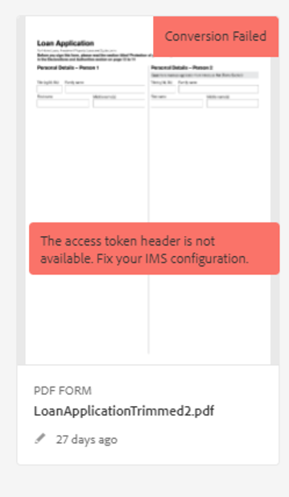
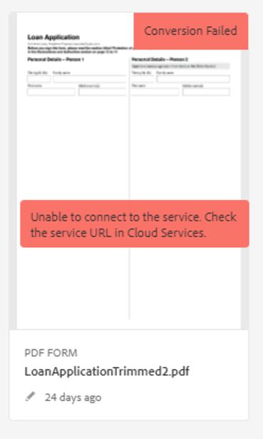
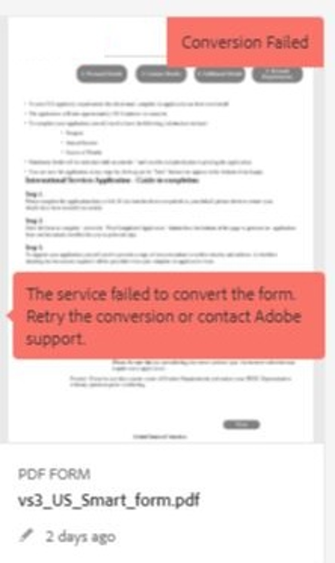
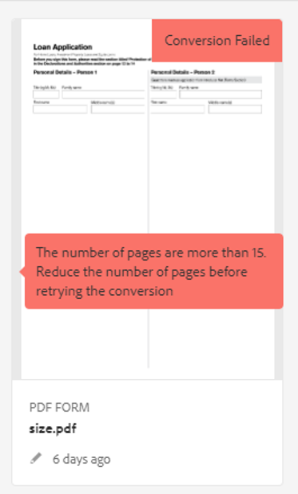
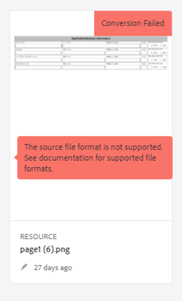
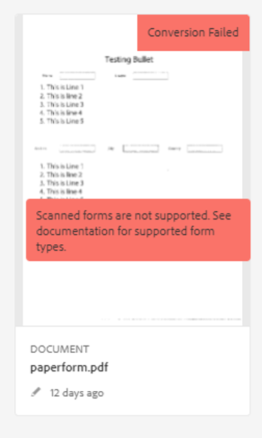
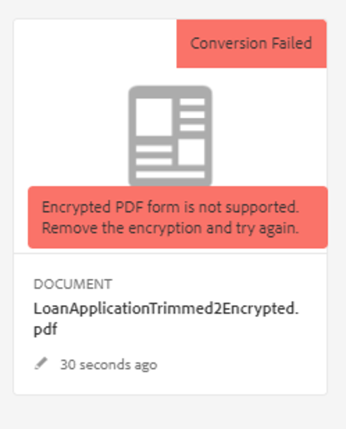
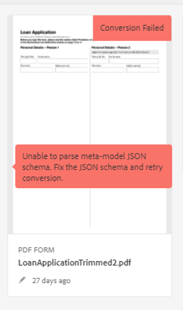
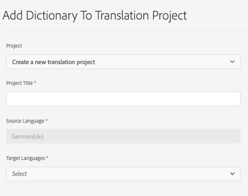

# 自动化表单转换服务 (AFCS) 故障诊断

本文档提供常见错误的基本故障诊断步骤。

<!--The article provides information on installation, configuration and administration issues that may arise in an Automated Forms Conversion Service production environment. -->

## 常见错误 {#commonerrors}

| 错误 | 示例 |
|--- |--- |
| **错误消息**  访问令牌标头不可用。   **原因**  管理员创建了多个 IMS 配置，或 IMS 配置无法在 Adobe Cloud 上连接 AFCS 服务。   **分辨率**  如果有多个配置，请删除所有配置并[创建新的配置](configure-service.md#obtainpubliccertificates)。  如果只有一个配置，请使用&#x200B;**运行状况检查**&#x200B;到[检查连接](configure-service.md#createintegrationoption)。 |  |
| **错误消息**  无法连接到服务。    **原因**  服务URL不正确或自动表单转换服务(AFCS)云服务中没有提及服务URL。   **解决办法**  在自动表单转换服务(AFCS)云服务中更正[服务URL](configure-service.md#configure-the-cloud-service)。 |  |
| **错误消息**  服务无法转换表单。    **原因**  您的网络连接有问题、服务因定期维护停止或 Adobe Cloud 中断。   **解决办法**  解决您的网络连接问题，并在 https://status.adobe.com/zh-cn/ 上检查服务状态，确定是否有计划的或意外的中断。 |  |
| **错误消息**  页面超过 15 页。    **原因**  源表单超过 15 页。    **解决办法**  使用 Adobe Acrobat 对超过 15 页的表单进行拆分。 将表单缩减到 15 页以下。 |  |
| **错误消息**  文件数超过 15 个。    **原因**    本文件夹包含的表单超过 15 个。   **解决办法**  将文件夹中的表单数量缩减到 15 个或 15 个以下。 将文件夹中的总页数缩减到 50 页以下。 将文件夹的大小缩减到 10 MB 以下。 请勿将表单放在子文件夹中。 以 8 到 15 个表单为一个批次整理表单。 |  |
| **错误消息**  不支持源文件格式。    **原因**  源表格所在的文件夹中存在一些不支持的文件。   **解决办法**  本服务仅支持 .xdp 和 .pdf 文件。 从文件夹中删除任何其他扩展名的文件，然后运行转换。 |  |
| **错误消息**  扫描的表单不受支持。    **原因**  PDF 表单仅包含表单的扫描图像，不包含内容结构。   **解决办法**  本服务不支持直接将扫描的表单或表单图像转换为自适应表单。 但您可以使用 Adobe Acrobat 将表单图像转换为 PDF 表单。 然后再使用本服务将 PDF 表单转换为自适应表单。 对于 Acrobat，请务必使用高质量的表单图像进行转换。 这样可以提高转换质量。 |  |
| **错误消息**  加密的 PDF 表单不受支持。    **原因**  文件夹包含加密的 PDF 表单。   **解决办法**  本服务不支持将加密的 PDF 表单转换为自适应表单。 删除加密，上传未加密表单，然后运行转换。 |  |
| **错误消息**  无法解析元模型 JSON 架构。    **原因**  提供给本服务的 JSON 架构格式不正确，其中包含无效字符或用于映射组件的语法无效。    **解决办法**  检查 JSON 文件格式。 可使用任何在线 JSON 验证器来检查架构格式和结构。 请参阅[“扩展默认的元模型”](extending-the-default-meta-model.md)一文，了解有关元模型语法的信息。 |  |
| **错误（仅限内部部署环境）**   **[!UICONTROL Source Language]**&#x200B;选项未列出自适应表单的正确语言。   **原因**  自适应表单的jcr:language属性设置不正确。    **分辨率**  打开CRX-DE LITE，导航到`/content/forms/af/`，打开`jcr:content`节点，并将节点的值设置为正确的语言。 有关支持的语言的列表，请参阅[添加对不受支持的区域设置的本地化支持](https://experienceleague.adobe.com/docs/experience-manager-65/forms/manage-administer-aem-forms/supporting-new-language-localization.html?lang=zh-Hans#add-localization-support-for-non-supported-locales)。 |  |

<!--

<table>
<thead>
<tr>
<th>Error</th>
<th>Example</th>
</tr>
</thead>
<tbody>
<tr>
<td><strong>Error Message</strong> 
 The access token header is not available. 
 <strong>Reason</strong>   An administrator has created multiple IMS configurations or IMS configuration is not able to reach AFCS service on Adobe Cloud.   <strong>Resolution</strong>   If there are multiple configurations, delete all the configurations and <a href="configure-service.md#obtainpubliccertificates">create a new configuration</a>.   If there is a single configuration, use <strong> Health Check </strong> to <a href="configure-service.md#createintegrationoption">check connectivity</a>.</td>
<td></td>
</tr>
<tr>
<td><strong>Error Message</strong>   Unable to connect to the service.    <strong>Reason</strong>   Incorrect service URL or no service URL is mentioned in Automated Forms Conversion Service (AFCS) cloud services.   <strong>Resolution</strong>   Correct <a href="configure-service.md#configure-the-cloud-service">Service URL</a> in Automated Forms Conversion Service (AFCS) Cloud services.</td>
<td></td>
</tr>
<tr>
<td><strong>Error Message</strong>   The service failed to convert the form.    <strong>Reason</strong>   Network connectivity issues at your end, the service is down due to scheduled maintenance, or outage on Adobe Cloud.   <strong>Resolution</strong>   Resolve network connectivity issues at your end and check the status of the service on <a href="https://status.adobe.com/zh-cn/">https://status.adobe.com/zh-cn/</a> for a planned or unplanned outage.</td>
<td></td>
</tr>
<tr>
<td><strong>Error Message</strong>   The number of pages is more than 15.    <strong>Reason</strong>   The source form is more than 15 pages long.    <strong>Resolution</strong>   Use Adobe Acrobat to split forms with more than 15 pages. Bring the number of pages in a form to less than 15.</td>
<td></td>
</tr>
<tr>
<td><strong>Error Message</strong>   The number of files is more than 15.    <strong>Reason</strong>    The folder contains more than 15 forms.   <strong>Resolution</strong>   Bring the number of forms in a folder to less than or equal to 15. Bring the total number of pages in a folder less than 50. Bring the size of the folder to less than 10 MB. Do not keep forms in a sub-folder. Organize source forms into a batch of 8-15 forms.</td>
<td></td>
</tr>
<tr>
<td><strong>Error Message</strong>   The source file format is not supported.    <strong>Reason</strong>   The folder containing source forms have some unsupported files.   <strong>Resolution</strong>   The service supports only .xdp and .pdf files. Remove files with any other extension from the folder and run the conversion.</td>
<td></td>
</tr>
<tr>
<td><strong>Error Message</strong>   Scanned forms are not supported.    <strong>Reason</strong>   The PDF form contains only scanned images of the form and contains no content structure.   <strong>Resolution</strong>   The service does not support converting scanned forms or an image of a form to an adaptive out-of-the-box. However, you use Adobe Acrobat to convert the image of a form to a PDF Form. Then, use the service to convert the PDF Form to an adaptive form. Always use a high-quality image of the form for conversion in Acrobat. It improves the quality of the conversion.</td>
<td></td>
</tr>
<tr>
<td><strong>Error Message</strong>   Encrypted PDF form is not supported.    <strong>Reason</strong>   The folder contains encrypted PDF forms.   <strong>Resolution</strong>   The service does not support converting an encrypted PDF form to an adaptive form. Remove the encryption, upload the non-encrypted form, and run the conversion.</td>
<td></td>
</tr>
<tr>
<td><strong>Error Message</strong>   Unable to parse meta-model JSON schema.    <strong>Reason</strong>   The JSON schema supplied to the service is not properly formatted, contains invalid characters, or uses invalid syntax to map components.    <strong>Resolution</strong>   Check the formatting of the JSON file. You can use any online JSON validator to check the formatting and structure of the schema. See, <a href="extending-the-default-meta-model.md">Extend the default meta-model</a> article for information on meta-model syntax.</td>
<td></td>
</tr>
</tbody>
</table>
-->
